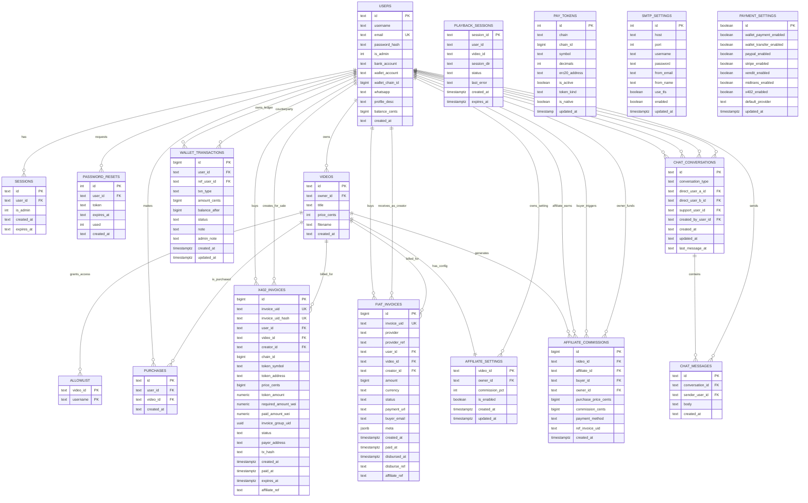

# ERD Explanation

This document explains the database structure of the PPV Stream repository in detail.
It covers the core entities, payment entities, wallet and affiliate entities, chat entities, and operational tables used by the application.

The schema is assembled from:

- [src/schema.sql](/c:/rust/github_ppv_stream_rust/ppv_stream_rust/src/schema.sql)
- [migrations/](/c:/rust/github_ppv_stream_rust/ppv_stream_rust/migrations)
- [sql/](/c:/rust/github_ppv_stream_rust/ppv_stream_rust/sql)

## Scope

This ERD includes:

- Authentication and account data
- Video catalog and access control
- Purchases and password reset flow
- x402 blockchain payment flow
- Fiat payment gateway flow
- Wallet ledger and internal balance flow
- Affiliate commission tracking
- Chat and support messaging
- Playback session tracking
- Singleton configuration tables

It does not treat `pay_tokens_compat` as a core entity because it is a compatibility view, not a primary table.

## High-Level Domain Summary

The application is a pay-per-view streaming platform with these major business actors:

- `users`: platform accounts, including admins, creators, buyers, and affiliates
- `videos`: monetized content uploaded by creators
- `purchases`: proof that a user bought access to a video
- `allowlist`: username-based access records for stream authorization
- `x402_invoices` and `fiat_invoices`: payment records for blockchain and gateway purchases
- `wallet_transactions`: ledger of wallet deposits, withdrawals, transfers, and wallet-based purchases
- `affiliate_settings` and `affiliate_commissions`: affiliate program configuration and payout ledger
- `chat_conversations` and `chat_messages`: user-to-admin and user-to-user chat

## Mermaid ERD

## Core Account and Access Model

### `users`

This is the central entity of the system.

It stores:

- account identity: `id`, `username`, `email`, `password_hash`
- role marker: `is_admin`
- creator payout and profile fields: `bank_account`, `wallet_account`, `wallet_chain_id`, `whatsapp`, `profile_desc`
- wallet balance: `balance_cents`
- audit timestamp: `created_at`

Business roles are not stored in separate tables. Instead, one `users` row can act as:

- admin
- creator
- buyer
- affiliate
- chat participant

Important notes:

- `email` is unique.
- `balance_cents` is the current wallet balance, while `wallet_transactions` is the immutable or semi-immutable ledger explaining why the balance changed.
- `wallet_account` and `wallet_chain_id` are used by blockchain payment flows and creator payout preferences.

### `sessions`

This table tracks login sessions.

Relationship:

- many sessions can belong to one user

Purpose:

- browser authentication
- session expiration
- admin or non-admin session state

The `is_admin` column is denormalized session state so the app can quickly enforce authorization.

### `password_resets`

This table supports forgot-password and reset-password flows.

Relationship:

- one user can have many password reset requests over time

Important fields:

- `token`: the reset token
- `expires_at`: expiry deadline
- `used`: one-time-use marker

## Video Commerce Model

### `videos`

This table stores the content catalogue.

Relationship:

- one creator user owns many videos

Important fields:

- `owner_id`: creator account
- `price_cents`: list price for paid access
- `filename`: source media file reference

This is the main sellable entity in the application.

### `purchases`

This table is the canonical entitlement record that proves a user bought a video.

Relationship:

- one user can purchase many videos
- one video can be purchased by many users

This is the table most directly tied to access rights.

Payment flows usually end by creating:

- a `purchases` row
- an `allowlist` row

### `allowlist`

This table grants practical playback access by storing `(video_id, username)` pairs.

Relationship:

- one video can have many allowed usernames

This is slightly denormalized because it stores `username` rather than `user_id`.
That design makes playback checks simple, but it also means username changes need careful handling if the platform ever supports renaming.

## Playback Operations

### `playback_sessions`

This table tracks temporary streaming session state.

Purpose:

- create short-lived playback directories
- track stream preparation status
- clean up expired playback sessions

Important note:

- the current SQL file does not declare database foreign keys to `users` or `videos`, even though the columns logically reference those tables

So in ERD terms:

- `playback_sessions.user_id -> users.id` is a logical relationship
- `playback_sessions.video_id -> videos.id` is also a logical relationship

This is useful operationally, but it is weaker than a real FK because the database does not enforce referential integrity here.

## Blockchain Payment Model

### `pay_tokens`

This table defines which chains and tokens are accepted for x402 payments.

It stores:

- network identity: `chain`, `chain_id`
- token identity: `symbol`, `erc20_address`
- token precision: `decimals`
- availability flag: `is_active`
- classification: `token_kind`, `is_native`

Conceptually, this table is a payment configuration registry, not a transaction ledger.

Important rules:

- unique token identity is enforced through `chain_id + erc20_address + symbol`
- `token_kind` must match whether `erc20_address` is null or not
- native assets have no ERC-20 address

### `x402_invoices`

This table stores blockchain payment invoices for video purchases.

Relationship:

- one buyer user can create many x402 invoices
- one creator user can receive many x402 invoices
- one video can have many x402 invoices

Important fields:

- `invoice_uid`: public invoice identifier
- `invoice_uid_hash`: hashed identifier for lookup hardening
- `user_id`: buyer
- `creator_id`: seller
- `video_id`: purchased content
- `chain_id`, `token_symbol`, `token_address`: requested payment asset
- `token_amount`, `required_amount_wei`, `paid_amount_wei`: amount tracking
- `invoice_group_uid`: groups retries or top-up related invoices
- `status`: pending, paid, underpaid, expired, cancelled
- `tx_hash`: blockchain settlement reference
- `affiliate_ref`: affiliate ref captured at invoice creation time

Business meaning:

- this is the source of truth for crypto purchase intent and payment confirmation
- after successful confirmation, it should lead to entitlement creation in `purchases` and `allowlist`

## Fiat Gateway Payment Model

### `fiat_invoices`

This table tracks gateway-based purchases for Stripe, PayPal, Midtrans, and Xendit.

Relationship:

- one buyer user can have many fiat invoices
- one creator user can receive many fiat invoices
- one video can have many fiat invoices

Important fields:

- `provider`: which gateway created the invoice
- `provider_ref`: provider-side session or order ID
- `status`: pending, paid, failed, expired, cancelled
- `payment_url`: hosted checkout URL if applicable
- `buyer_email`: payer email used by provider integrations
- `disbursed_at`, `disburse_ref`: creator payout bookkeeping
- `affiliate_ref`: referral captured when invoice is created

This is the fiat equivalent of `x402_invoices`.

## Internal Wallet Model

### `wallet_transactions`

This table is the internal ledger for the platform wallet.

Relationship:

- one user owns many wallet transaction rows
- some transactions optionally reference another user through `ref_user_id`

Supported transaction types:

- `deposit`
- `withdrawal`
- `transfer_in`
- `transfer_out`

Supported lifecycle statuses:

- `pending`
- `approved`
- `completed`
- `rejected`

Design intent:

- `users.balance_cents` stores the current balance snapshot
- `wallet_transactions` stores the audit trail of changes to that balance

This is a common ledger-plus-balance pattern.

## Affiliate Model

### `affiliate_settings`

This table stores per-video affiliate configuration.

Relationship:

- one video has at most one affiliate setting row
- one owner user can configure many videos

Important fields:

- `video_id`: also the primary key, so settings are one-to-one with a video
- `owner_id`: creator who owns the video
- `commission_pct`: creator-defined commission percentage
- `is_enabled`: whether affiliate earning is active for the video

### `affiliate_commissions`

This table is the affiliate earnings ledger.

Relationship:

- one video can generate many commission rows
- one affiliate can earn many commissions
- one buyer can trigger many commissions
- one owner can fund many commissions

It records one successful referral sale per row.

Important fields:

- `affiliate_id`: the referring user
- `buyer_id`: the actual purchaser
- `owner_id`: the creator whose video was sold
- `payment_method`: `wallet`, `x402`, or `fiat`
- `ref_invoice_uid`: invoice or payment reference

This table is important because it bridges the commerce model with the payout model.

## Chat Model

### `chat_conversations`

This table stores chat thread headers.

It supports two conversation modes:

- direct user-to-user chat
- user-to-admin support chat

Important columns:

- `conversation_type`
- `direct_user_a_id`
- `direct_user_b_id`
- `support_user_id`
- `created_by_user_id`
- `last_message_at`

The design uses a polymorphic pattern:

- direct chat uses `direct_user_a_id` and `direct_user_b_id`
- support chat uses `support_user_id`

Important uniqueness rules:

- only one direct conversation exists for a given user pair
- only one support conversation exists for a given support user

### `chat_messages`

This table stores messages inside a conversation.

Relationship:

- one conversation has many messages
- one user can send many messages

Important fields:

- `conversation_id`
- `sender_user_id`
- `body`
- `created_at`

This is the durable message history table, which matches the feature requirement that all conversations are recorded in the database.

## Configuration Tables

### `smtp_settings`

This is effectively a singleton table.

Purpose:

- store SMTP delivery configuration for reset emails, notifications, and test email flow

Practical rule:

- the app expects row `id = 1` to exist

### `payment_settings`

This is also a singleton table.

Purpose:

- toggle which payment methods are enabled in the admin dashboard

Examples:

- wallet payments
- wallet transfers
- PayPal
- Stripe
- Xendit
- Midtrans
- x402

The `id` column is constrained so only a single logical row should exist.

## Relationship Patterns

### 1. User-centric pattern

`users` is the hub of the entire data model.

It connects to:

- `sessions`
- `password_resets`
- `videos`
- `purchases`
- `x402_invoices`
- `fiat_invoices`
- `wallet_transactions`
- `affiliate_settings`
- `affiliate_commissions`
- `chat_conversations`
- `chat_messages`

### 2. Video-centric monetization pattern

`videos` is the core business object for monetization.

It connects to:

- `allowlist`
- `purchases`
- `x402_invoices`
- `fiat_invoices`
- `affiliate_settings`
- `affiliate_commissions`
- logically, `playback_sessions`

### 3. Dual payment pattern

The repo uses two parallel payment rails:

- blockchain rail: `pay_tokens` + `x402_invoices`
- fiat rail: `fiat_invoices`

Both rails converge into the same entitlement outcome:

- create a purchase
- allow the buyer to access the video
- optionally create affiliate commission data

### 4. Ledger pattern

The repo uses ledger-style tables for historical truth:

- `wallet_transactions`
- `affiliate_commissions`
- `chat_messages`
- `fiat_invoices`
- `x402_invoices`

These tables are append-heavy and are useful for auditability.

## Key Integrity Notes

### Strong FK-enforced relationships

Examples:

- `videos.owner_id -> users.id`
- `purchases.user_id -> users.id`
- `purchases.video_id -> videos.id`
- `fiat_invoices.user_id -> users.id`
- `fiat_invoices.video_id -> videos.id`
- `chat_messages.conversation_id -> chat_conversations.id`

### Logical but weakly enforced relationships

Examples:

- `playback_sessions.user_id -> users.id`
- `playback_sessions.video_id -> videos.id`
- `affiliate_commissions.ref_invoice_uid -> fiat_invoices.invoice_uid` or `x402_invoices.invoice_uid`

These relationships matter to the application, but they are not fully normalized with database-level foreign keys.

### Denormalized fields

Examples:

- `allowlist.username`
- `sessions.is_admin`
- `fiat_invoices.buyer_email`
- `users.balance_cents` alongside `wallet_transactions`

These fields are useful for speed, interoperability, or operational convenience, but they require careful application logic to stay consistent.

## Typical End-to-End Flows

### User buys a video with fiat

1. A buyer user selects a `video`.
2. The app creates a `fiat_invoices` row.
3. The gateway completes payment.
4. The app marks the invoice as paid.
5. The app inserts a `purchases` row.
6. The app inserts or preserves the `allowlist` row.
7. If the purchase used an affiliate link, the app creates `affiliate_commissions`.

### User buys a video with x402

1. A buyer user selects a `video`.
2. The app chooses a supported token from `pay_tokens`.
3. The app creates an `x402_invoices` row.
4. On-chain payment is verified.
5. The app updates invoice status.
6. The app inserts a `purchases` row.
7. The app inserts the `allowlist` row.
8. If the purchase used an affiliate ref, the app creates `affiliate_commissions`.

### User pays with internal wallet

1. Wallet balance lives on `users.balance_cents`.
2. Detailed movement is recorded in `wallet_transactions`.
3. If wallet payment is used for a video purchase, the app still converges to the same entitlement outcome:
   purchase plus access plus optional affiliate commission.

### User opens support chat or direct chat

1. The app creates or fetches a `chat_conversations` row.
2. Each message is saved as a `chat_messages` row.
3. `last_message_at` on the conversation is updated.
4. The full conversation history remains persisted in the database.

## Suggested Reading Order

If you want to understand the repo gradually, read the schema in this order:

1. `users`
2. `videos`
3. `purchases`
4. `allowlist`
5. `fiat_invoices`
6. `x402_invoices`
7. `wallet_transactions`
8. `affiliate_settings` and `affiliate_commissions`
9. `chat_conversations` and `chat_messages`
10. `smtp_settings` and `payment_settings`

## Table-by-Table Column Dictionary

This appendix summarizes the meaning of the most important columns in each table.

### `users`

- `id`: primary key for the account.
- `username`: public-facing handle used across browsing, access control, and chat.
- `email`: login and notification address. It is unique when present.
- `password_hash`: password digest stored by the authentication system.
- `is_admin`: marks whether the account has admin privileges.
- `bank_account`: creator payout destination for manual or gateway disbursement flows.
- `wallet_account`: creator EVM-compatible wallet address for blockchain-related flows.
- `wallet_chain_id`: preferred chain for the creator wallet.
- `whatsapp`: creator contact field.
- `profile_desc`: public profile description shown on creator-facing surfaces.
- `balance_cents`: current internal wallet balance snapshot in platform cents.
- `created_at`: account creation timestamp.

### `sessions`

- `id`: session token or session identifier.
- `user_id`: owner of the session.
- `is_admin`: denormalized privilege marker copied into the session context.
- `created_at`: session creation time.
- `expires_at`: session expiry deadline.

### `password_resets`

- `id`: primary key.
- `user_id`: user requesting the password reset.
- `token`: one-time reset token.
- `expires_at`: token expiration time.
- `used`: indicates whether the token has already been consumed.
- `created_at`: token issuance time.

### `videos`

- `id`: primary key for the video.
- `owner_id`: creator who owns and sells the video.
- `title`: human-readable video title.
- `price_cents`: selling price in cents.
- `filename`: media file reference on disk or storage.
- `created_at`: upload or creation time.

### `allowlist`

- `video_id`: video being unlocked.
- `username`: username granted playback access for that video.

### `purchases`

- `id`: purchase record identifier.
- `user_id`: buyer who obtained the entitlement.
- `video_id`: purchased video.
- `created_at`: purchase completion time.

### `playback_sessions`

- `session_id`: primary key for the playback session.
- `user_id`: user who requested streaming.
- `video_id`: video being streamed.
- `session_dir`: server-side working directory for generated playback artifacts.
- `status`: lifecycle state such as `starting`, `ready`, `completed`, or `error`.
- `last_error`: latest processing or playback preparation error.
- `created_at`: session creation timestamp.
- `expires_at`: cleanup deadline for temporary playback resources.

### `pay_tokens`

- `id`: primary key.
- `chain`: human-readable chain name.
- `chain_id`: numeric blockchain network ID.
- `symbol`: token ticker symbol.
- `decimals`: token precision.
- `erc20_address`: contract address for ERC-20 or similar tokens; null for native assets.
- `is_active`: whether the token is currently enabled for payment.
- `updated_at`: last configuration update time.
- `token_kind`: token classification such as `NATIVE`, `ERC20`, or `STABLE`.
- `is_native`: generated convenience flag derived from `token_kind`.

### `x402_invoices`

- `id`: internal primary key.
- `invoice_uid`: public invoice identifier.
- `invoice_uid_hash`: hash used for safer lookup and external references.
- `user_id`: buyer creating the invoice.
- `video_id`: target video being purchased.
- `creator_id`: creator expected to receive the sale proceeds.
- `chain_id`: blockchain network selected for payment.
- `token_symbol`: chosen payment symbol.
- `token_address`: contract address when a token is not native.
- `price_cents`: product price at invoice creation time.
- `usd_to_idr`: optional captured conversion rate.
- `token_amount`: quoted token amount stored in base units.
- `required_amount_wei`: minimum required amount for successful settlement.
- `paid_amount_wei`: actual amount detected as paid.
- `invoice_group_uid`: group identifier for retries or related quote attempts.
- `split_creator_bp`: creator share in basis points.
- `split_admin_bp`: platform share in basis points.
- `status`: lifecycle state such as `pending`, `paid`, `underpaid`, `expired`, or `cancelled`.
- `payer_address`: on-chain sender address.
- `tx_hash`: blockchain transaction hash.
- `created_at`: invoice creation time.
- `paid_at`: settlement confirmation time.
- `expires_at`: payment deadline.
- `affiliate_ref`: affiliate reference captured at checkout creation.

### `fiat_invoices`

- `id`: internal primary key.
- `invoice_uid`: public invoice identifier.
- `provider`: payment provider name such as Stripe, PayPal, Midtrans, or Xendit.
- `provider_ref`: provider-specific order, session, or invoice reference.
- `user_id`: buyer creating the invoice.
- `video_id`: target video being purchased.
- `creator_id`: creator whose content is being sold.
- `amount`: invoice amount in provider-compatible units.
- `currency`: billing currency.
- `status`: lifecycle state such as `pending`, `paid`, `failed`, `expired`, or `cancelled`.
- `payment_url`: hosted checkout URL or external payment link.
- `buyer_email`: payer email passed to or returned by the provider.
- `meta`: provider-specific structured payload or auxiliary metadata.
- `created_at`: invoice creation time.
- `paid_at`: payment completion time.
- `disbursed_at`: creator disbursement completion time.
- `disburse_ref`: payout or transfer reference used during disbursement.
- `affiliate_ref`: affiliate reference captured at invoice creation.

### `wallet_transactions`

- `id`: primary key.
- `user_id`: ledger owner whose balance is affected.
- `txn_type`: transaction category such as `deposit`, `withdrawal`, `transfer_in`, or `transfer_out`.
- `amount_cents`: absolute transaction amount in cents.
- `balance_after`: user balance after the transaction is applied.
- `status`: approval or completion state.
- `ref_user_id`: optional counterparty user in transfer scenarios.
- `note`: user-facing or user-supplied reason text.
- `admin_note`: internal approval, rejection, or audit remark.
- `created_at`: transaction creation time.
- `updated_at`: last administrative or lifecycle update time.

### `affiliate_settings`

- `video_id`: video whose affiliate program is being configured.
- `owner_id`: creator who controls the setting.
- `commission_pct`: percentage of the purchase allocated to the affiliate.
- `is_enabled`: whether affiliate referrals are active for the video.
- `created_at`: row creation time.
- `updated_at`: last configuration update time.

### `affiliate_commissions`

- `id`: primary key.
- `video_id`: video that generated the commission.
- `affiliate_id`: referring user earning the commission.
- `buyer_id`: final purchaser whose order triggered the commission.
- `owner_id`: creator whose sale funded the commission.
- `purchase_price_cents`: sale price used for commission calculation.
- `commission_cents`: affiliate earning amount.
- `payment_method`: payment rail used by the buyer, such as `wallet`, `x402`, or `fiat`.
- `ref_invoice_uid`: invoice or payment reference associated with the sale.
- `created_at`: commission record creation time.

### `chat_conversations`

- `id`: conversation identifier.
- `conversation_type`: thread type such as direct user chat or admin support chat.
- `direct_user_a_id`: first participant for direct conversations.
- `direct_user_b_id`: second participant for direct conversations.
- `support_user_id`: end-user participant for support conversations.
- `created_by_user_id`: user who initiated the conversation.
- `created_at`: conversation creation time.
- `updated_at`: last structural update time.
- `last_message_at`: timestamp used for ordering recent threads.

### `chat_messages`

- `id`: message identifier.
- `conversation_id`: parent conversation.
- `sender_user_id`: user who sent the message.
- `body`: message content.
- `created_at`: message creation time.

### `smtp_settings`

- `id`: singleton row identifier, practically expected to be `1`.
- `host`: SMTP host name.
- `port`: SMTP port.
- `username`: SMTP login username.
- `password`: SMTP login password.
- `from_email`: default sender email.
- `from_name`: default sender display name.
- `use_tls`: whether TLS is enabled.
- `enabled`: whether SMTP sending is enabled in the application.
- `updated_at`: last settings update time.

### `payment_settings`

- `id`: singleton key constrained to a single logical row.
- `wallet_payment_enabled`: enables video purchases using internal wallet balance.
- `wallet_transfer_enabled`: enables user-to-user wallet transfers.
- `paypal_enabled`: enables PayPal.
- `stripe_enabled`: enables Stripe.
- `xendit_enabled`: enables Xendit.
- `midtrans_enabled`: enables Midtrans.
- `x402_enabled`: enables blockchain x402 payments.
- `default_provider`: preferred default payment provider.
- `updated_at`: last settings update time.

## Business Rules and Invariants

This section describes behavioral rules that are important even when they are not fully enforced by foreign keys or database constraints alone.

### Identity and session rules

- Each user account should have a stable `id` across all modules.
- `email` should uniquely identify a login-capable account when present.
- `sessions.user_id` must always refer to a valid account while the session is active.
- `sessions.is_admin` should stay consistent with the authorization context used when the session was created.
- `password_resets.token` should be single-use in practice, even if historical rows remain stored.
- Expired or used password reset tokens must not be accepted again.

### Video ownership and access rules

- Every `video` must belong to exactly one creator through `videos.owner_id`.
- A purchase is only meaningful if both the buyer and video still exist.
- A successful purchase should result in an entitlement outcome:
  `purchases` row plus access grant behavior.
- `allowlist` exists as an access optimization and should remain aligned with actual purchases or approved access grants.
- Because `allowlist` stores `username` rather than `user_id`, username changes would require special synchronization logic if renaming is ever introduced.

### Purchase and entitlement rules

- `purchases` is the strongest durable business proof that a user bought a video.
- The same payment success event must not create duplicate entitlements for the same outcome.
- Payment confirmation should be idempotent:
  retrying a webhook or callback should not double-insert `purchases`, `allowlist`, or commission rows.
- A failed, expired, cancelled, or underpaid invoice must not unlock content.

### x402 invoice rules

- Each `x402_invoices.invoice_uid` must uniquely represent one invoice instance.
- `invoice_uid_hash` should map to the same invoice as `invoice_uid`, but is safer to expose in lookup flows.
- `required_amount_wei` is the minimum settlement threshold.
- `paid_amount_wei` records what was actually received.
- `status = paid` should only happen when the platform has verified sufficient on-chain payment.
- `status = underpaid` means the invoice exists but should not grant entitlement until business rules say the shortfall is resolved.
- `invoice_group_uid` should group related quote attempts, retries, or top-up flows for the same logical purchase attempt.
- `creator_id` should match the owner of the referenced video at invoice creation time.

### Fiat invoice rules

- Each `fiat_invoices.invoice_uid` must uniquely identify one gateway invoice.
- `provider_ref` should be treated as the external provider reconciliation key.
- `status = paid` should only be set after trusted confirmation from the payment provider or a verified callback flow.
- A creator disbursement should only happen after the invoice has genuinely been paid.
- `disbursed_at` and `disburse_ref` should be written together when a payout is completed or externally reconciled.
- Sensitive values such as `buyer_email` may be operationally useful, but should not be exposed broadly in admin or public surfaces.

### Wallet rules

- `users.balance_cents` is the current balance snapshot, not the full audit history.
- `wallet_transactions` is the supporting ledger and should explain every meaningful wallet balance movement.
- `amount_cents` is always positive; direction is inferred from `txn_type` and the business operation.
- `balance_after` should reflect the post-transaction balance for the ledger owner.
- Transfers between users should produce consistent dual-sided accounting when the product flow requires it.
- A withdrawal marked `completed` should represent funds considered finalized from the platform perspective.
- Rejected withdrawals or deposits should not leave the user balance in an inconsistent state.

### Affiliate rules

- `affiliate_settings` is one-to-one with `videos`, so each video has at most one active affiliate configuration row.
- `commission_pct` must stay within the configured safe range and should never exceed the business cap.
- `affiliate_commissions` should only be created for successfully completed purchases.
- The `owner_id` in `affiliate_commissions` should represent the creator who sold the video.
- The `affiliate_id` should never be the same business actor as the buyer unless the platform explicitly allows self-referrals.
- `ref_invoice_uid` is a cross-module reference and should point to the payment attempt that triggered the commission.
- Commission creation should be idempotent so that repeated payment callbacks do not double-credit affiliates.

### Chat rules

- Every persisted message must belong to exactly one conversation.
- `chat_conversations.conversation_type` determines which participant columns are meaningful.
- For direct conversations:
  `direct_user_a_id` and `direct_user_b_id` should be populated, and `support_user_id` should be null.
- For support conversations:
  `support_user_id` should be populated, and direct-user fields should not define another independent direct thread.
- The unique indexes mean there should be only one support thread per support user and one direct thread per normalized participant pair.
- `last_message_at` should always reflect the timestamp of the most recent stored message.
- Deleting a conversation cascades to its messages, so historical retention policies should take that into account.

### Playback rules

- `playback_sessions` is an operational table for temporary streaming state, not long-term business history.
- Each `session_id` should represent one prepared playback context.
- Expired playback sessions should be cleaned up so temporary directories and access windows do not linger indefinitely.
- A playback session should only be considered usable while it is not expired and its status is valid for streaming.

### Configuration singleton rules

- `smtp_settings` is effectively treated as a singleton table with row `id = 1`.
- `payment_settings` is designed as a singleton through `id = TRUE`.
- Admin-facing configuration UIs should update these rows rather than creating additional logical duplicates.
- Secrets are only partially represented in the database model:
  feature toggles may live in tables, while some provider secrets remain in environment configuration.

### Security and privacy invariants

- Public-facing endpoints should expose only the minimum user profile data needed for the product feature.
- Admin-facing endpoints should still follow least-privilege and least-exposure principles.
- Invoice and ledger tables should be considered sensitive operational records.
- PII such as email, payout details, wallet addresses, and contact fields should be carefully scoped per endpoint and UI surface.
- Chat records are durable database records and should be treated as retained user content.

### Consistency invariants across modules

- A successful paid purchase should converge to the same business result regardless of payment rail:
  access granted, purchase recorded, and optional affiliate accounting applied.
- Creator identity should remain consistent across:
  `videos.owner_id`, invoice `creator_id`, affiliate `owner_id`, and payout/disbursement logic.
- Buyer identity should remain consistent across:
  `purchases.user_id`, invoice `user_id`, affiliate `buyer_id`, wallet debit flows, and chat ownership where relevant.
- The database contains a mix of strongly enforced foreign keys and application-enforced invariants.
  For safe evolution of the product, both categories need to be respected.

## Final Takeaway

This database is centered around three main ideas:

- users and creator-owned videos
- multiple payment rails that all resolve into the same entitlement model
- audit-friendly ledgers for money, referrals, and messaging

If you think of the schema in those three layers, the repository becomes much easier to understand:

- identity layer: `users`, `sessions`, `password_resets`
- commerce layer: `videos`, `purchases`, `allowlist`, payment invoice tables
- operational layer: wallet, affiliate, chat, playback, and singleton settings
