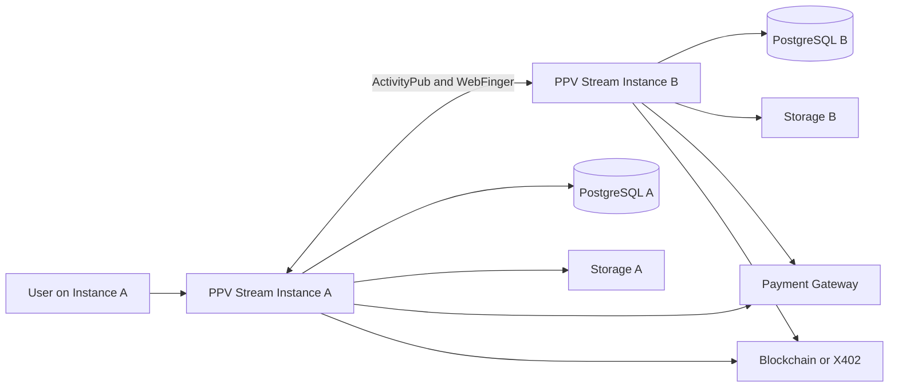
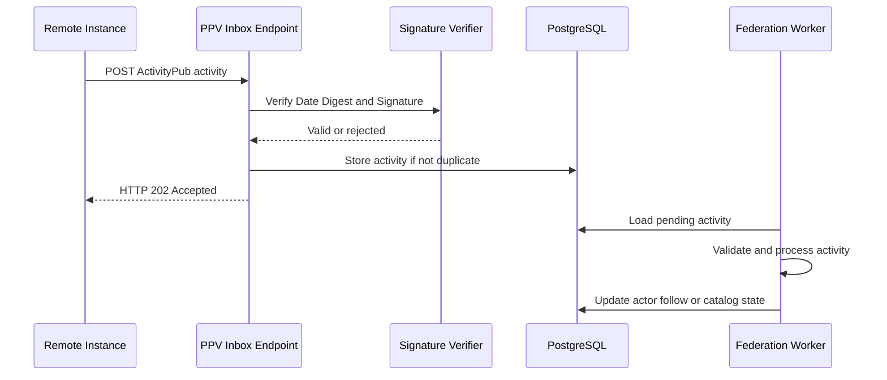
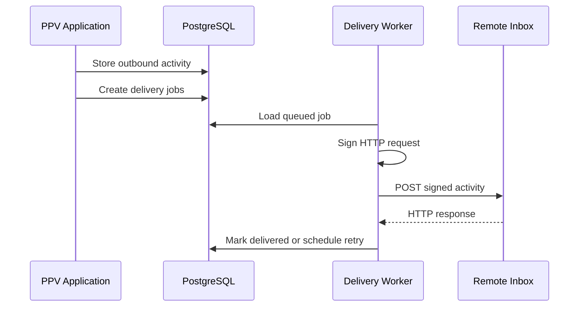

# Federated PPV Stream Implementation Guide

## 1. Purpose

This document defines the technical work required to evolve PPV Stream Rust from a single-instance pay-per-view platform into a federated video commerce network inspired by Mastodon and PeerTube.

If you are new to the federation work, start with [FEDERATED_LEARN.md](FEDERATED_LEARN.md) for the conceptual overview, then read [FEDERATED_INDEX_ONLY_ARCHITECTURE.md](FEDERATED_INDEX_ONLY_ARCHITECTURE.md) for the core boundary decision.

The target architecture allows independent PPV Stream servers to communicate with one another while keeping video files, payment processing, playback authorization, watermark generation, and private user data under the control of the origin server.

The recommended approach is:

- ActivityPub for identities, follows, timelines, creator profiles, public video metadata, comments, likes, and federation events
- WebFinger for account discovery
- HTTP Signatures for authenticated server-to-server requests
- Origin-server checkout for fiat and wallet payments
- X402 or blockchain settlement for optional cross-instance payment splitting
- Origin-server HLS delivery and watermarking
- Signed access grants for remote buyers

## 2. Goals

The federated implementation must support the following outcomes:

1. Every PPV Stream installation can operate independently.
2. Users have globally addressable identities such as `alice@example.com`.
3. A user on one instance can discover and follow a creator on another instance.
4. Public creator profiles and public video metadata can be synchronized between instances.
5. A remote user can purchase access to a video from its origin instance.
6. The origin instance remains authoritative for video files, prices, playback access, and payment confirmation.
7. Instances can block, mute, or restrict other instances.
8. Federation can be disabled entirely by the administrator.
9. Private information must never be exposed through federation.
10. The existing local-only marketplace must continue to work.

## 3. Non-Goals for the First Release

The first release should not attempt to implement every possible decentralized feature.

The following items are intentionally out of scope for the MVP:

- Shared wallet balance across instances
- Automatic fiat settlement between instances
- Full video file replication
- Distributed transcoding
- Distributed HLS segment hosting
- Cross-instance private chat
- Cross-instance password authentication
- Account migration with wallet balances
- Global moderation consensus
- Fully trustless fiat payment settlement

These features can be considered after the federation core is stable.

## 4. Recommended Federation Model

### 4.1 Federated Public Data

The following data may be federated:

- Creator username
- Display name
- Avatar
- Profile description
- Public profile URL
- Public video title
- Public video description
- Thumbnail
- Trailer URL
- Price and currency
- Category
- Content rating
- Publication status
- Publication date
- Follow activity
- Unfollow activity
- Public comments
- Likes
- Shares or announces
- Public creator announcements

### 4.2 Data That Must Remain Local

The following data must not be exposed through ActivityPub:

- Password hashes
- Session cookies
- Session IDs
- Email addresses unless explicitly public
- Phone numbers
- Bank account details
- Wallet balances
- Internal wallet transaction history
- Payment provider secrets
- Webhook secrets
- Private invoice metadata
- Private chat messages
- Signed HLS URLs
- Playback session IDs
- Raw HLS segments
- Watermark processing details
- Internal moderation notes
- Private purchase history

### 4.3 Origin Authority

The origin server is authoritative for:

- Creator identity ownership
- Video ownership
- Video price
- Video availability
- Payment confirmation
- Purchase records
- Playback authorization
- HLS delivery
- Watermark generation
- Video deletion
- Access revocation

Remote instances may cache public metadata, but they must not override origin data.

## 5. High-Level Architecture



## 6. Federation Protocols

### 6.1 ActivityPub

ActivityPub should be used for server-to-server federation.

Required concepts:

- Actor
- Object
- Activity
- Inbox
- Outbox
- Followers
- Following
- Shared inbox
- Create
- Update
- Delete
- Follow
- Accept
- Reject
- Undo
- Like
- Announce

### 6.2 WebFinger

WebFinger is required to resolve identities such as:

```text
acct:alice@example.com
```

Required endpoint:

```http
GET /.well-known/webfinger?resource=acct:alice@example.com
```

### 6.3 NodeInfo

NodeInfo is recommended so other federated software can identify the server type and capabilities.

Suggested endpoints:

```http
GET /.well-known/nodeinfo
GET /nodeinfo/2.1
```

### 6.4 HTTP Signatures

Every incoming federated request must be cryptographically verified.

Each local actor must have:

- Public key
- Private key
- Key identifier
- Actor URI

Each outbound request should sign at least:

- Request target
- Host
- Date
- Digest
- Content-Type where applicable

## 7. Global Identity Model

Local numeric or UUID identifiers are not sufficient for federation.

Every federated entity must have a globally unique URI.

Examples:

```text
https://example.com/users/alice
https://example.com/videos/550e8400-e29b-41d4-a716-446655440000
https://example.com/activities/550e8400-e29b-41d4-a716-446655440001
```

Recommended identity fields:

```text
actor_uri
object_uri
activity_uri
origin_domain
canonical_url
```

Local IDs should remain in use internally, but federated records must also store canonical URIs.

## 8. Database Changes

Create migrations for the following tables.

### 8.1 federation_instances

Stores known remote instances.

Suggested columns:

```sql
CREATE TABLE federation_instances (
    id UUID PRIMARY KEY,
    domain TEXT NOT NULL UNIQUE,
    base_url TEXT NOT NULL,
    software_name TEXT,
    software_version TEXT,
    shared_inbox_url TEXT,
    status TEXT NOT NULL DEFAULT 'active',
    trust_level TEXT NOT NULL DEFAULT 'unknown',
    last_seen_at TIMESTAMPTZ,
    last_error TEXT,
    created_at TIMESTAMPTZ NOT NULL DEFAULT NOW(),
    updated_at TIMESTAMPTZ NOT NULL DEFAULT NOW()
);
```

Possible statuses:

- active
- blocked
- silenced
- suspended
- unreachable

### 8.2 federation_actors

Stores local and remote actors.

```sql
CREATE TABLE federation_actors (
    id UUID PRIMARY KEY,
    local_user_id TEXT REFERENCES users(id),
    actor_uri TEXT NOT NULL UNIQUE,
    username TEXT NOT NULL,
    domain TEXT NOT NULL,
    display_name TEXT,
    inbox_url TEXT NOT NULL,
    outbox_url TEXT,
    followers_url TEXT,
    following_url TEXT,
    shared_inbox_url TEXT,
    public_key_id TEXT,
    public_key_pem TEXT NOT NULL,
    private_key_encrypted TEXT,
    avatar_url TEXT,
    profile_url TEXT,
    is_local BOOLEAN NOT NULL DEFAULT FALSE,
    is_deleted BOOLEAN NOT NULL DEFAULT FALSE,
    fetched_at TIMESTAMPTZ,
    created_at TIMESTAMPTZ NOT NULL DEFAULT NOW(),
    updated_at TIMESTAMPTZ NOT NULL DEFAULT NOW()
);
```

Only local actors should have an encrypted private key.

### 8.3 federation_follows

```sql
CREATE TABLE federation_follows (
    id UUID PRIMARY KEY,
    follower_actor_id UUID NOT NULL REFERENCES federation_actors(id),
    following_actor_id UUID NOT NULL REFERENCES federation_actors(id),
    activity_uri TEXT NOT NULL UNIQUE,
    status TEXT NOT NULL,
    created_at TIMESTAMPTZ NOT NULL DEFAULT NOW(),
    updated_at TIMESTAMPTZ NOT NULL DEFAULT NOW(),
    UNIQUE (follower_actor_id, following_actor_id)
);
```

Possible statuses:

- pending
- accepted
- rejected
- cancelled

### 8.4 federation_activities

Stores normalized incoming and outgoing activities.

```sql
CREATE TABLE federation_activities (
    id UUID PRIMARY KEY,
    activity_uri TEXT NOT NULL UNIQUE,
    activity_type TEXT NOT NULL,
    actor_uri TEXT NOT NULL,
    object_uri TEXT,
    direction TEXT NOT NULL,
    payload JSONB NOT NULL,
    processing_status TEXT NOT NULL DEFAULT 'pending',
    error_message TEXT,
    received_at TIMESTAMPTZ,
    processed_at TIMESTAMPTZ,
    created_at TIMESTAMPTZ NOT NULL DEFAULT NOW()
);
```

Directions:

- inbound
- outbound

### 8.5 federation_delivery_jobs

```sql
CREATE TABLE federation_delivery_jobs (
    id UUID PRIMARY KEY,
    activity_id UUID NOT NULL REFERENCES federation_activities(id),
    target_inbox_url TEXT NOT NULL,
    attempt_count INT NOT NULL DEFAULT 0,
    max_attempts INT NOT NULL DEFAULT 10,
    next_attempt_at TIMESTAMPTZ NOT NULL DEFAULT NOW(),
    status TEXT NOT NULL DEFAULT 'queued',
    last_http_status INT,
    last_error TEXT,
    delivered_at TIMESTAMPTZ,
    created_at TIMESTAMPTZ NOT NULL DEFAULT NOW(),
    updated_at TIMESTAMPTZ NOT NULL DEFAULT NOW()
);
```

### 8.6 remote_video_catalog

```sql
CREATE TABLE remote_video_catalog (
    id UUID PRIMARY KEY,
    object_uri TEXT NOT NULL UNIQUE,
    origin_actor_uri TEXT NOT NULL,
    origin_domain TEXT NOT NULL,
    title TEXT NOT NULL,
    description TEXT,
    thumbnail_url TEXT,
    trailer_url TEXT,
    canonical_url TEXT NOT NULL,
    price_amount NUMERIC,
    price_currency TEXT,
    content_rating TEXT,
    published_at TIMESTAMPTZ,
    raw_object JSONB NOT NULL,
    is_deleted BOOLEAN NOT NULL DEFAULT FALSE,
    fetched_at TIMESTAMPTZ NOT NULL DEFAULT NOW(),
    updated_at TIMESTAMPTZ NOT NULL DEFAULT NOW()
);
```

### 8.7 federated_purchase_receipts

```sql
CREATE TABLE federated_purchase_receipts (
    id UUID PRIMARY KEY,
    receipt_uri TEXT NOT NULL UNIQUE,
    buyer_actor_uri TEXT NOT NULL,
    video_object_uri TEXT NOT NULL,
    origin_instance TEXT NOT NULL,
    payment_method TEXT NOT NULL,
    amount NUMERIC NOT NULL,
    currency TEXT NOT NULL,
    payment_reference TEXT,
    signed_receipt JSONB NOT NULL,
    signature TEXT NOT NULL,
    status TEXT NOT NULL,
    purchased_at TIMESTAMPTZ NOT NULL,
    expires_at TIMESTAMPTZ,
    created_at TIMESTAMPTZ NOT NULL DEFAULT NOW()
);
```

### 8.8 remote_access_grants

```sql
CREATE TABLE remote_access_grants (
    id UUID PRIMARY KEY,
    buyer_actor_uri TEXT NOT NULL,
    video_id TEXT NOT NULL REFERENCES videos(id),
    receipt_id UUID REFERENCES federated_purchase_receipts(id),
    status TEXT NOT NULL DEFAULT 'active',
    granted_at TIMESTAMPTZ NOT NULL DEFAULT NOW(),
    expires_at TIMESTAMPTZ,
    revoked_at TIMESTAMPTZ,
    UNIQUE (buyer_actor_uri, video_id)
);
```

### 8.9 federation_domain_rules

```sql
CREATE TABLE federation_domain_rules (
    id UUID PRIMARY KEY,
    domain TEXT NOT NULL UNIQUE,
    action TEXT NOT NULL,
    reason TEXT,
    created_by TEXT,
    created_at TIMESTAMPTZ NOT NULL DEFAULT NOW(),
    updated_at TIMESTAMPTZ NOT NULL DEFAULT NOW()
);
```

Possible actions:

- allow
- silence
- reject_media
- suspend
- block

## 9. Existing Table Changes

### 9.1 users

Recommended additions:

```sql
ALTER TABLE users
ADD COLUMN actor_uri TEXT UNIQUE,
ADD COLUMN federation_enabled BOOLEAN NOT NULL DEFAULT TRUE,
ADD COLUMN discoverable BOOLEAN NOT NULL DEFAULT TRUE;
```

### 9.2 videos

Recommended additions:

```sql
ALTER TABLE videos
ADD COLUMN object_uri TEXT UNIQUE,
ADD COLUMN federation_visibility TEXT NOT NULL DEFAULT 'public',
ADD COLUMN federated_at TIMESTAMPTZ,
ADD COLUMN federation_updated_at TIMESTAMPTZ;
```

Visibility options:

- public
- unlisted
- followers
- local_only
- private

### 9.3 purchases

Recommended additions:

```sql
ALTER TABLE purchases
ADD COLUMN buyer_actor_uri TEXT,
ADD COLUMN video_object_uri TEXT,
ADD COLUMN origin_instance TEXT,
ADD COLUMN federated_receipt_id UUID;
```

## 10. Rust Module Structure

Add a new federation module.

```text
src/
  federation/
    mod.rs
    config.rs
    types.rs
    actor.rs
    activity.rs
    webfinger.rs
    nodeinfo.rs
    inbox.rs
    outbox.rs
    delivery.rs
    discovery.rs
    signatures.rs
    digest.rs
    resolver.rs
    processor.rs
    moderation.rs
    remote_catalog.rs
    purchase.rs
    access_grant.rs
    errors.rs
```

Suggested responsibilities:

### config.rs

- Federation feature flag
- Local domain
- Base URL
- Delivery retry settings
- Request timeout
- Maximum payload size
- Private network restrictions

### types.rs

- ActivityPub actor structures
- Activity structures
- Video object structures
- Public key structures
- Collection structures
- WebFinger response structures

### actor.rs

- Generate local actor JSON
- Generate actor public key
- Load local actor
- Cache remote actor
- Refresh remote actor

### webfinger.rs

- Resolve local account requests
- Parse `acct:` resources
- Return ActivityPub actor link

### inbox.rs

- Receive activities
- Verify signatures
- Validate payloads
- Deduplicate activities
- Queue processing

### outbox.rs

- Return local actor activities
- Paginate activities
- Create ordered collections

### delivery.rs

- Queue outbound deliveries
- Sign outbound requests
- Retry failed requests
- Handle shared inbox delivery

### discovery.rs

- Resolve remote handles
- Fetch WebFinger
- Fetch remote actor
- Validate remote URLs
- Cache remote results

### signatures.rs

- Generate actor RSA or Ed25519 keys
- Build HTTP Signature headers
- Verify inbound signatures
- Rotate keys

### moderation.rs

- Apply domain block rules
- Apply actor block rules
- Reject unwanted content
- Record moderation events

### purchase.rs

- Build remote checkout flow
- Create signed purchase receipt
- Verify signed receipts
- Confirm payment ownership

### access_grant.rs

- Map remote buyer identity to local video access
- Revoke remote access
- Check expiration
- Integrate with playback authorization

## 11. Cargo Dependencies

Evaluate and add suitable crates for:

- RSA or Ed25519 signatures
- PEM encoding
- HTTP date parsing
- URL parsing
- JSON-LD-compatible serialization
- Base64
- Cryptographic digest generation
- Secure random key generation

Possible crates to evaluate:

```toml
url = "2"
rsa = "0.9"
rand = "0.8"
pem = "3"
httpdate = "1"
http-signature-normalization = "0.7"
serde_with = "3"
```

Do not add dependencies without reviewing maintenance status, security history, and compatibility with the existing Rust version.

## 12. Required HTTP Endpoints

### 12.1 Discovery

```http
GET /.well-known/webfinger
GET /.well-known/nodeinfo
GET /nodeinfo/2.1
```

### 12.2 Actor Endpoints

```http
GET /users/:username
GET /users/:username/followers
GET /users/:username/following
GET /users/:username/outbox
POST /users/:username/inbox
```

### 12.3 Shared Inbox

```http
POST /inbox
```

### 12.4 Object Endpoints

```http
GET /federation/videos/:id
GET /activities/:id
```

### 12.5 Federation Management

```http
GET /admin/federation/instances
POST /admin/federation/instances/:domain/block
POST /admin/federation/instances/:domain/silence
POST /admin/federation/instances/:domain/allow
GET /admin/federation/activities
GET /admin/federation/delivery-jobs
POST /admin/federation/delivery-jobs/:id/retry
```

### 12.6 Remote Purchase

```http
GET /federation/checkout/:video_id
POST /api/federation/purchase/start
POST /api/federation/purchase/confirm
GET /api/federation/purchase/:receipt_id
POST /api/federation/access-grants
POST /api/federation/access-grants/:id/revoke
```

## 13. ActivityPub Object Mapping

### 13.1 User as Person

```json
{
  "@context": "https://www.w3.org/ns/activitystreams",
  "id": "https://example.com/users/alice",
  "type": "Person",
  "preferredUsername": "alice",
  "name": "Alice",
  "inbox": "https://example.com/users/alice/inbox",
  "outbox": "https://example.com/users/alice/outbox",
  "followers": "https://example.com/users/alice/followers",
  "following": "https://example.com/users/alice/following",
  "url": "https://example.com/public/profile/alice",
  "publicKey": {
    "id": "https://example.com/users/alice#main-key",
    "owner": "https://example.com/users/alice",
    "publicKeyPem": "-----BEGIN PUBLIC KEY-----..."
  }
}
```

### 13.2 Video as Video Object

```json
{
  "@context": [
    "https://www.w3.org/ns/activitystreams",
    {
      "price": "https://example.com/ns/price",
      "currency": "https://example.com/ns/currency",
      "purchaseUrl": "https://example.com/ns/purchaseUrl"
    }
  ],
  "id": "https://example.com/federation/videos/123",
  "type": "Video",
  "attributedTo": "https://example.com/users/alice",
  "name": "Rust Backend Masterclass",
  "summary": "Premium video course",
  "url": "https://example.com/public/watch.html?video_id=123",
  "icon": {
    "type": "Image",
    "url": "https://example.com/media/thumbnails/123.jpg"
  },
  "price": "5.00",
  "currency": "USD",
  "purchaseUrl": "https://example.com/federation/checkout/123",
  "published": "2026-06-20T10:00:00Z"
}
```

### 13.3 Create Activity

```json
{
  "@context": "https://www.w3.org/ns/activitystreams",
  "id": "https://example.com/activities/abc",
  "type": "Create",
  "actor": "https://example.com/users/alice",
  "object": {
    "id": "https://example.com/federation/videos/123",
    "type": "Video"
  }
}
```

## 14. Inbox Processing Flow



The inbox endpoint should return quickly. Heavy processing must be performed asynchronously.

## 15. Outbound Delivery Flow



## 16. Delivery Retry Policy

Recommended retry schedule:

```text
Attempt 1: immediately
Attempt 2: 1 minute
Attempt 3: 5 minutes
Attempt 4: 15 minutes
Attempt 5: 1 hour
Attempt 6: 4 hours
Attempt 7: 12 hours
Attempt 8: 24 hours
Attempt 9: 48 hours
Attempt 10: 72 hours
```

Use exponential backoff with random jitter.

After the maximum attempts, mark the job as failed and expose it in the admin dashboard.

## 17. Remote Purchase Architecture

### 17.1 Recommended MVP Flow

1. A user on Instance B discovers a video from Instance A.
2. Instance B displays cached public metadata.
3. The user selects purchase.
4. The user is redirected to Instance A.
5. Instance A verifies or creates a temporary remote buyer identity.
6. Instance A processes payment using wallet, fiat gateway, or X402.
7. Instance A generates a signed purchase receipt.
8. Instance A creates a remote access grant.
9. The user receives a short-lived playback session.
10. HLS content is streamed directly from Instance A.

### 17.2 Remote Buyer Identity

The buyer must be identified by an actor URI:

```text
https://instance-b.example/users/bob
```

Do not rely only on a username because usernames are not globally unique.

### 17.3 Signed Purchase Receipt

A purchase receipt should include:

```json
{
  "receipt_id": "urn:uuid:...",
  "buyer_actor": "https://instance-b.example/users/bob",
  "video_object": "https://instance-a.example/federation/videos/123",
  "seller_actor": "https://instance-a.example/users/alice",
  "amount": "5.00",
  "currency": "USD",
  "payment_method": "x402",
  "payment_reference": "0xabc...",
  "purchased_at": "2026-06-20T10:00:00Z",
  "expires_at": null,
  "issuer": "https://instance-a.example",
  "signature": "..."
}
```

The receipt must be signed by the origin instance.

## 18. Playback Authorization Changes

The existing playback authorization should be extended to support either:

- Local user ID
- Local username allowlist
- Remote actor URI access grant
- Valid signed purchase receipt

Suggested authorization sequence:

1. Validate local session or federated playback token.
2. Load video.
3. Confirm video ownership or local purchase.
4. If remote buyer, confirm active `remote_access_grants` record.
5. Confirm grant is not expired or revoked.
6. Create session-scoped HLS output.
7. Generate watermark containing a safe remote identity reference.
8. Return short-lived playback URL.

Do not place the full actor URI directly in visible watermark text if it exposes sensitive information. A shortened identity or receipt reference may be preferable.

## 19. Security Requirements

### 19.1 Signature Verification

Incoming federated requests must verify:

- `Date` header
- `Digest` header
- Signature key ID
- Signature algorithm
- Signed header list
- Request target
- Actor ownership of the public key
- Maximum clock skew

### 19.2 Replay Protection

Store recently processed activity IDs and reject duplicates.

Recommended protections:

- Unique activity URI constraint
- Maximum accepted request age
- Digest validation
- Nonce support for custom purchase APIs
- Idempotency keys

### 19.3 SSRF Protection

Remote actor discovery can introduce server-side request forgery risks.

The resolver must reject:

- localhost
- loopback addresses
- private IPv4 ranges
- private IPv6 ranges
- link-local addresses
- metadata service addresses
- non-HTTPS URLs in production
- excessive redirect chains
- redirects to private networks

Perform DNS resolution checks before requests and after redirects.

### 19.4 Payload Protection

Set strict limits for:

- Maximum request body size
- Maximum JSON nesting depth
- Maximum string length
- Maximum number of recipients
- Maximum attachment count
- Maximum remote image size

### 19.5 Content Sanitization

Sanitize all remote HTML before rendering.

Do not trust:

- Summary HTML
- Profile HTML
- Video description HTML
- Remote links
- Image metadata
- Embedded scripts

### 19.6 Domain Moderation

Administrators must be able to:

- Block an instance
- Silence an instance
- Reject media from an instance
- Suspend a remote actor
- Delete cached remote content
- Retry or cancel delivery jobs
- Review federation errors

### 19.7 Key Management

Private keys must:

- Be encrypted at rest
- Never appear in logs
- Support rotation
- Be backed up securely
- Be isolated from public actor responses

## 20. Configuration

Add environment variables similar to:

```env
FEDERATION_ENABLED=true
FEDERATION_DOMAIN=example.com
FEDERATION_BASE_URL=https://example.com
FEDERATION_SHARED_INBOX=true
FEDERATION_REQUIRE_HTTPS=true
FEDERATION_MAX_BODY_BYTES=1048576
FEDERATION_REQUEST_TIMEOUT_SECONDS=10
FEDERATION_MAX_REDIRECTS=3
FEDERATION_MAX_CLOCK_SKEW_SECONDS=300
FEDERATION_DELIVERY_WORKERS=4
FEDERATION_DELIVERY_MAX_ATTEMPTS=10
FEDERATION_REMOTE_FETCH_TTL_SECONDS=3600
FEDERATION_ALLOW_PRIVATE_NETWORKS=false
FEDERATION_DEFAULT_VISIBILITY=public
FEDERATION_KEY_ENCRYPTION_SECRET=change-me
```

The application must refuse to start federation in production if required security settings are missing.

## 21. Admin Interface Requirements

Add an administration section for federation.

Recommended pages:

### Federation Overview

- Enabled or disabled status
- Local domain
- Known instances
- Active remote actors
- Pending deliveries
- Failed deliveries
- Incoming activity volume
- Outgoing activity volume

### Instance Management

- Domain
- Software name
- Last seen
- Trust level
- Current moderation rule
- Last delivery error

### Activity Log

- Activity type
- Direction
- Actor
- Object
- Processing status
- Error message
- Timestamp

### Delivery Queue

- Target inbox
- Attempt count
- Next retry
- HTTP status
- Retry action
- Cancel action

### Moderation

- Block domain
- Silence domain
- Reject media
- Suspend actor
- Remove cached content

## 22. User Interface Requirements

Add user-facing federation features.

Recommended features:

- Search by `username@domain`
- Follow remote creator
- Unfollow remote creator
- View remote creator profile
- Browse remote video metadata
- Open remote checkout
- Show content origin domain
- Show whether content is local or remote
- Report remote content
- Hide remote content

A remote video must be clearly labeled with its origin instance.

## 23. Background Workers

Add dedicated asynchronous workers for:

- Outbound ActivityPub delivery
- Incoming activity processing
- Remote actor refresh
- Remote object refresh
- Failed delivery retry
- Expired cache cleanup
- Expired access grant cleanup
- Dead instance detection

Workers should not block the main Axum request path.

## 24. Observability

Add structured logs and metrics.

Recommended metrics:

```text
federation_inbox_requests_total
federation_inbox_rejected_total
federation_signature_failures_total
federation_activities_processed_total
federation_delivery_success_total
federation_delivery_failure_total
federation_delivery_retry_total
federation_remote_fetch_total
federation_remote_fetch_failure_total
federation_known_instances_total
federation_remote_actors_total
federation_remote_videos_total
federation_purchase_receipts_total
```

Logs must not include:

- Private keys
- Session cookies
- Payment secrets
- Full signed playback tokens
- Sensitive invoice metadata

## 25. Testing Strategy

### 25.1 Unit Tests

Create unit tests for:

- WebFinger parsing
- Actor serialization
- Activity serialization
- Signature generation
- Signature verification
- Digest generation
- URL validation
- SSRF protection
- Domain rule evaluation
- Activity deduplication
- Purchase receipt signing
- Purchase receipt verification
- Access grant expiration

### 25.2 Integration Tests

Run two PPV Stream instances during tests:

```text
instance-a.test
instance-b.test
```

Test scenarios:

1. Resolve remote user through WebFinger.
2. Fetch remote actor.
3. Follow remote creator.
4. Receive Accept activity.
5. Publish local video.
6. Deliver Create activity.
7. Cache remote video.
8. Update remote video metadata.
9. Delete remote video metadata.
10. Block remote instance.
11. Reject request with invalid signature.
12. Reject duplicate activity.
13. Retry failed delivery.
14. Complete remote purchase flow.
15. Create remote access grant.
16. Authorize remote playback.
17. Revoke remote access.

### 25.3 Security Tests

Test at least:

- Invalid signature
- Expired Date header
- Modified request body
- Incorrect Digest header
- Unknown key ID
- Actor key mismatch
- Replay attack
- Duplicate activity
- Private IP resolution
- Redirect to private IP
- Oversized JSON body
- Deeply nested JSON
- Malicious HTML
- Cross-site scripting payload
- Excessive recipient list
- Delivery flood

### 25.4 Compatibility Tests

Where practical, test federation compatibility with:

- Mastodon
- PeerTube
- Other ActivityPub implementations

Compatibility should initially focus on profile discovery, follow, and public activity delivery.

## 26. Development Phases

### Phase 0: Architecture and Safety Foundation

Deliverables:

- Final federation architecture decision
- Threat model
- Database migration plan
- Configuration design
- Feature flag
- Domain validation utility
- SSRF protection utility

Acceptance criteria:

- Federation can be enabled or disabled
- No remote network request can reach blocked private ranges
- Schema migrations are reversible

### Phase 1: Identity and Discovery

Deliverables:

- Local actor generation
- WebFinger endpoint
- Actor endpoint
- Public key generation
- Remote actor resolver
- Remote actor cache
- NodeInfo endpoint

Acceptance criteria:

- A local user can be resolved as `username@domain`
- A remote actor can be resolved and cached
- Local actor JSON contains a valid public key

### Phase 2: Follow Federation

Deliverables:

- Inbox
- Outbox
- Followers collection
- Following collection
- Follow activity
- Accept activity
- Reject activity
- Undo activity
- HTTP Signature validation
- Delivery queue

Acceptance criteria:

- A user on Instance A can follow a user on Instance B
- Follow status is synchronized on both instances
- Invalid signatures are rejected
- Failed deliveries are retried

### Phase 3: Federated Video Catalog

Deliverables:

- Video ActivityPub object
- Create activity on publication
- Update activity on metadata changes
- Delete activity on removal
- Remote video cache
- Remote video profile page
- Origin labeling

Acceptance criteria:

- A local video appears on follower instances
- Metadata updates propagate
- Deleted videos are removed from remote catalogs
- Video files remain on the origin instance

### Phase 4: Remote Purchase MVP

Deliverables:

- Remote checkout redirect
- Remote buyer actor mapping
- Signed purchase receipts
- Remote access grants
- Playback token exchange
- Remote playback authorization

Acceptance criteria:

- A remote user can purchase an origin video
- Payment is confirmed by the origin server
- A signed receipt is generated
- Playback works only with a valid active grant
- Revoked grants cannot play content

### Phase 5: Federated Social Features

Deliverables:

- Like
- Undo Like
- Announce
- Public comments
- Delete comment
- Report remote content

Acceptance criteria:

- Social actions synchronize across instances
- Blocked instances cannot send accepted content
- Remote HTML is sanitized

### Phase 6: Federated Affiliate and X402 Settlement

Deliverables:

- Remote affiliate actor identity
- Signed referral attribution
- Cross-instance X402 payment split
- Settlement receipt
- Affiliate commission receipt

Acceptance criteria:

- Referral attribution cannot be modified after payment
- Smart contract or settlement proof is verifiable
- Revenue split matches configured percentages

## 27. Suggested Issue Breakdown

Create implementation issues for:

1. Add federation configuration and feature flag
2. Add federation database migrations
3. Add global actor and object URI fields
4. Implement WebFinger endpoint
5. Implement NodeInfo endpoint
6. Implement local ActivityPub actor endpoint
7. Implement actor key generation and storage
8. Implement HTTP Signature signing
9. Implement HTTP Signature verification
10. Implement remote actor resolver
11. Add SSRF-safe HTTP client
12. Implement shared inbox endpoint
13. Implement activity deduplication
14. Implement inbound activity processor
15. Implement outbound delivery queue
16. Implement delivery retry worker
17. Implement Follow activity
18. Implement Accept and Reject activities
19. Implement Undo Follow
20. Implement followers and following collections
21. Implement federated video object
22. Publish Create activity for video
23. Publish Update activity for video
24. Publish Delete activity for video
25. Implement remote video catalog
26. Add remote creator profile page
27. Add remote video page
28. Add domain moderation rules
29. Add federation admin dashboard
30. Add signed purchase receipt format
31. Add remote buyer mapping
32. Add remote access grant validation
33. Extend playback authorization
34. Add federation metrics and logging
35. Add federation integration test environment
36. Add compatibility tests with Mastodon and PeerTube
37. Add federation operator documentation
38. Add federation privacy documentation
39. Add federation troubleshooting guide
40. Add federation API documentation

## 28. Definition of Done

The federation feature is considered production-ready only when:

- All migrations have rollback scripts
- Federation can be disabled without breaking local features
- WebFinger passes integration tests
- Actor endpoints return valid ActivityPub JSON
- Incoming signatures are verified
- Outbound requests are signed
- Activity IDs are deduplicated
- Delivery retries use backoff and jitter
- SSRF protections are tested
- Private network access is blocked by default
- Remote HTML is sanitized
- Domain blocking works
- Remote catalog updates correctly
- Remote purchase receipts are signed and verifiable
- Playback access is enforced at the origin server
- Private data is not exposed
- Structured logs and metrics exist
- Admin controls exist
- Two-instance end-to-end tests pass
- Security review is completed
- Documentation is complete

## 29. Recommended MVP Scope

The recommended first milestone should contain only:

1. Federation feature flag
2. WebFinger
3. ActivityPub actor endpoint
4. Public key management
5. HTTP Signature signing and verification
6. Inbox and outbox
7. Follow, Accept, Reject, and Undo
8. Remote actor cache
9. Federated public video metadata
10. Create, Update, and Delete video activities
11. Remote video catalog
12. Instance block and silence rules
13. Delivery queue and retry worker
14. Two-instance integration tests

Remote purchasing should be implemented after the federation identity and catalog layers are stable.

## 30. Final Architecture Principle

The implementation must preserve this principle:

> Federation distributes identity, discovery, public metadata, and social activity. The origin server retains control of payment, entitlement, video files, watermarking, and playback.

This separation keeps the system decentralized without weakening content protection or payment integrity.
