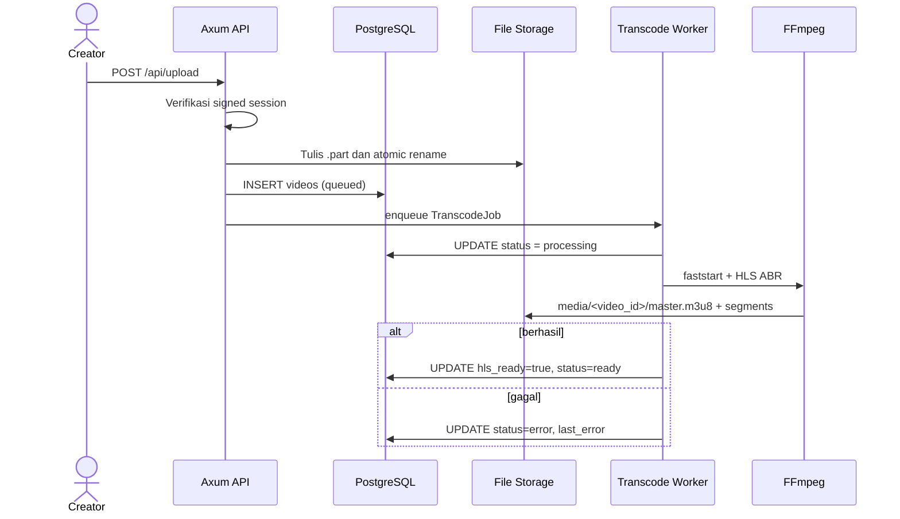
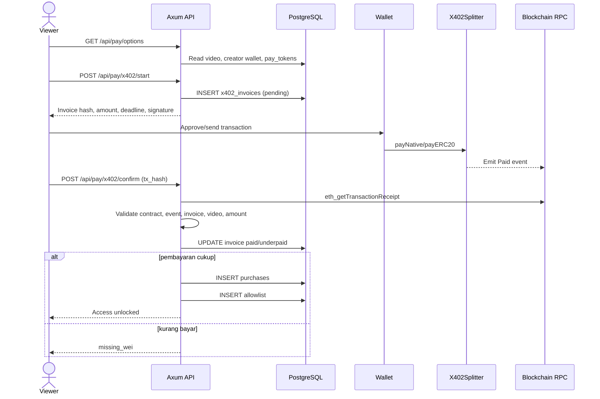
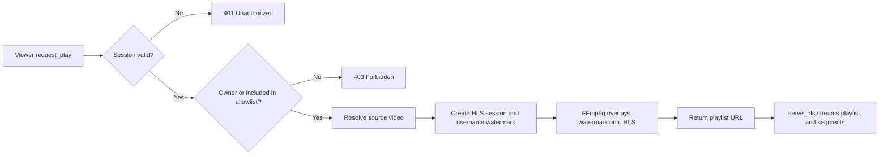
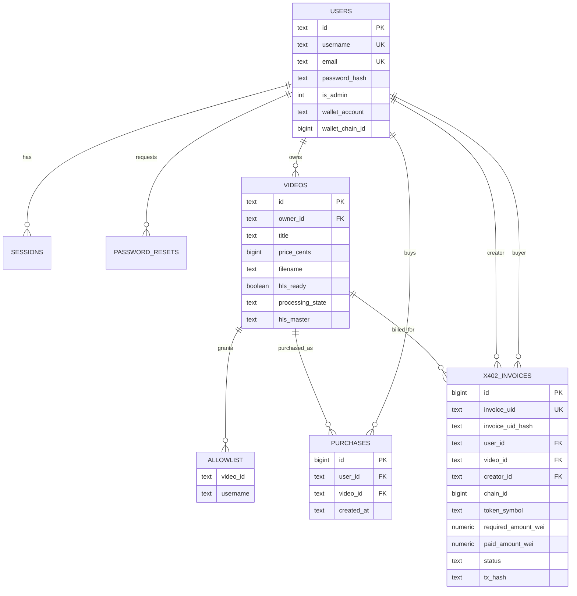

# 🎬 PPV Stream — Rust-Based Pay-Per-View Video Platform

**PPV Stream** is a secure video streaming application built with **Rust (Axum)** and **PostgreSQL**, designed for independent creators to monetize their content fairly through a **Pay-Per-View (PPV)** model.  

It features watermark-protected HLS streaming, authentication, upload management, and user dashboards.

**PPV Stream Rust** empowers anyone to build their own secure video streaming platform — like having your own version of **OnlyFans or Netflix**, but fully **open-source** and **privacy-controlled**.  

Each video is streamed via encrypted HLS with forensic watermarking to discourage piracy.

🎥 **Demo on YouTube:**  
🔗 [https://www.youtube.com/watch?v=WOsDwBcD03A](https://www.youtube.com/watch?v=WOsDwBcD03A)

🔗 [https://www.youtube.com/watch?v=IuSjkMoYEHk](https://www.youtube.com/watch?v=IuSjkMoYEHk)

🔗 [https://www.youtube.com/watch?v=dm8eRdstBHY](https://www.youtube.com/watch?v=dm8eRdstBHY)

---

## 🌍 Vision

To make it possible for every creator, teacher, performer, or filmmaker to **earn money directly from their audience**, using a fair and transparent pay-per-view system that protects their creative rights.

PPV Stream Rust is **open-source**, **self-hosted**, and **built for creators who want independence** — no centralized platform, no gatekeepers, and no hidden fees.

---

## 💡 New Feature: C2C Marketplace

PPV Stream Rust makes it easy for anyone to create a **video streaming marketplace** — similar to **OnlyFans**, but **consumer-to-consumer (C2C)**.

Users can **pay other users directly** to watch exclusive content, tutorials, music performances, religious broadcasts, short films, or personal vlogs.

This model allows:

* 💸 **Direct payments** between viewers and creators (no middleman)
* 🧾 **Transparent transactions** for every pay-per-view event
* 🌐 **Independent video portals** that anyone can host and brand as their own marketplace

---

## ⚙️ Built-in X402 Smart Contract Payment

The C2C system is powered by the **X402 payment contract**, a Solidity-based module integrated into PPV Stream Rust.

With **X402**, every video purchase is securely processed on the blockchain, ensuring **trust, transparency, and automation**.

Key features of the X402 integration:

* 🔐 **Decentralized Settlement** — funds are transferred directly from viewer → creator via on-chain transaction.
* ⚖️ **Auto-Split Fees** — payments are automatically divided between the **creator (e.g., 90%)** and **platform admin (e.g., 10%)**.
* 💰 **Multi-Token Support** — users can pay using **native coins (MEGA, MATIC, ETH)** or **ERC-20 tokens (USDC, USDT, etc.)**.
* 🪙 **Transparent Ledger** — all `Paid` events are logged on-chain with invoice UID, payer, creator, and amount in wei.
* 🧾 **Invoice Hashing (Keccak256)** — every invoice has a unique hash (`invoice_uid_hash`) that binds the payment to the specific video ID.

---

**Example workflow:**

1. Viewer clicks *Buy with Crypto (X402)*.
2. System creates an on-chain invoice (`invoice_uid`).
3. MetaMask opens and executes `payNative` or `payERC20`.
4. The smart contract emits a `Paid` event — funds automatically go to the creator and admin wallets.
5. Viewer instantly gains access to the video (`allowlist` updated).

---

This makes PPV Stream Rust not only a **decentralized pay-per-view platform**, but also a **ready-to-use C2C video marketplace** with **trustless crypto payments** and **full ownership control** for every creator.

Here’s the  summary updated october 26th, 2025 — clearly structured and focused on **performance**, **security**, and **data flow** differences between the old and new logic:

---

# 1) Video Upload

* **Old:** wrote files directly to the target using `File::create` + `write_all` per chunk.
* **New:**

  * Uses **Buffered I/O** with `BufWriter` (~1 MB) → fewer syscalls.
  * Writes to a temporary `*.part` file, then **atomically renames** it → prevents half-written files.
  * Enforces **file size limit** (`MAX_UPLOAD_BYTES`) and counts bytes in real time.
  * Adds **extension whitelist** (`ALLOW_EXTS`) and **MIME sniffing** via `infer`.
  * If DB insert fails, the file is **cleaned up**.
  * Logs file size and storage location.

---

# 2) Transcoding Worker

* **Old:** no `faststart`; inconsistent ABR quality; several missing functions.
* **New:**

  * Adds **MP4 faststart** (`-c copy -movflags +faststart`) before HLS → faster initial seeking.
  * Supports **multi-rendition ABR** (240p/360p/480p) in **a single ffmpeg process** using `-filter_complex` + `-var_stream_map` → better CPU/IO efficiency.
  * Includes **anti-upscale** logic (ladder adjusts to source height).
  * Handles **silent audio** with `anullsrc` + `-shortest`.
  * Uses **Semaphore** for controlled concurrency.
  * DB status is clearly tracked: `processing → ready|error`, with `last_error` and `hls_master` path stored.
  * Clean output structure under `media/<video_id>`; includes `master.m3u8` and variant subfolders.

---

# 3) FFMPEG Runner & Probing

* **Old:** `transcode_hls` ran raw command args, no dedicated working directory.
* **New:**

  * Introduces `run_ffmpeg(args, work_dir)` → all output written inside the safe target folder.
  * `transcode_hls` now truly runs inside its `session_dir`.
  * Adds helpers: `ffprobe_duration`, `ffprobe_dimensions`, `ffprobe_has_audio`.
  * HLS ABR encoding is now a utility function respecting `hwaccel` (default: CPU).

---

# 4) Streaming (Play) & HLS Serving

* **Old:** read entire HLS file into memory (`Vec<u8>`) before sending; watermark logic similar.
* **New:**

  * Streams files using **`ReaderStream`** → no full file loaded in RAM.
  * Consistent **`Cache-Control: no-store`** headers.
  * Stricter path and extension validation.
  * Moving watermark remains, and ffmpeg threads are set to `num_cpus()`.

---

# 5) Sessions & Cookies

* **Old:** stored plain `sid` cookie; fixed 7-day TTL; no integrity protection.
* **New:**

  * TTL now configurable (`SESSION_TOKEN_TTL`).
  * Cookie **signed with HMAC-SHA256** (`b64(sid).b64(sig)`) → prevents forgery.
  * Secure cookie attributes: `HttpOnly`, `SameSite=Lax`.
  * API now requires `&Config` for access to `hmac_secret` and TTL:

    * `create_session(pool, &cfg, user_id, is_admin, cookies)`
    * `destroy_session(pool, &cfg, cookies)`
    * `current_user_id(pool, &cfg, cookies)`

---

# 6) Configuration & Directories

* **Old:** `media_dir` sometimes defaulted to `hls_root`; `tmp_dir` fixed; no `allow_exts`.
* **New:**

  * Default **`media_dir = media/`**, with separate **`hls_root`** for temporary HLS sessions.
  * **`tmp_dir`** now cross-platform (uses OS temp; `/dev/shm` on Linux if available).
  * **`ensure_dirs`** creates all required directories, including `hls_root`.
  * `allow_exts` read from `ALLOW_EXTS`.
  * Startup logs redact DB credentials.

---

# 7) Security & Robustness

* **Old:** potential race conditions / partial uploads; cookies could be forged; full-file reads for streaming.
* **New:**

  * Atomic rename + size limit + MIME validation on upload.
  * HMAC-signed cookies + expired-session cleanup.
  * Streaming I/O for HLS serving.
  * `last_error` written to DB on failures for easier diagnostics.

---

# 8) Migration Impact (Changed APIs)

* `sessions::*` functions now require `&Config`.
* `Worker::new(pool, cfg, concurrency)` stores `cfg` for TTL/dirs.
* `ffmpeg::run_ffmpeg(args, work_dir)` now used by both worker and streaming layers.
* New or updated environment variables:
  `ALLOW_EXTS`, `MAX_UPLOAD_BYTES`, `SESSION_TOKEN_TTL`, `HMAC_SECRET`, `HLS_ROOT`, `MEDIA_DIR`, `TMP_DIR`, `WATERMARK_FONT`.

---

## Summary

The new version is significantly **faster** (buffered I/O, single-process multi-rendition, faststart), **more memory-efficient** (streamed HLS delivery), and far more **secure** (HMAC cookies, path validation, size & MIME checks), while offering better **observability** (DB status and error logging).


## 🚀 Key Features

* 🔐 **User & Admin Authentication** (login/register/reset password)  
* 🎥 **Video Upload** (MP4, stored securely in `/storage/`)  
* 💧 **Dynamic Watermarking** – watermark moves randomly every few seconds  
* ⚡ **HLS Transcoding via FFmpeg** – fast, segmented streaming  
* 💰 **Pay-Per-View Access** – users pay per video  
* 👥 **Allowlist System** – creators can manually grant view access  
* 📊 **Dashboard** for video management and viewer control  
* 🖥️ **Responsive Frontend** – HTML + JS in `/public`  
* 🧩 **Admin Panel** – manage users and video content  
* 💵 **USD → IDR Conversion** for pricing ($1 = Rp17,000)  

---

## 🔄 Business Processes

This section describes the platform's primary business workflows from the perspectives of viewers, creators, payments, and system operations.

### Primary Actors

| Actor | Responsibilities |
|---|---|
| **Viewer / buyer** | Registers, logs in, selects a video, pays for access, and watches unlocked content. |
| **Creator / video owner** | Completes payment profile details, uploads videos, sets prices, manages metadata, and grants manual access. |
| **Platform administrator** | Bootstraps or logs in as an administrator and monitors users, sessions, videos, allowlists, purchases, and password resets. |
| **Backend system** | Authenticates sessions, stores metadata, runs transcoding, verifies payments, manages access rights, and serves HLS. |
| **X402 smart contract** | Processes on-chain payments and splits funds between the creator and administrator according to basis points signed by the backend. |

### 1. Registration, Login, and Sessions

1. A user registers through `POST /auth/register`.
2. The backend validates the input, hashes the password with Argon2, and creates the user record.
3. A user logs in through `POST /auth/login`; an administrator uses `POST /admin/login`.
4. After validating the credentials, the backend creates a database session and sends an HMAC-SHA256-signed `ppv_session` cookie.
5. Every protected endpoint verifies the cookie signature, loads the session, and confirms that it has not expired.
6. Logging out removes both the database session and browser cookie.
7. During password recovery, a time-limited, single-use token is stored and later marked as `used` after the password is changed successfully.

### 2. Creator Onboarding and Profile Management

1. Every user can act as a creator; there is no separate creator table or role.
2. A creator updates their profile through `POST /api/profile_update`.
3. Bank account details, blockchain wallet, preferred chain, WhatsApp number, and profile description are stored on the user record.
4. The creator wallet must be present and valid before a buyer can start an X402 payment.

### 3. Video Upload and Processing

1. An authenticated creator sends a multipart form to `POST /api/upload` containing `title`, `price_cents`, and `file`.
2. The backend validates the extension and size, writes the upload to a temporary `*.part` file, and then performs an atomic rename.
3. Video metadata is created with the initial `queued` status.
4. A job is submitted to the in-memory transcoding worker.
5. The worker changes the status to `processing`, creates a fast-start MP4, and generates adaptive-bitrate HLS with FFmpeg.
6. On success, the video is assigned `hls_ready = true` and `processing_state = 'ready'`. On failure, its status becomes `error` and the cause is stored in `last_error`.
7. The creator can update the title, description, and price through `POST /api/video_update`.

> **Operational note:** the transcode queue currently resides in the application process memory. Queued jobs do not survive a process restart, although video metadata and the last recorded status remain in PostgreSQL.

### 4. Discovery and Manual Access

1. The marketplace loads its catalog through `GET /api/videos`.
2. A creator retrieves their own videos through `GET /api/my_videos`.
3. A creator can search for users through `GET /api/user_lookup`.
4. A creator grants manual access through `POST /api/allow`.
5. The backend confirms that the requester owns the video and then adds the `(video_id, username)` pair to the allowlist.

### 5. PPV Purchase with X402

1. A viewer selects a video and requests payment options through `GET /api/pay/options?video_id=...`.
2. The backend loads the video price, creator wallet, and active payment tokens from the database.
3. The viewer selects a chain and token, then sends `POST /api/pay/x402/start`.
4. The backend creates a unique invoice, calculates the token amount in its smallest unit (`wei`), stores the invoice hash, sets an expiration time, and signs the smart-contract payment payload.
5. The viewer's wallet calls the X402 contract with the payload. The contract transfers and splits the funds between the creator and administrator, then emits a `Paid` event.
6. Access can be finalized through either of two paths:
   * **HTTP confirmation** — the frontend sends the transaction hash to `POST /api/pay/x402/confirm`; the backend reads the RPC receipt and validates the contract address, event, invoice hash, video ID, and payment amount.
   * **Optional watcher** — when the `x402-watcher` feature and `WATCHER_ENABLE=1` are enabled, the backend listens for `Paid` events over WebSocket.
7. The invoice is updated to `paid` or `underpaid`.
8. A full payment creates a purchase record and adds the viewer to the allowlist idempotently.

> **Playback authorization source:** viewing access currently depends on video ownership or the presence of the viewer's username in `allowlist`. The `purchases` table acts as the purchase ledger and audit trail; a successful payment also writes to `allowlist` to unlock playback.

### 6. Playback and Content Protection

1. A viewer requests playback through `GET /api/request_play?video_id=...`.
2. The backend validates the session and checks whether the viewer owns the video or appears in the allowlist.
3. The backend resolves the source file, creates a temporary HLS session directory, and generates a watermark containing the username and timestamp.
4. FFmpeg creates a session-specific HLS stream with a moving watermark.
5. The backend returns the `/hls/:session/master.m3u8` playlist URL.
6. Playlists and segments are streamed with `Cache-Control: no-store` and validated path and file names.

### 7. Administrator Monitoring

1. An administrator logs in with an account whose `is_admin` flag is enabled.
2. The `GET /admin/data` endpoint validates both the session and administrator role.
3. The dashboard displays records and aggregate counts for users, sessions, videos, allowlists, purchases, and password resets.
4. The `/setup_admin` endpoint can create or promote the initial administrator when a bootstrap token is configured.

---

## 🧭 Business Process-to-Code Mapping

### Mapping Summary

| Business process | HTTP route / trigger | Primary implementation | Primary effects |
|---|---|---|---|
| User registration | `POST /auth/register` | `src/handlers/auth_user.rs::post_register` | Inserts a user with a password hash. |
| User login/logout | `POST /auth/login`, `POST /auth/logout` | `src/handlers/auth_user.rs`, `src/sessions.rs` | Creates or removes the session and signed cookie. |
| Administrator login/logout | `POST /admin/login`, `POST /admin/logout` | `src/handlers/auth_admin.rs`, `src/sessions.rs` | Validates `is_admin` and manages the session. |
| Forgot/reset password | `POST /auth/forgot`, `POST /auth/reset` | `src/handlers/password.rs`, `src/handlers/auth_user.rs` | Creates a reset token, replaces the password hash, and marks the token as used. |
| Creator profile | `GET /api/profile`, `POST /api/profile_update` | `src/handlers/users.rs` | Reads or updates profile, contact, bank, and wallet details. |
| Marketplace browsing | `GET /api/videos` | `src/handlers/video.rs::list_videos` | Joins video data with creator profile data. |
| Video upload | `POST /api/upload` | `src/handlers/upload.rs::upload_video` | Writes the file, inserts video metadata, and enqueues a job. |
| Video transcoding | Internal trigger after upload | `src/worker.rs`, `src/ffmpeg.rs` | Updates processing status and produces ABR HLS media. |
| Video management | `GET /api/my_videos`, `POST /api/video_update` | `src/handlers/video.rs` | Reads creator-owned videos and updates metadata or price. |
| Manual access grant | `GET /api/user_lookup`, `POST /api/allow` | `src/handlers/video.rs` | Validates ownership and inserts an allowlist entry. |
| Payment options | `GET /api/pay/options` | `src/handlers/pay.rs::pay_options` | Reads the price, creator wallet, and active tokens. |
| X402 invoice creation | `POST /api/pay/x402/start` | `src/handlers/pay.rs::x402_start` | Inserts an invoice and creates the payment signature. |
| Payment confirmation | `POST /api/pay/x402/confirm` | `src/handlers/pay.rs::x402_confirm` | Verifies the receipt/event, updates the invoice, and inserts purchase and allowlist records. |
| Asynchronous payment event | `Paid` event over WSS | `src/services/x402_watcher.rs` | Matches the invoice hash and unlocks access. |
| Playback authorization | `GET /api/request_play` | `src/handlers/stream.rs`, `src/handlers/video.rs::user_has_view_access` | Checks ownership/allowlist access and generates watermarked HLS. |
| HLS delivery | `GET /hls/:session/:file` | `src/handlers/stream.rs::serve_hls` | Streams a playlist or segment from the session directory. |
| Administrator monitoring | `GET /admin/data` | `src/handlers/admin.rs::admin_data` | Reads operational records and entity counts. |

### Upload-to-Ready Flow



### Flow Pembayaran sampai Unlock



### Flow Playback



---

## 🗄️ Business Process-to-Database Mapping

### Entities and Responsibilities

| Table | Business role | Written by | Read by / important relationships |
|---|---|---|---|
| `users` | User/admin identity, creator profile, and payment destination. | Registration, administrator setup, profile update, password reset. | Authentication, video catalog, payments, watermarking, and administrator dashboard. Referenced by sessions, videos, purchases, resets, and invoices. |
| `sessions` | Server-side login sessions with a TTL and administrator flag. | User/admin login; removed on logout or expiration. | Every protected endpoint through `sessions::current_user_id`. |
| `password_resets` | Single-use password recovery tokens. | Forgot-password and reset-password flows. | Token, expiration, and `used` status validation. |
| `videos` | PPV products containing ownership, title, description, price, source file, and HLS status. | Upload handler, transcode worker, video update handler. | Marketplace, creator dashboard, access checks, payments, playback, and administrator dashboard. |
| `allowlist` | Playback permission source for each `(video_id, username)` pair. | Manual grants, X402 confirmation, or watcher. | Playback authorization and creator dashboard viewer lists. |
| `purchases` | Ledger of user purchases for videos. | X402 confirmation or watcher. | Auditing and administrator dashboard; not read directly for playback authorization. |
| `pay_tokens` | Master data for supported payment tokens and chains. | Migrations, seed data, or database operations. | Payment options and token validation during invoice creation. |
| `x402_invoices` | On-chain payment lifecycle from quote to paid/underpaid. | Payment start, payment confirmation, and watcher. | Invoice matching, amount validation, transaction auditing, and access unlocking. |
| `pay_tokens_compat` | Compatibility view for legacy and current token column names. | Created by a migration. | Preserves compatibility for queries or integrations that still use the `erc20` alias. |

### Primary Data Relationships



### Status and Transition Mapping

| Entity | Status | Meaning and transition |
|---|---|---|
| `videos.processing_state` | `queued` | The upload and metadata are stored, and the job is waiting for a worker. |
| `videos.processing_state` | `processing` | The worker is running fast-start processing and transcoding. |
| `videos.processing_state` | `ready` | HLS generation succeeded; `hls_ready=true` and `hls_master` are set. |
| `videos.processing_state` | `error` | Job enqueueing or transcoding failed; details are stored in `last_error`. |
| `x402_invoices.status` | `pending` | The invoice exists and is waiting for payment or confirmation. |
| `x402_invoices.status` | `paid` | A valid event satisfies the required amount; purchase and allowlist records are created. |
| `x402_invoices.status` | `underpaid` | A valid event paid less than `required_amount_wei`; access remains locked. |
| `x402_invoices.status` | `expired` / `cancelled` | Schema-supported lifecycle states for expired or cancelled invoices. |

### Source of Truth by Requirement

| Requirement | Source of truth |
|---|---|
| Creator identity and profile | `users` |
| Login status | `sessions` plus the signed `ppv_session` cookie |
| Content price and ownership | `videos` |
| Transcode readiness | `videos.hls_ready`, `videos.processing_state`, `videos.hls_master` |
| Playback permission | Ownership through `videos.owner_id` **or** a matching entry in `allowlist` |
| Purchase history | `purchases` |
| Crypto payment status and proof | `x402_invoices` |
| Available payment tokens | `pay_tokens` |
| Original video file | Configured upload/storage directory |
| Worker-generated HLS | `media_dir/<video_id>/` |
| Per-viewer watermarked HLS | `hls_root/<session>/` |

### Migration Order

The core database migrations are stored in `sql/001_*.sql` through `sql/012_*.sql`, while X402 additions are stored in `migrations/013_*.sql` and later files. Run:

```bash
make migrate
```

This target applies every file in `sql/` and then `migrations/` in version order. The application also runs SQLx migrations from `sql/` during startup, but deployments that use X402 must still run `make migrate` so the `pay_tokens` and `x402_invoices` schemas are available.

---

## 🧱 Project Structure

```
ppv_stream/
.
├── Cargo.lock
├── Cargo.toml
├── Dockerfile
├── Makefile
├── README.md
├── a
├── contracts
│   ├── Dockerfile
│   ├── contracts
│   │   └── X402Splitter.sol
│   ├── guidance_smartcontract_deployment
│   ├── hardhat.config.js
│   ├── package.json
│   └── scripts
│       ├── check_balance.js
│       ├── deploy_x402.js
│       └── estimate_gas_cost.js
├── docker-compose.yml
├── migrations
│   ├── 013_tokens.sql
│   ├── 014_x402_invoice.sql
│   ├── 015_users_wallet_chain.sql
│   ├── 016_purchases_fk_video.sql
│   ├── 017_allowlist_idx_username.sql
│   ├── 018_invoice_uid_hash.sql
│   ├── 019_x402_core.sql
│   ├── 020_x402_invoice_hash.sql
│   ├── 021_pay_tokens.sql
│   ├── 022_pay_tokens_rename_erc20.sql
│   ├── 023_x402_underpay_and_quote.sql
│   └── 024_pay_tokens_compat_view.sql
├── public
│   ├── admin
│   │   ├── dashboard.html
│   │   └── login.html
│   ├── auth
│   │   ├── forgot_password.html
│   │   ├── login.html
│   │   ├── register.html
│   │   └── reset_password.html
│   ├── browse.html
│   ├── dashboard.html
│   ├── index.html
│   ├── styles.css
│   └── watch.html
├── sql
│   ├── 001_init.sql
│   ├── 002_admins.sql
│   ├── 003_password_resets.sql
│   ├── 004_sessions.sql
│   ├── 005_allowlist.sql
│   ├── 006_indexes.sql
│   ├── 007_perf_and_fk.sql
│   ├── 008_price_cents_bigint.sql
│   ├── 009_users_username_unique.sql
│   ├── 010_videos_hls.sql
│   ├── 011_videos_description.sql
│   └── 012_user_profile.sql
├── src
│   ├── a
│   ├── auth.rs
│   ├── bin
│   │   └── seed_dummy.rs
│   ├── bootstrap.rs
│   ├── config.rs
│   ├── db.rs
│   ├── email.rs
│   ├── ffmpeg.rs
│   ├── handlers
│   │   ├── admin.rs
│   │   ├── auth_admin.rs
│   │   ├── auth_user.rs
│   │   ├── kurs.rs
│   │   ├── me.rs
│   │   ├── mod.rs
│   │   ├── pages.rs
│   │   ├── password.rs
│   │   ├── pay.rs
│   │   ├── setup.rs
│   │   ├── stream.rs
│   │   ├── upload.rs
│   │   ├── users.rs
│   │   └── video.rs
│   ├── hls.rs
│   ├── main.rs
│   ├── middleware.rs
│   ├── models.rs
│   ├── schema.sql
│   ├── services
│   │   └── x402_watcher.rs
│   ├── sessions.rs
│   ├── token.rs
│   ├── util.rs
│   ├── validators.rs
│   └── worker.rs

13 directories, 74 files
```

---

## ⚙️ Quick Start

```bash
# 1️⃣ Build and start database
make db-up
make migrate

# 2️⃣ Build Rust app (release)
make build 

# 3️⃣ Run application
make run
make seed
```

The service will start on **http://localhost:8080**

---

## 👤 Default User Accounts (for testing)

| No | Username | Email | Password |
|----|----------|-------|----------|
| 1 | user01 | user01@example.com | Passw0rd01! |
| 2 | user02 | user02@example.com | Passw0rd02! |
| 3 | user03 | user03@example.com | Passw0rd03! |
| 4 | user04 | user04@example.com | Passw0rd04! |
| 5 | user05 | user05@example.com | Passw0rd05! |
| 6 | user06 | user06@example.com | Passw0rd06! |
| 7 | user07 | user07@example.com | Passw0rd07! |
| 8 | user08 | user08@example.com | Passw0rd08! |
| 9 | user09 | user09@example.com | Passw0rd09! |
| 10 | user10 | user10@example.com | Passw0rd10! |

---

## 🗃️ Database Schema

The database schema includes the core `users`, `sessions`, `password_resets`, `videos`, `allowlist`, and `purchases` tables, as well as the `pay_tokens` and `x402_invoices` crypto-payment tables. See **Business Process-to-Database Mapping** above for each table's responsibilities, relationships, statuses, and source-of-truth rules.

---

## 🔐 Architecture Overview

```
┌───────────────┐
│ User Browser  │
│ (HTML + JS)   │
└──────┬────────┘
       │ HTTP
       ▼
┌───────────────────────┐
│ Rust Backend (Axum)   │
│  - Auth (user/admin)  │
│  - Upload MP4         │
│  - Allowlist / Buy    │
│  - Request HLS Token  │
│  - Serve HLS Segments │
└────────┬──────────────┘
         │
         ▼
   ┌──────────────┐
   │ PostgreSQL   │
   │ (users,      │
   │  videos,     │
   │  purchases,  │
   │  allowlist)  │
   └──────────────┘
         │
         ▼
   ┌──────────────┐
   │ File Storage │
   │  - /storage/ │
   │  - /hls/     │
   └──────────────┘
```

---

## 📦 Tech Stack

- **Backend:** Rust + Axum + SQLx
- **Database:** PostgreSQL
- **Frontend:** HTML, CSS, JavaScript
- **Media:** FFmpeg (HLS + watermarking)
- **Session:** tower-cookies

---

## 💡 License

Apache 2.0 license

---

## 🧠 Project Metadata

```
=============================================================================
Project : PPV Stream — Secure Pay-Per-View Video Platform
Author  : Kukuh Tripamungkas Wicaksono (Kukuh TW)
Email   : kukuhtw@gmail.com
WhatsApp: https://wa.me/628129893706
LinkedIn: https://id.linkedin.com/in/kukuhtw
GitHub  : https://github.com/kukuhtw/ppv_stream_rust
=============================================================================
```

### 📜 Description

PPV Stream is a secure Rust-based Pay-Per-View (PPV) video streaming platform. It allows independent creators to upload, sell, and stream encrypted videos with dynamic watermarking to prevent piracy. Built with Rust (Axum), PostgreSQL, and FFmpeg (HLS transcoding), it provides fast, safe, and transparent streaming.

### ✨ Tagline

**"Fair streaming for creators, secure content for viewers, and freedom for everyone."**

---

<p align="center">
  © 2025 <b>Kukuh Tripamungkas Wicaksono</b><br>
  📧 <a href="mailto:kukuhtw@gmail.com">kukuhtw@gmail.com</a> | 
  💬 <a href="https://wa.me/628129893706">WhatsApp</a> | 
  🔗 <a href="https://id.linkedin.com/in/kukuhtw">LinkedIn</a> | 
  💻 <a href="https://github.com/kukuhtw/ppv_stream_rust">GitHub</a>
</p>
