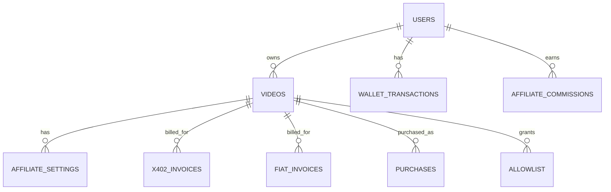

# PPV Stream Rust — Open Source White Label Video Commerce Platform

> *"Fair streaming for creators, secure content for viewers, and freedom for everyone."*

**PPV Stream** is a production-ready, self-hosted Pay-Per-View video platform built with **Rust (Axum)** and **PostgreSQL**. It ships everything a creator marketplace needs — multi-provider payments, an internal wallet, an affiliate system, forensic watermarking, adaptive HLS streaming, and a plugin-based storage/payment architecture — all open-source and white-label.

🎥 **Demo on YouTube:**
- [https://www.youtube.com/watch?v=WOsDwBcD03A](https://www.youtube.com/watch?v=WOsDwBcD03A)
- [https://www.youtube.com/watch?v=IuSjkMoYEHk](https://www.youtube.com/watch?v=IuSjkMoYEHk)
- [https://www.youtube.com/watch?v=dm8eRdstBHY](https://www.youtube.com/watch?v=dm8eRdstBHY)

---

## 📚 Documentation Index

| Document | Description |
|----------|-------------|
| **README.md** *(this file)* | Platform overview, quick start, architecture, feature list |
| [SETUP.md](SETUP.md) | Complete step-by-step setup and run guide in English for Docker and non-Docker environments |
| [DEPLOYMENT.md](DEPLOYMENT.md) | Detailed cloud deployment guide for Docker and non-Docker setups on DigitalOcean, Google Cloud, Azure, plus Cloudflare and Vercel guidance |
| [SECURITY.md](SECURITY.md) | Security model, hardening notes, production security recommendations, and remaining security work |
| [GLOSSARY.md](GLOSSARY.md) | Comprehensive English glossary of business, payment, streaming, security, and technical terms used across the repo |
| [VISION.md](VISION.md) | Inspiration — the problems we solve and the creator economy we're building |
| [WALLET.md](WALLET.md) | Internal fiat wallet — business flows, DB design, API reference |
| [AFFILIATE.md](AFFILIATE.md) | Affiliate system — referral links, commission flows, security model |
| [PAYMENT.md](PAYMENT.md) | All payment methods: Wallet, X402 crypto, Fiat gateways |
| [PAYMENT_PLUGIN_ARCHITECTURE.md](PAYMENT_PLUGIN_ARCHITECTURE.md) | How payment providers are structured and extended |
| [ADMIN_AUTHENTICATION.md](ADMIN_AUTHENTICATION.md) | Admin login, wallet admin, affiliate admin |
| [TECHNICAL_DOCUMENTATION.md](TECHNICAL_DOCUMENTATION.md) | Full codebase reference — every module, function, and data flow |
| [updated.md](updated.md) | Changelog — architecture improvements and new feature summaries |
| [RUST_CONCEPTS_FOR_BEGINNERS.md](RUST_CONCEPTS_FOR_BEGINNERS.md) | Rust concepts used in this project, explained for newcomers |

---

## 🚀 Key Features

### Commerce & Payments
- 💰 **Internal Wallet** — deposit, withdraw, P2P transfer; admin-managed payouts; [details →](WALLET.md)
- 💳 **3-Tab Payment Panel** — Wallet / Crypto X402 / Fiat Gateway in one UI
- ⛓️ **X402 Smart Contract** — on-chain payments with auto-split (creator 90%, platform 10%); [details →](PAYMENT.md)
- 🏦 **Multi-Provider Fiat** — Stripe, PayPal, Midtrans, Xendit via plugin architecture; [details →](PAYMENT_PLUGIN_ARCHITECTURE.md)
- 🔔 **Webhook Receivers** — each provider delivers payment notifications automatically
- 🏧 **Xendit Auto-Disburse** — 90% of payment goes to creator's bank account instantly

### Affiliate & Growth
- 🤝 **Affiliate System** — creators set commission % per video; affiliates earn from referral sales; [details →](AFFILIATE.md)
- 🔗 **Referral Links** — `?ref=USERNAME` captured across all payment paths (wallet, x402, fiat)
- 📊 **Earnings Dashboard** — affiliates track commissions; creators track program performance

### Content & Streaming
- 🎥 **Video Upload** — MP4 with size limit, MIME validation, atomic writes
- ⚡ **Adaptive HLS Transcoding** — FFmpeg multi-rendition (240p/360p/480p) in a single process
- 💧 **Forensic Watermarking** — per-viewer moving watermark to deter piracy
- 🔐 **Session-Scoped HLS** — each viewer gets a unique, isolated stream segment set

### Platform & Operations
- 👤 **User & Admin Authentication** — HMAC-SHA256 signed cookies, Argon2 password hashing; [details →](ADMIN_AUTHENTICATION.md)
- 👥 **Allowlist System** — creators grant manual access; purchases auto-grant
- 📧 **SMTP Email Notifications** — password reset, change-password confirmation
- 🧩 **Admin Panel** — users, videos, wallet transactions, fiat invoices, SMTP, affiliate commissions
- 💵 **USD → IDR Conversion** — live exchange rate from `/api/kurs`
- 🗄️ **Storage Plugins** — local disk or cloud storage via plugin registry

---

## 🌍 Vision

To make it possible for every creator, teacher, performer, or filmmaker to **earn money directly from their audience** — using a fair, transparent, and forensically protected pay-per-view system with no centralized gatekeepers.

→ Read the full vision: [VISION.md](VISION.md)

---

## 💡 C2C Video Marketplace

PPV Stream Rust enables a **consumer-to-consumer (C2C) marketplace** where users pay other users directly:

- Creators upload exclusive content and set their price
- Buyers purchase access with wallet balance, crypto, or fiat
- Affiliates share referral links and earn commission
- Platform retains a configurable fee (default 10%)

The affiliate layer means creators can grow their audience without advertising spend — they pay commissions only when sales actually happen.

---

## ⚙️ X402 Smart Contract Payment

The X402 integration processes on-chain payments with automatic fund splitting:

- **Decentralized Settlement** — funds go directly from viewer to creator via smart contract
- **Auto-Split** — creator 90%, platform admin 10% (configurable via basis points)
- **Multi-Token** — native coins (MATIC, ETH) or ERC-20 tokens (USDC, USDT)
- **Invoice Hashing** — Keccak256 hash binds each payment to a specific invoice + video

→ See [PAYMENT.md](PAYMENT.md) for the full payment flow including wallet and fiat.

---

## 🔄 Business Processes

### Primary Actors

| Actor | Role |
|-------|------|
| **Viewer / Buyer** | Registers, purchases video access via wallet/crypto/fiat, watches watermarked stream |
| **Creator / Video Owner** | Uploads videos, sets price, configures affiliate program, receives wallet revenue |
| **Affiliate** | Shares referral links, earns commission from creator's revenue when buyers convert |
| **Platform Admin** | Manages users, approves deposits/payouts, monitors all payments and commissions |
| **X402 Smart Contract** | Splits on-chain payments between creator and platform per signed basis points |

### 1. Registration & Authentication

1. User registers via `POST /auth/register` — Argon2 password hash, DB user row.
2. Login via `POST /auth/login` — HMAC-SHA256 signed `ppv_session` cookie.
3. Every protected endpoint verifies signature, loads session, checks expiry.
4. Admin login via `POST /admin/login` — requires `is_admin = true`.
5. Password recovery via time-limited single-use token.

### 2. Video Upload & Processing

1. Creator POSTs to `POST /api/upload` — extension whitelist + MIME check + size limit.
2. Written to `*.part` file → atomic rename to prevent partial uploads.
3. Video record created with `status = queued`, submitted to in-process worker.
4. Worker generates fast-start MP4, then multi-rendition HLS (`240p/360p/480p`).
5. On success: `hls_ready = true`, `processing_state = ready`, `hls_master` set.

### 3. Video Purchase — Wallet Path

1. Buyer opens `watch.html?video_id=X` (optionally with `?ref=AFFILIATE_USERNAME`).
2. `GET /api/pay/all_options` returns wallet balance, x402 tokens, fiat providers in one call.
3. Buyer selects Wallet tab → `POST /api/wallet/pay` with `{ video_id, ref_code }`.
4. Atomic DB transaction: debit buyer, credit creator (90%), create ledger rows, insert purchase + allowlist.
5. If `ref_code` is set and affiliate program is active: commission deducted from creator, credited to affiliate.

### 4. Video Purchase — X402 Path

1. `POST /api/pay/x402/start` — invoice created, signed with admin ECDSA key, `affiliate_ref` stored.
2. MetaMask executes `payNativeSigned` / `payERC20Signed` on-chain.
3. `POST /api/pay/x402/confirm` — receipt verified, `Paid` event decoded, invoice updated.
4. Purchase + allowlist inserted; affiliate commission processed.

### 5. Video Purchase — Fiat Path

1. `POST /api/pay/:provider/start` — `fiat_invoices` row pre-inserted, `affiliate_ref` stored, provider checkout URL returned.
2. Buyer pays on provider's hosted page.
3. Provider webhook → `POST /api/pay/:provider/webhook` — signature verified, access granted.
4. Affiliate commission processed after access is confirmed.

### 6. Affiliate Program

1. Creator configures commission % via `POST /api/affiliate/settings` (0–90%).
2. Affiliate gets referral link from `GET /api/affiliate/link?video_id=X`.
3. Buyer arrives via `?ref=AFFILIATE_USERNAME`; referral notice shown in payment panel.
4. On purchase: `commission_cents = price * commission_pct / 100` moved from creator → affiliate wallet.
5. Affiliate sees earnings in `GET /api/affiliate/earnings`.

→ Full details: [AFFILIATE.md](AFFILIATE.md)

### 7. Playback & Content Protection

1. `GET /api/request_play?video_id=X` — session + ownership/allowlist check.
2. Per-viewer HLS session created with moving username+timestamp watermark via FFmpeg.
3. Segments streamed via `GET /hls/:session/:file` with `Cache-Control: no-store`.

### 8. Wallet Operations

1. **Deposit**: user submits amount → admin approves → balance credited.
2. **Withdrawal**: balance held immediately → admin marks paid or rejects (auto-refund).
3. **P2P Transfer**: instant, atomic, both parties get ledger rows.
4. All operations append to `wallet_transactions` for full audit trail.

→ Full details: [WALLET.md](WALLET.md)

### 9. Admin Operations

- `GET /admin/data` — users, sessions, videos, purchases, allowlists
- `GET /admin/payments` — fiat invoices with filter/disburse
- `GET /admin/wallet/transactions` — all wallet operations with approve/reject
- `GET /admin/affiliate/commissions` — full commission ledger
- `GET/POST /admin/smtp` — email configuration

---

## 🧭 Business Process-to-Code Mapping

| Business Process | Route | Source File |
|-----------------|-------|-------------|
| User register/login | `POST /auth/register`, `/auth/login` | `src/handlers/auth_user.rs` |
| Admin login | `POST /admin/login` | `src/handlers/auth_admin.rs` |
| Password recovery | `POST /auth/forgot` | `src/handlers/auth_user.rs` |
| Creator profile | `GET/POST /api/profile` | `src/handlers/users.rs` |
| Video upload | `POST /api/upload` | `src/handlers/upload.rs` |
| Video transcoding | Worker internal | `src/worker.rs`, `src/ffmpeg.rs` |
| Marketplace browse | `GET /api/videos` | `src/handlers/video.rs` |
| Manual access grant | `POST /api/allow` | `src/handlers/video.rs` |
| All payment options | `GET /api/pay/all_options` | `src/handlers/pay.rs` |
| X402 invoice | `POST /api/pay/x402/start` | `src/handlers/pay.rs` |
| X402 confirm | `POST /api/pay/x402/confirm` | `src/handlers/pay.rs` |
| Fiat invoice | `POST /api/pay/:provider/start` | `src/handlers/payment_plugins.rs` |
| Fiat webhook | `POST /api/pay/:provider/webhook` | `src/handlers/payment_plugins.rs` |
| Wallet balance | `GET /api/wallet/balance` | `src/handlers/wallet.rs` |
| Wallet deposit | `POST /api/wallet/deposit` | `src/handlers/wallet.rs` |
| Wallet withdraw | `POST /api/wallet/withdraw` | `src/handlers/wallet.rs` |
| Wallet transfer | `POST /api/wallet/transfer` | `src/handlers/wallet.rs` |
| Wallet pay video | `POST /api/wallet/pay` | `src/handlers/wallet.rs` |
| Affiliate settings | `GET/POST /api/affiliate/settings` | `src/handlers/affiliate.rs` |
| Affiliate link | `GET /api/affiliate/link` | `src/handlers/affiliate.rs` |
| Affiliate earnings | `GET /api/affiliate/earnings` | `src/handlers/affiliate.rs` |
| Affiliate commission | Internal helper | `src/commission.rs` |
| Playback auth | `GET /api/request_play` | `src/handlers/stream.rs` |
| HLS delivery | `GET /hls/:session/:file` | `src/handlers/stream.rs` |
| Admin wallet | `/admin/wallet/transactions/*` | `src/handlers/admin.rs` |
| Admin affiliate | `GET /admin/affiliate/commissions` | `src/handlers/affiliate.rs` |
| Admin payments | `GET /admin/payments` | `src/handlers/admin.rs` |

---

## 🗄️ Database Schema

### Migration Files

| Migration | Content |
|-----------|---------|
| `sql/001–012` | Core: users, sessions, videos, allowlist, purchases, profile |
| `migrations/013–024` | X402: pay_tokens, x402_invoices, compatibility view |
| `migrations/025` | Fiat plugin: fiat_invoices |
| `migrations/026` | Payment plugin schema |
| `migrations/027` | SMTP settings |
| `migrations/028_wallet.sql` | `users.balance_cents`, `wallet_transactions` |
| `migrations/029_affiliate.sql` | `affiliate_settings`, `affiliate_commissions`, `affiliate_ref` on invoices |

### Tables Overview

| Table | Role |
|-------|------|
| `users` | Identity, profile, wallet balance (`balance_cents`) |
| `sessions` | Server-side signed sessions with TTL |
| `password_resets` | Single-use recovery tokens |
| `videos` | PPV products — price, ownership, HLS state |
| `allowlist` | `(video_id, username)` playback permission |
| `purchases` | Purchase audit ledger |
| `pay_tokens` | Supported crypto tokens/chains |
| `x402_invoices` | On-chain invoice lifecycle + `affiliate_ref` |
| `fiat_invoices` | Fiat invoice lifecycle + `affiliate_ref` |
| `smtp_settings` | Email server configuration |
| `wallet_transactions` | Immutable wallet ledger (deposit/withdraw/transfer/payment) |
| `affiliate_settings` | Per-video affiliate commission config |
| `affiliate_commissions` | Commission audit log |

### Entity Relationships



---

## 🧱 Project Structure

```
ppv_stream_rust/
├── contracts/                    # Solidity X402Splitter smart contract
│   └── contracts/X402Splitter.sol
├── migrations/                   # Numbered SQL migrations (013–029)
│   ├── 028_wallet.sql
│   └── 029_affiliate.sql
├── public/                       # Frontend HTML + JS
│   ├── admin/
│   │   ├── dashboard.html
│   │   ├── login.html
│   │   └── wallet.html           # Admin wallet management
│   ├── auth/
│   ├── affiliate.html            # Affiliate dashboard
│   ├── wallet.html               # User wallet UI
│   ├── watch.html                # 3-tab payment panel + HLS player
│   └── styles.css
├── sql/                          # Core schema migrations (001–012)
├── src/
│   ├── commission.rs             # Affiliate commission helper (standalone)
│   ├── config.rs                 # Environment-based configuration
│   ├── db.rs                     # PostgreSQL pool setup
│   ├── email.rs                  # SMTP notifications
│   ├── ffmpeg.rs                 # FFmpeg/FFprobe wrappers
│   ├── sessions.rs               # HMAC-signed session cookies
│   ├── validators.rs             # Input validation utilities
│   ├── worker.rs                 # In-process transcode queue
│   ├── handlers/
│   │   ├── admin.rs              # Admin data + wallet admin endpoints
│   │   ├── affiliate.rs          # Affiliate settings, earnings, admin view
│   │   ├── auth_admin.rs         # Admin login/logout/change-password
│   │   ├── auth_user.rs          # User register/login/logout/forgot-password
│   │   ├── kurs.rs               # Exchange rate (USD/IDR)
│   │   ├── me.rs                 # /api/me — current user info
│   │   ├── pay.rs                # X402 + all_options endpoints
│   │   ├── payment_plugins.rs    # Fiat invoice create/confirm/webhook
│   │   ├── setup.rs              # Admin bootstrap
│   │   ├── stream.rs             # HLS playback + watermark
│   │   ├── upload.rs             # Video upload
│   │   ├── users.rs              # Profile CRUD + public profiles
│   │   ├── video.rs              # Video list/update/allowlist
│   │   └── wallet.rs             # Wallet balance/deposit/withdraw/transfer/pay
│   ├── plugins/
│   │   ├── payment/              # Payment plugin registry
│   │   │   └── providers/        # stripe, paypal, midtrans, xendit, x402
│   │   └── storage/              # Storage plugin registry
│   └── services/
│       └── x402_watcher.rs       # Optional WebSocket blockchain event watcher
├── Cargo.toml
├── docker-compose.yml
├── Makefile
└── *.md                          # Documentation (see Documentation Index above)
```

---

## ⚙️ Quick Start

For the complete installation guide, environment variable reference, admin bootstrap steps, and both Docker and non-Docker workflows, see [SETUP.md](SETUP.md).

```bash
# 1. Start PostgreSQL
make db-up

# 2. Run all migrations
make migrate

# 3. Build and run
make build
make run

# 4. Seed test data (optional)
make seed
```

The server starts at **http://localhost:8080**

---

## 👤 Default Test Accounts

| Username | Email | Password |
|----------|-------|----------|
| user01 | user01@example.com | Passw0rd01! |
| user02 | user02@example.com | Passw0rd02! |
| … | … | … |
| user10 | user10@example.com | Passw0rd10! |

---

## 📦 Tech Stack

| Layer | Technology |
|-------|-----------|
| Backend | Rust + Axum + SQLx |
| Database | PostgreSQL |
| Frontend | HTML + Vanilla JS (Bootstrap 5) |
| Media | FFmpeg — HLS transcoding + forensic watermarking |
| Payments | X402 (EVM smart contract) + Stripe + PayPal + Midtrans + Xendit |
| Sessions | HMAC-SHA256 signed cookies via tower-cookies |
| Storage | Plugin: local disk or S3-compatible |

---

## 🔐 Architecture Overview

```
┌─────────────────────────────────────────────┐
│            User Browser                     │
│  watch.html — 3-tab payment panel           │
│  wallet.html — balance + history            │
│  affiliate.html — earnings + links          │
└──────────────────┬──────────────────────────┘
                   │ HTTP/JSON
                   ▼
┌─────────────────────────────────────────────┐
│           Rust Backend (Axum)               │
│  Auth · Upload · Stream · Pay               │
│  Wallet · Affiliate · Commission            │
│  Payment plugins (stripe/paypal/midtrans/   │
│  xendit/x402) · Storage plugins             │
└──────────┬──────────────────┬───────────────┘
           │                  │
           ▼                  ▼
  ┌──────────────┐   ┌──────────────────────┐
  │  PostgreSQL  │   │  File Storage        │
  │  13 tables   │   │  /storage/ /media/   │
  │  wallet +    │   │  /hls/ (per-viewer)  │
  │  affiliate   │   └──────────────────────┘
  └──────────────┘
           │
           ▼
  ┌──────────────────────┐
  │  EVM Blockchain      │
  │  X402Splitter.sol    │
  │  (optional)          │
  └──────────────────────┘
```

---

## 💡 License

Apache 2.0

---

## 🧠 Project Metadata

```
Project : PPV Stream — Secure Pay-Per-View Video Platform
Author  : Kukuh Tripamungkas Wicaksono (Kukuh TW)
Email   : kukuhtw@gmail.com
WhatsApp: https://wa.me/628129893706
LinkedIn: https://id.linkedin.com/in/kukuhtw
GitHub  : https://github.com/kukuhtw/ppv_stream_rust
```

---

<p align="center">
  © 2025–2026 <b>Kukuh Tripamungkas Wicaksono</b><br>
  📧 <a href="mailto:kukuhtw@gmail.com">kukuhtw@gmail.com</a> |
  💬 <a href="https://wa.me/628129893706">WhatsApp</a> |
  🔗 <a href="https://id.linkedin.com/in/kukuhtw">LinkedIn</a> |
  💻 <a href="https://github.com/kukuhtw/ppv_stream_rust">GitHub</a>
</p>
