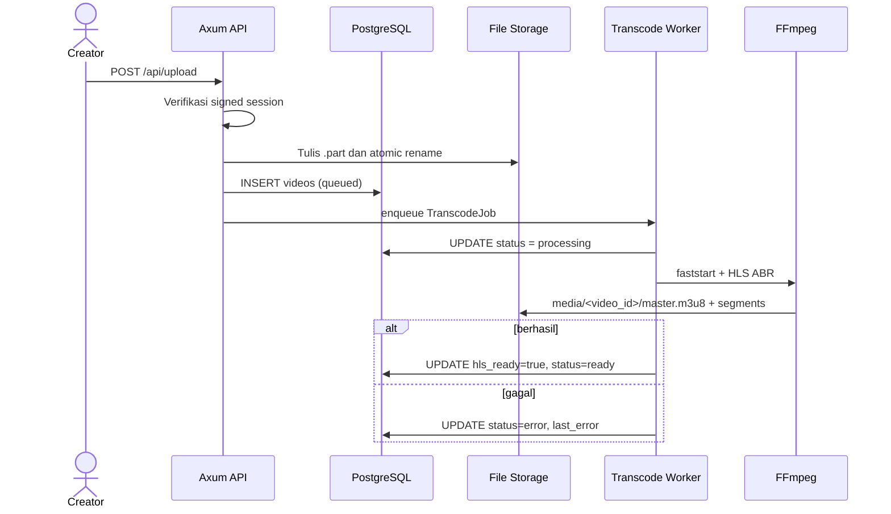
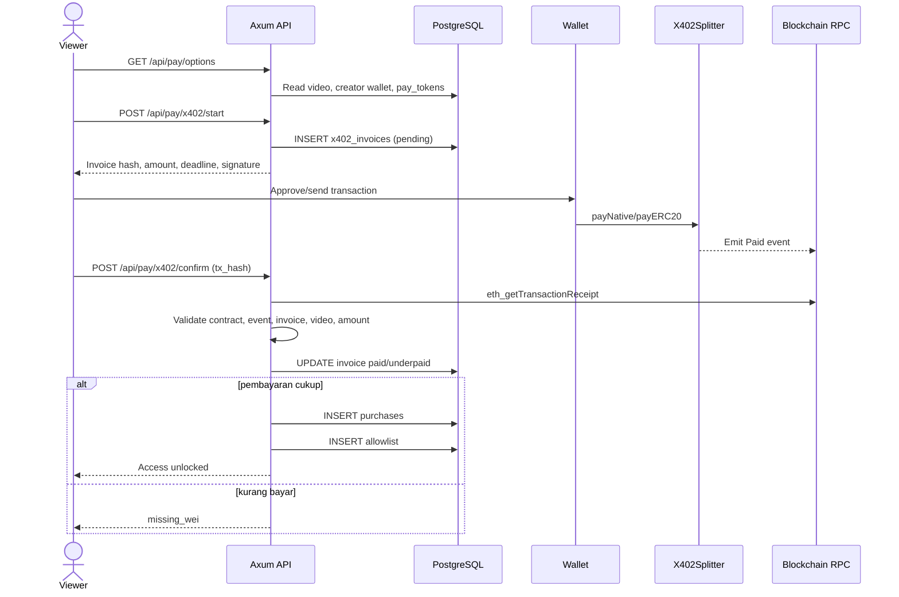
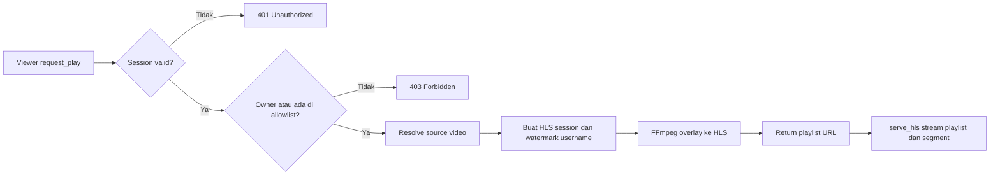
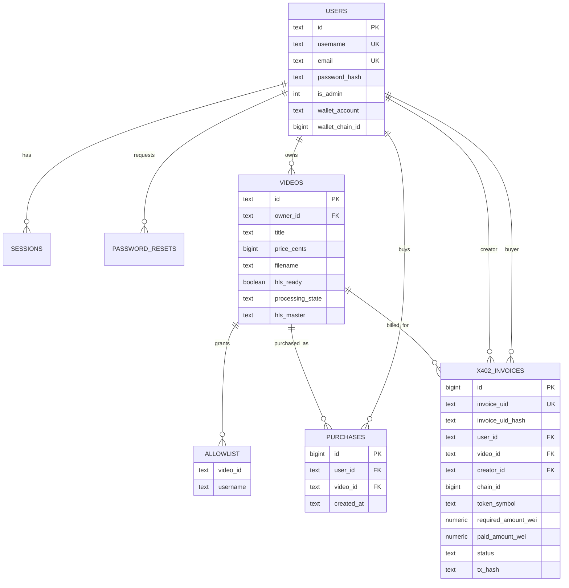

# 🎬 PPV Stream — Rust-Based Pay-Per-View Video Platform

**PPV Stream** is a secure video streaming application built with **Rust (Axum)** and **PostgreSQL**, designed for independent creators to monetize their content fairly through a **Pay-Per-View (PPV)** model.  

It features watermark-protected HLS streaming, authentication, upload management, and user dashboards.

**PPV Stream Rust** empowers anyone to build their own secure video streaming platform — like having your own version of **OnlyFans or Netflix**, but fully **open-source** and **privacy-controlled**.  

Each video is streamed via encrypted HLS with forensic watermarking to discourage piracy.

🎥 **Demo on YouTube:**  
🔗 [https://www.youtube.com/watch?v=WOsDwBcD03A](https://www.youtube.com/watch?v=WOsDwBcD03A)

🔗 [https://www.youtube.com/watch?v=IuSjkMoYEHk](https://www.youtube.com/watch?v=IuSjkMoYEHk)

🔗 [https://www.youtube.com/watch?v=dm8eRdstBHY](https://www.youtube.com/watch?v=dm8eRdstBHY)

---

## 🌍 Vision

To make it possible for every creator, teacher, performer, or filmmaker to **earn money directly from their audience**, using a fair and transparent pay-per-view system that protects their creative rights.

PPV Stream Rust is **open-source**, **self-hosted**, and **built for creators who want independence** — no centralized platform, no gatekeepers, and no hidden fees.

---

## 💡 New Feature: C2C Marketplace

PPV Stream Rust makes it easy for anyone to create a **video streaming marketplace** — similar to **OnlyFans**, but **consumer-to-consumer (C2C)**.

Users can **pay other users directly** to watch exclusive content, tutorials, music performances, religious broadcasts, short films, or personal vlogs.

This model allows:

* 💸 **Direct payments** between viewers and creators (no middleman)
* 🧾 **Transparent transactions** for every pay-per-view event
* 🌐 **Independent video portals** that anyone can host and brand as their own marketplace

---

## ⚙️ Built-in X402 Smart Contract Payment

The C2C system is powered by the **X402 payment contract**, a Solidity-based module integrated into PPV Stream Rust.

With **X402**, every video purchase is securely processed on the blockchain, ensuring **trust, transparency, and automation**.

Key features of the X402 integration:

* 🔐 **Decentralized Settlement** — funds are transferred directly from viewer → creator via on-chain transaction.
* ⚖️ **Auto-Split Fees** — payments are automatically divided between the **creator (e.g., 90%)** and **platform admin (e.g., 10%)**.
* 💰 **Multi-Token Support** — users can pay using **native coins (MEGA, MATIC, ETH)** or **ERC-20 tokens (USDC, USDT, etc.)**.
* 🪙 **Transparent Ledger** — all `Paid` events are logged on-chain with invoice UID, payer, creator, and amount in wei.
* 🧾 **Invoice Hashing (Keccak256)** — every invoice has a unique hash (`invoice_uid_hash`) that binds the payment to the specific video ID.

---

**Example workflow:**

1. Viewer clicks *Buy with Crypto (X402)*.
2. System creates an on-chain invoice (`invoice_uid`).
3. MetaMask opens and executes `payNative` or `payERC20`.
4. The smart contract emits a `Paid` event — funds automatically go to the creator and admin wallets.
5. Viewer instantly gains access to the video (`allowlist` updated).

---

This makes PPV Stream Rust not only a **decentralized pay-per-view platform**, but also a **ready-to-use C2C video marketplace** with **trustless crypto payments** and **full ownership control** for every creator.

Here’s the  summary updated october 26th, 2025 — clearly structured and focused on **performance**, **security**, and **data flow** differences between the old and new logic:

---

# 1) Video Upload

* **Old:** wrote files directly to the target using `File::create` + `write_all` per chunk.
* **New:**

  * Uses **Buffered I/O** with `BufWriter` (~1 MB) → fewer syscalls.
  * Writes to a temporary `*.part` file, then **atomically renames** it → prevents half-written files.
  * Enforces **file size limit** (`MAX_UPLOAD_BYTES`) and counts bytes in real time.
  * Adds **extension whitelist** (`ALLOW_EXTS`) and **MIME sniffing** via `infer`.
  * If DB insert fails, the file is **cleaned up**.
  * Logs file size and storage location.

---

# 2) Transcoding Worker

* **Old:** no `faststart`; inconsistent ABR quality; several missing functions.
* **New:**

  * Adds **MP4 faststart** (`-c copy -movflags +faststart`) before HLS → faster initial seeking.
  * Supports **multi-rendition ABR** (240p/360p/480p) in **a single ffmpeg process** using `-filter_complex` + `-var_stream_map` → better CPU/IO efficiency.
  * Includes **anti-upscale** logic (ladder adjusts to source height).
  * Handles **silent audio** with `anullsrc` + `-shortest`.
  * Uses **Semaphore** for controlled concurrency.
  * DB status is clearly tracked: `processing → ready|error`, with `last_error` and `hls_master` path stored.
  * Clean output structure under `media/<video_id>`; includes `master.m3u8` and variant subfolders.

---

# 3) FFMPEG Runner & Probing

* **Old:** `transcode_hls` ran raw command args, no dedicated working directory.
* **New:**

  * Introduces `run_ffmpeg(args, work_dir)` → all output written inside the safe target folder.
  * `transcode_hls` now truly runs inside its `session_dir`.
  * Adds helpers: `ffprobe_duration`, `ffprobe_dimensions`, `ffprobe_has_audio`.
  * HLS ABR encoding is now a utility function respecting `hwaccel` (default: CPU).

---

# 4) Streaming (Play) & HLS Serving

* **Old:** read entire HLS file into memory (`Vec<u8>`) before sending; watermark logic similar.
* **New:**

  * Streams files using **`ReaderStream`** → no full file loaded in RAM.
  * Consistent **`Cache-Control: no-store`** headers.
  * Stricter path and extension validation.
  * Moving watermark remains, and ffmpeg threads are set to `num_cpus()`.

---

# 5) Sessions & Cookies

* **Old:** stored plain `sid` cookie; fixed 7-day TTL; no integrity protection.
* **New:**

  * TTL now configurable (`SESSION_TOKEN_TTL`).
  * Cookie **signed with HMAC-SHA256** (`b64(sid).b64(sig)`) → prevents forgery.
  * Secure cookie attributes: `HttpOnly`, `SameSite=Lax`.
  * API now requires `&Config` for access to `hmac_secret` and TTL:

    * `create_session(pool, &cfg, user_id, is_admin, cookies)`
    * `destroy_session(pool, &cfg, cookies)`
    * `current_user_id(pool, &cfg, cookies)`

---

# 6) Configuration & Directories

* **Old:** `media_dir` sometimes defaulted to `hls_root`; `tmp_dir` fixed; no `allow_exts`.
* **New:**

  * Default **`media_dir = media/`**, with separate **`hls_root`** for temporary HLS sessions.
  * **`tmp_dir`** now cross-platform (uses OS temp; `/dev/shm` on Linux if available).
  * **`ensure_dirs`** creates all required directories, including `hls_root`.
  * `allow_exts` read from `ALLOW_EXTS`.
  * Startup logs redact DB credentials.

---

# 7) Security & Robustness

* **Old:** potential race conditions / partial uploads; cookies could be forged; full-file reads for streaming.
* **New:**

  * Atomic rename + size limit + MIME validation on upload.
  * HMAC-signed cookies + expired-session cleanup.
  * Streaming I/O for HLS serving.
  * `last_error` written to DB on failures for easier diagnostics.

---

# 8) Migration Impact (Changed APIs)

* `sessions::*` functions now require `&Config`.
* `Worker::new(pool, cfg, concurrency)` stores `cfg` for TTL/dirs.
* `ffmpeg::run_ffmpeg(args, work_dir)` now used by both worker and streaming layers.
* New or updated environment variables:
  `ALLOW_EXTS`, `MAX_UPLOAD_BYTES`, `SESSION_TOKEN_TTL`, `HMAC_SECRET`, `HLS_ROOT`, `MEDIA_DIR`, `TMP_DIR`, `WATERMARK_FONT`.

---

## Summary

The new version is significantly **faster** (buffered I/O, single-process multi-rendition, faststart), **more memory-efficient** (streamed HLS delivery), and far more **secure** (HMAC cookies, path validation, size & MIME checks), while offering better **observability** (DB status and error logging).


## 🚀 Key Features

* 🔐 **User & Admin Authentication** (login/register/reset password)  
* 🎥 **Video Upload** (MP4, stored securely in `/storage/`)  
* 💧 **Dynamic Watermarking** – watermark moves randomly every few seconds  
* ⚡ **HLS Transcoding via FFmpeg** – fast, segmented streaming  
* 💰 **Pay-Per-View Access** – users pay per video  
* 👥 **Allowlist System** – creators can manually grant view access  
* 📊 **Dashboard** for video management and viewer control  
* 🖥️ **Responsive Frontend** – HTML + JS in `/public`  
* 🧩 **Admin Panel** – manage users and video content  
* 💵 **USD → IDR Conversion** for pricing ($1 = Rp17,000)  

---

## 🔄 Proses Bisnis

Bagian ini menjelaskan alur bisnis utama platform dari sudut pandang pengguna, kreator, pembayaran, dan operasi sistem.

### Aktor Utama

| Aktor | Tanggung jawab |
|---|---|
| **Viewer / pembeli** | Registrasi, login, memilih video, membayar akses, dan menonton video yang telah dibuka. |
| **Creator / pemilik video** | Melengkapi profil pembayaran, mengunggah video, menentukan harga, mengelola metadata, dan memberikan akses manual. |
| **Admin platform** | Melakukan bootstrap/login admin serta memantau pengguna, sesi, video, allowlist, pembelian, dan password reset. |
| **Sistem backend** | Mengautentikasi sesi, menyimpan metadata, menjalankan transcode, memverifikasi pembayaran, mengatur hak akses, dan menyajikan HLS. |
| **X402 smart contract** | Memproses pembayaran on-chain dan membagi dana antara creator dan admin sesuai basis point yang ditandatangani backend. |

### 1. Registrasi, Login, dan Sesi

1. Pengguna mendaftar melalui `POST /auth/register`.
2. Backend memvalidasi data, meng-hash password dengan Argon2, lalu membuat data pengguna.
3. Pengguna login melalui `POST /auth/login`; admin menggunakan `POST /admin/login`.
4. Setelah kredensial valid, backend membuat sesi di database dan mengirim cookie `ppv_session` yang ditandatangani HMAC-SHA256.
5. Setiap endpoint terproteksi memverifikasi signature cookie, mencari sesi, dan memastikan sesi belum kedaluwarsa.
6. Logout menghapus sesi dari database dan cookie dari browser.
7. Pada proses lupa password, token sekali pakai disimpan dengan batas waktu, kemudian ditandai `used` setelah password berhasil diganti.

### 2. Onboarding Creator dan Pengelolaan Profil

1. Semua user dapat bertindak sebagai creator; tidak ada tabel atau role creator terpisah.
2. Creator memperbarui profil melalui `POST /api/profile_update`.
3. Informasi seperti rekening bank, wallet blockchain, chain pilihan, WhatsApp, dan deskripsi profil disimpan pada record user.
4. Wallet creator wajib tersedia dan valid ketika pembeli memulai pembayaran X402.

### 3. Upload dan Pemrosesan Video

1. Creator yang sudah login mengirim multipart form ke `POST /api/upload` berisi `title`, `price_cents`, dan `file`.
2. Backend memvalidasi ekstensi dan ukuran, menulis upload ke file sementara `*.part`, lalu melakukan atomic rename.
3. Metadata video dibuat dengan status awal `queued`.
4. Job dikirim ke in-memory transcoding worker.
5. Worker mengubah status menjadi `processing`, membuat MP4 faststart, lalu menghasilkan HLS adaptive bitrate menggunakan FFmpeg.
6. Jika berhasil, video ditandai `hls_ready = true` dan `processing_state = 'ready'`; jika gagal, status menjadi `error` dan penyebab disimpan di `last_error`.
7. Creator dapat mengubah judul, deskripsi, serta harga melalui `POST /api/video_update`.

> **Catatan operasional:** antrean transcode saat ini berada di memory process aplikasi. Job yang masih mengantre tidak persisten apabila process restart, walaupun metadata video dan status terakhir tetap tersimpan di PostgreSQL.

### 4. Discovery dan Akses Manual

1. Marketplace membaca katalog melalui `GET /api/videos`.
2. Creator melihat video miliknya melalui `GET /api/my_videos`.
3. Creator dapat mencari user melalui `GET /api/user_lookup`.
4. Creator memberikan akses manual melalui `POST /api/allow`.
5. Backend memastikan pemberi akses adalah pemilik video, lalu menambahkan pasangan `(video_id, username)` ke allowlist.

### 5. Pembelian PPV dengan X402

1. Viewer memilih video dan meminta opsi pembayaran melalui `GET /api/pay/options?video_id=...`.
2. Backend mengambil harga video, wallet creator, serta token aktif dari database.
3. Viewer memilih chain/token dan mengirim `POST /api/pay/x402/start`.
4. Backend membuat invoice unik, menghitung nilai token dalam unit terkecil (`wei`), menyimpan hash invoice, menentukan masa berlaku, dan menghasilkan signature untuk payload smart contract.
5. Wallet viewer memanggil kontrak X402 menggunakan payload tersebut. Kontrak mentransfer dan membagi dana ke creator serta admin, lalu mengeluarkan event `Paid`.
6. Akses dapat diselesaikan melalui dua jalur:
   * **Konfirmasi HTTP** — frontend mengirim transaction hash ke `POST /api/pay/x402/confirm`; backend membaca receipt RPC dan memvalidasi contract address, event, invoice hash, video ID, serta jumlah pembayaran.
   * **Watcher opsional** — ketika feature `x402-watcher` dan `WATCHER_ENABLE=1` aktif, backend mendengarkan event `Paid` melalui WebSocket.
7. Invoice diperbarui menjadi `paid` atau `underpaid`.
8. Pembayaran penuh menghasilkan record pembelian dan menambahkan viewer ke allowlist secara idempotent.

> **Sumber otorisasi playback:** keputusan boleh menonton saat ini berasal dari kepemilikan video atau keberadaan username di `allowlist`. Tabel `purchases` berfungsi sebagai ledger/audit pembelian; pembayaran yang berhasil juga menulis `allowlist` agar akses benar-benar terbuka.

### 6. Playback dan Proteksi Konten

1. Viewer meminta playback melalui `GET /api/request_play?video_id=...`.
2. Backend memvalidasi sesi dan memeriksa apakah viewer adalah pemilik video atau tercatat di allowlist.
3. Backend mengambil file sumber, membuat direktori sesi HLS sementara, dan menghasilkan watermark berisi username serta timestamp.
4. FFmpeg membuat stream HLS khusus sesi dengan watermark bergerak.
5. Backend mengembalikan URL playlist `/hls/:session/master.m3u8`.
6. Playlist dan segment dikirim secara streaming dengan `Cache-Control: no-store` serta validasi nama path/file.

### 7. Monitoring Admin

1. Admin login menggunakan akun dengan `is_admin`.
2. Endpoint `GET /admin/data` memvalidasi sesi dan role admin.
3. Dashboard menampilkan data dan agregat dari user, session, video, allowlist, purchase, dan password reset.
4. Endpoint `/setup_admin` dapat membuat atau mempromosikan admin awal apabila bootstrap token dikonfigurasi.

---

## 🧭 Mapping Proses Bisnis ke Implementasi Flow Code

### Ringkasan Mapping

| Proses bisnis | HTTP route / trigger | Implementasi utama | Efek utama |
|---|---|---|---|
| Registrasi user | `POST /auth/register` | `src/handlers/auth_user.rs::post_register` | Insert user dengan password hash. |
| Login/logout user | `POST /auth/login`, `POST /auth/logout` | `src/handlers/auth_user.rs`, `src/sessions.rs` | Membuat/menghapus session dan signed cookie. |
| Login/logout admin | `POST /admin/login`, `POST /admin/logout` | `src/handlers/auth_admin.rs`, `src/sessions.rs` | Validasi `is_admin`, lalu mengelola session. |
| Lupa/reset password | `POST /auth/forgot`, `POST /auth/reset` | `src/handlers/password.rs`, `src/handlers/auth_user.rs` | Membuat token reset, mengganti hash password, menandai token terpakai. |
| Profil creator | `GET /api/profile`, `POST /api/profile_update` | `src/handlers/users.rs` | Membaca/mengubah profil, kontak, rekening, dan wallet. |
| Browse marketplace | `GET /api/videos` | `src/handlers/video.rs::list_videos` | Join video dengan profil creator. |
| Upload video | `POST /api/upload` | `src/handlers/upload.rs::upload_video` | Menulis file, insert metadata video, enqueue job. |
| Transcode video | Trigger internal setelah upload | `src/worker.rs`, `src/ffmpeg.rs` | Update status dan menghasilkan HLS ABR di media storage. |
| Kelola video | `GET /api/my_videos`, `POST /api/video_update` | `src/handlers/video.rs` | Membaca video creator dan mengubah metadata/harga. |
| Grant akses manual | `GET /api/user_lookup`, `POST /api/allow` | `src/handlers/video.rs` | Validasi owner dan insert allowlist. |
| Ambil opsi pembayaran | `GET /api/pay/options` | `src/handlers/pay.rs::pay_options` | Membaca harga, wallet creator, dan token aktif. |
| Membuat invoice X402 | `POST /api/pay/x402/start` | `src/handlers/pay.rs::x402_start` | Insert invoice dan membuat signature pembayaran. |
| Konfirmasi pembayaran | `POST /api/pay/x402/confirm` | `src/handlers/pay.rs::x402_confirm` | Verifikasi receipt/event, update invoice, insert purchase dan allowlist. |
| Event pembayaran async | Event `Paid` melalui WSS | `src/services/x402_watcher.rs` | Mencocokkan invoice hash dan membuka akses. |
| Otorisasi playback | `GET /api/request_play` | `src/handlers/stream.rs`, `src/handlers/video.rs::user_has_view_access` | Memeriksa owner/allowlist dan membuat HLS ber-watermark. |
| Penyajian HLS | `GET /hls/:session/:file` | `src/handlers/stream.rs::serve_hls` | Stream playlist/segment dari direktori sesi. |
| Monitoring admin | `GET /admin/data` | `src/handlers/admin.rs::admin_data` | Membaca data operasional dan count tiap entitas. |

### Flow Upload sampai Video Siap



### Flow Pembayaran sampai Unlock



### Flow Playback



---

## 🗄️ Mapping Proses Bisnis ke Database

### Entitas dan Perannya

| Tabel | Peran bisnis | Ditulis oleh | Dibaca oleh / relasi penting |
|---|---|---|---|
| `users` | Identitas user/admin sekaligus profil creator dan tujuan pembayaran. | Register, setup admin, update profil, reset password. | Auth, katalog video, pembayaran, watermark, admin dashboard. Direferensikan oleh session, video, purchase, reset, dan invoice. |
| `sessions` | Sesi login server-side dengan TTL dan flag admin. | Login user/admin; dihapus saat logout atau kedaluwarsa. | Semua endpoint terproteksi melalui `sessions::current_user_id`. |
| `password_resets` | Token pemulihan password sekali pakai. | Forgot password dan reset password. | Validasi token, expiry, dan status `used`. |
| `videos` | Produk PPV: pemilik, judul, deskripsi, harga, file sumber, dan status HLS. | Upload, worker transcode, update video. | Marketplace, creator dashboard, access check, payment, playback, admin dashboard. |
| `allowlist` | Sumber hak tonton per `(video_id, username)`. | Grant manual, konfirmasi X402, atau watcher. | Otorisasi playback dan daftar viewer pada dashboard creator. |
| `purchases` | Ledger pembelian user terhadap video. | Konfirmasi X402 atau watcher. | Audit dan admin dashboard; bukan sumber langsung pengecekan playback. |
| `pay_tokens` | Master token/chain yang didukung untuk pembayaran. | Migration/seed/operasi database. | Opsi pembayaran dan validasi token saat membuat invoice. |
| `x402_invoices` | Lifecycle pembayaran on-chain dari quote sampai paid/underpaid. | Start payment, confirm payment, watcher. | Pencocokan invoice, validasi jumlah, audit transaksi, dan unlock akses. |
| `pay_tokens_compat` | View kompatibilitas nama kolom token lama dan baru. | Dibentuk oleh migration. | Menjaga kompatibilitas query/integrasi yang masih menggunakan alias `erc20`. |

### Relasi Data Utama



### Mapping Status dan Transisi

| Entitas | Status | Arti dan transisi |
|---|---|---|
| `videos.processing_state` | `queued` | Metadata dan file upload sudah tersimpan, job menunggu worker. |
| `videos.processing_state` | `processing` | Worker sedang menjalankan faststart/transcoding. |
| `videos.processing_state` | `ready` | HLS berhasil dibuat; `hls_ready=true` dan `hls_master` terisi. |
| `videos.processing_state` | `error` | Upload enqueue atau transcode gagal; detail berada di `last_error`. |
| `x402_invoices.status` | `pending` | Invoice telah dibuat dan menunggu pembayaran/konfirmasi. |
| `x402_invoices.status` | `paid` | Event valid dan nominal memenuhi kewajiban; purchase serta allowlist dibuat. |
| `x402_invoices.status` | `underpaid` | Event valid tetapi nilai di bawah `required_amount_wei`; akses belum dibuka. |
| `x402_invoices.status` | `expired` / `cancelled` | Status lifecycle yang didukung schema untuk invoice kedaluwarsa atau dibatalkan. |

### Source of Truth per Kebutuhan

| Kebutuhan | Source of truth |
|---|---|
| Identitas dan profil creator | `users` |
| Status login | `sessions` + signed cookie `ppv_session` |
| Harga dan kepemilikan konten | `videos` |
| Status kesiapan hasil transcode | `videos.hls_ready`, `videos.processing_state`, `videos.hls_master` |
| Hak tonton | Owner pada `videos.owner_id` **atau** pasangan pada `allowlist` |
| Riwayat pembelian | `purchases` |
| Status dan bukti pembayaran crypto | `x402_invoices` |
| Token pembayaran yang tersedia | `pay_tokens` |
| File video asli | Direktori upload/storage yang dikonfigurasi |
| HLS hasil worker | `media_dir/<video_id>/` |
| HLS ber-watermark per viewer | `hls_root/<session>/` |

### Urutan Migration

Database inti berada di `sql/001_*.sql` sampai `sql/012_*.sql`, sedangkan penambahan X402 berada di `migrations/013_*.sql` dan seterusnya. Jalankan:

```bash
make migrate
```

Target tersebut menerapkan seluruh file pada `sql/` lalu `migrations/` berdasarkan urutan versi. Aplikasi juga menjalankan SQLx migration dari direktori `sql/` saat startup, tetapi deployment yang menggunakan fitur X402 tetap harus menjalankan `make migrate` agar schema `pay_tokens` dan `x402_invoices` tersedia.

---

## 🧱 Project Structure

```
ppv_stream/
.
├── Cargo.lock
├── Cargo.toml
├── Dockerfile
├── Makefile
├── README.md
├── a
├── contracts
│   ├── Dockerfile
│   ├── contracts
│   │   └── X402Splitter.sol
│   ├── guidance_smartcontract_deployment
│   ├── hardhat.config.js
│   ├── package.json
│   └── scripts
│       ├── check_balance.js
│       ├── deploy_x402.js
│       └── estimate_gas_cost.js
├── docker-compose.yml
├── migrations
│   ├── 013_tokens.sql
│   ├── 014_x402_invoice.sql
│   ├── 015_users_wallet_chain.sql
│   ├── 016_purchases_fk_video.sql
│   ├── 017_allowlist_idx_username.sql
│   ├── 018_invoice_uid_hash.sql
│   ├── 019_x402_core.sql
│   ├── 020_x402_invoice_hash.sql
│   ├── 021_pay_tokens.sql
│   ├── 022_pay_tokens_rename_erc20.sql
│   ├── 023_x402_underpay_and_quote.sql
│   └── 024_pay_tokens_compat_view.sql
├── public
│   ├── admin
│   │   ├── dashboard.html
│   │   └── login.html
│   ├── auth
│   │   ├── forgot_password.html
│   │   ├── login.html
│   │   ├── register.html
│   │   └── reset_password.html
│   ├── browse.html
│   ├── dashboard.html
│   ├── index.html
│   ├── styles.css
│   └── watch.html
├── sql
│   ├── 001_init.sql
│   ├── 002_admins.sql
│   ├── 003_password_resets.sql
│   ├── 004_sessions.sql
│   ├── 005_allowlist.sql
│   ├── 006_indexes.sql
│   ├── 007_perf_and_fk.sql
│   ├── 008_price_cents_bigint.sql
│   ├── 009_users_username_unique.sql
│   ├── 010_videos_hls.sql
│   ├── 011_videos_description.sql
│   └── 012_user_profile.sql
├── src
│   ├── a
│   ├── auth.rs
│   ├── bin
│   │   └── seed_dummy.rs
│   ├── bootstrap.rs
│   ├── config.rs
│   ├── db.rs
│   ├── email.rs
│   ├── ffmpeg.rs
│   ├── handlers
│   │   ├── admin.rs
│   │   ├── auth_admin.rs
│   │   ├── auth_user.rs
│   │   ├── kurs.rs
│   │   ├── me.rs
│   │   ├── mod.rs
│   │   ├── pages.rs
│   │   ├── password.rs
│   │   ├── pay.rs
│   │   ├── setup.rs
│   │   ├── stream.rs
│   │   ├── upload.rs
│   │   ├── users.rs
│   │   └── video.rs
│   ├── hls.rs
│   ├── main.rs
│   ├── middleware.rs
│   ├── models.rs
│   ├── schema.sql
│   ├── services
│   │   └── x402_watcher.rs
│   ├── sessions.rs
│   ├── token.rs
│   ├── util.rs
│   ├── validators.rs
│   └── worker.rs

13 directories, 74 files
```

---

## ⚙️ Quick Start

```bash
# 1️⃣ Build and start database
make db-up
make migrate

# 2️⃣ Build Rust app (release)
make build 

# 3️⃣ Run application
make run
make seed
```

The service will start on **http://localhost:8080**

---

## 👤 Default User Accounts (for testing)

| No | Username | Email | Password |
|----|----------|-------|----------|
| 1 | user01 | user01@example.com | Passw0rd01! |
| 2 | user02 | user02@example.com | Passw0rd02! |
| 3 | user03 | user03@example.com | Passw0rd03! |
| 4 | user04 | user04@example.com | Passw0rd04! |
| 5 | user05 | user05@example.com | Passw0rd05! |
| 6 | user06 | user06@example.com | Passw0rd06! |
| 7 | user07 | user07@example.com | Passw0rd07! |
| 8 | user08 | user08@example.com | Passw0rd08! |
| 9 | user09 | user09@example.com | Passw0rd09! |
| 10 | user10 | user10@example.com | Passw0rd10! |

---

## 🗃️ Database Schema

Schema database mencakup tabel inti `users`, `sessions`, `password_resets`, `videos`, `allowlist`, dan `purchases`, serta tabel pembayaran crypto `pay_tokens` dan `x402_invoices`. Penjelasan fungsi, relasi, status, dan source of truth setiap tabel tersedia pada bagian **Mapping Proses Bisnis ke Database** di atas.

---

## 🔐 Architecture Overview

```
┌───────────────┐
│ User Browser  │
│ (HTML + JS)   │
└──────┬────────┘
       │ HTTP
       ▼
┌───────────────────────┐
│ Rust Backend (Axum)   │
│  - Auth (user/admin)  │
│  - Upload MP4         │
│  - Allowlist / Buy    │
│  - Request HLS Token  │
│  - Serve HLS Segments │
└────────┬──────────────┘
         │
         ▼
   ┌──────────────┐
   │ PostgreSQL   │
   │ (users,      │
   │  videos,     │
   │  purchases,  │
   │  allowlist)  │
   └──────────────┘
         │
         ▼
   ┌──────────────┐
   │ File Storage │
   │  - /storage/ │
   │  - /hls/     │
   └──────────────┘
```

---

## 📦 Tech Stack

- **Backend:** Rust + Axum + SQLx
- **Database:** PostgreSQL
- **Frontend:** HTML, CSS, JavaScript
- **Media:** FFmpeg (HLS + watermarking)
- **Session:** tower-cookies

---

## 💡 License

Apache 2.0 license

---

## 🧠 Project Metadata

```
=============================================================================
Project : PPV Stream — Secure Pay-Per-View Video Platform
Author  : Kukuh Tripamungkas Wicaksono (Kukuh TW)
Email   : kukuhtw@gmail.com
WhatsApp: https://wa.me/628129893706
LinkedIn: https://id.linkedin.com/in/kukuhtw
GitHub  : https://github.com/kukuhtw/ppv_stream_rust
=============================================================================
```

### 📜 Description

PPV Stream is a secure Rust-based Pay-Per-View (PPV) video streaming platform. It allows independent creators to upload, sell, and stream encrypted videos with dynamic watermarking to prevent piracy. Built with Rust (Axum), PostgreSQL, and FFmpeg (HLS transcoding), it provides fast, safe, and transparent streaming.

### ✨ Tagline

**"Fair streaming for creators, secure content for viewers, and freedom for everyone."**

---

<p align="center">
  © 2025 <b>Kukuh Tripamungkas Wicaksono</b><br>
  📧 <a href="mailto:kukuhtw@gmail.com">kukuhtw@gmail.com</a> | 
  💬 <a href="https://wa.me/628129893706">WhatsApp</a> | 
  🔗 <a href="https://id.linkedin.com/in/kukuhtw">LinkedIn</a> | 
  💻 <a href="https://github.com/kukuhtw/ppv_stream_rust">GitHub</a>
</p>
