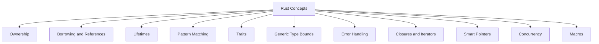
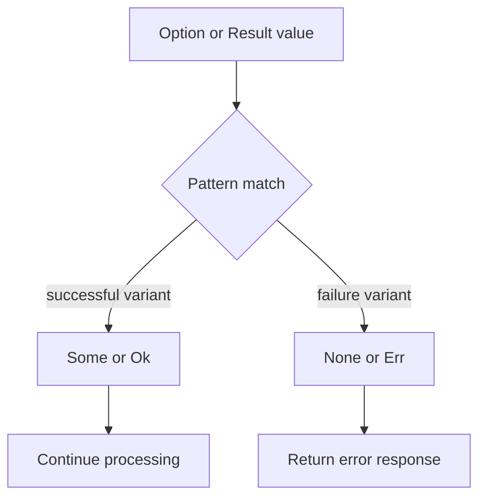
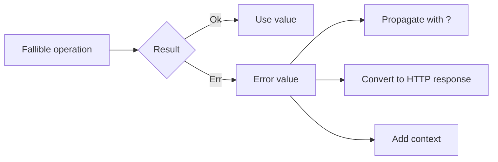
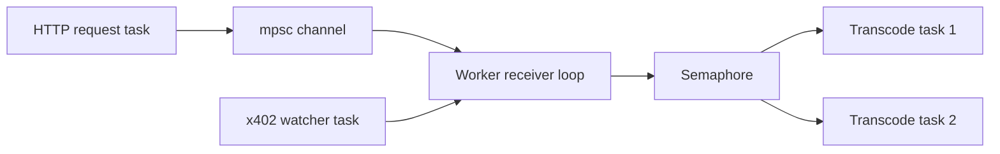
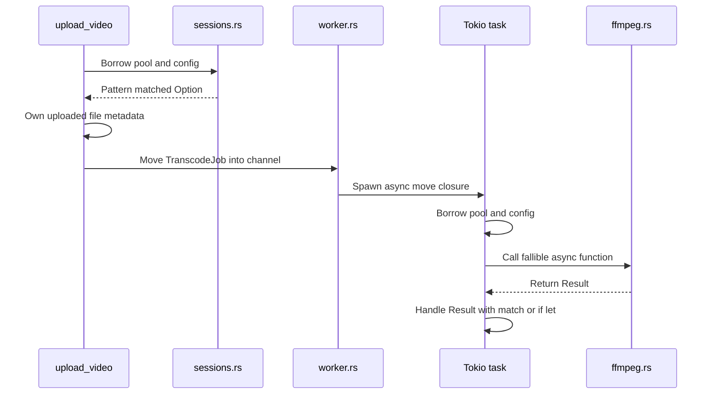

# Rust Concepts for Beginners in the PPV Stream Codebase

## 1. Introduction

This document helps beginner Rust developers understand where important Rust concepts are applied inside the PPV Stream repository.

The explanations are based on real code from this application, not isolated textbook examples. Each section answers three questions:

1. What does the Rust concept mean?
2. Where is it used in this repository?
3. Why is it useful in the application?

The concepts covered are:

* Ownership
* Borrowing and references
* Lifetimes
* Pattern matching
* Traits
* Generic type bounds
* Error handling
* Closures and iterators
* Smart pointers
* Concurrency and threading
* Macros

## 2. Concept Map



# 3. Ownership

## 3.1 What ownership means

In Rust, every value has one owner. When the owner goes out of scope, Rust automatically drops the value.

Ownership prevents:

* use after free
* double free
* accidental shared mutation
* many memory safety bugs

A value can be moved from one variable to another. After the move, the old variable can no longer be used unless the type implements `Copy`.

## 3.2 Ownership in `src/main.rs`

```rust
async fn start_http_server(cfg: config::Config, pool: sqlx::PgPool) -> anyhow::Result<()> {
```

This function takes ownership of both `cfg` and `pool`.

The caller:

```rust
start_http_server(cfg, pool).await
```

moves both values into `start_http_server()`.

After this call, `main()` cannot use `cfg` or `pool` again.

This is appropriate because `main()` delegates full application startup responsibility to the server function.

## 3.3 Ownership when creating jobs

In `src/handlers/upload.rs`:

```rust
st.worker.enqueue(TranscodeJob {
    video_id: vid.clone(),
    input_path: saved_path.to_string_lossy().to_string(),
    out_dir,
}).await
```

A new `TranscodeJob` owns its fields.

The job is moved into `enqueue()` and then moved into the Tokio channel.

```rust
pub async fn enqueue(&self, job: TranscodeJob) -> Result<()> {
    self.tx.send(job).await.map_err(|e| anyhow!(e))
}
```

After `send(job)`, the `enqueue()` function no longer owns the job. The receiver side owns it.

## 3.4 Ownership in worker tasks

In `src/worker.rs`:

```rust
tokio::spawn(async move {
    let _permit = permit;
    if let Err(e) = process_job(&pool, &cfg, job).await {
        error!("transcode job failed: {e}");
    }
});
```

The keyword `move` transfers ownership of `permit`, `pool`, `cfg`, and `job` into the asynchronous task.

This is required because the spawned task may continue running after the surrounding loop iteration ends.

## 3.5 Ownership summary


# 4. Borrowing and References

## 4.1 What borrowing means

Borrowing allows code to use a value without taking ownership.

Rust references use:

```rust
&T
```

for immutable borrowing, and:

```rust
&mut T
```

for mutable borrowing.

The main rule is:

* many immutable references may exist at the same time
* only one mutable reference may exist at a time
* mutable and immutable references cannot overlap

## 4.2 Immutable borrowing in database helpers

In `src/db.rs`:

```rust
pub async fn new_pool(database_url: &str) -> anyhow::Result<PgPool>
```

The function borrows the database URL as `&str`.

It does not take ownership of the original `String` stored in `Config`.

Called from:

```rust
let pool = db::new_pool(&cfg.database_url).await?;
```

The `&` creates a reference to `cfg.database_url`.

## 4.3 Borrowing shared application state

In `src/worker.rs`:

```rust
async fn process_job(pool: &PgPool, cfg: &Config, job: TranscodeJob) -> Result<()>
```

The function borrows:

* `pool` as `&PgPool`
* `cfg` as `&Config`

but takes ownership of `job`.

This design makes sense because:

* the database pool is shared across many jobs
* configuration is read only
* the job belongs to one processing task

## 4.4 Borrowing string data

In `src/handlers/users.rs`:

```rust
let wa_trim = f.wallet_account.trim();
```

`trim()` returns a borrowed `&str` slice pointing into the existing `String`.

No new string allocation happens yet.

Later:

```rust
let wallet_to_save = if wa_trim.is_empty() {
    "".to_string()
} else {
    wa_trim.to_lowercase()
};
```

A new owned `String` is created only when needed.

## 4.5 Borrowing versus cloning

In `src/main.rs`:

```rust
let users_state = UsersState {
    pool: pool.clone(),
    cfg: cfg.clone(),
};
```

This does not borrow the values. It clones their handles or data.

For `PgPool`, cloning is cheap because it creates another handle to the same underlying pool.

For `Config`, cloning duplicates its owned fields.

Borrowing would not work easily here because Axum state must usually be owned and live for the whole server lifetime.

# 5. Lifetimes

## 5.1 What lifetimes mean

Lifetimes describe how long references remain valid.

Rust often infers lifetimes automatically, so explicit syntax such as `'a` does not appear frequently in this repository.

Even when no lifetime annotation is written, lifetime rules still apply.

## 5.2 Lifetime elision in function parameters

Example from `src/ffmpeg.rs`:

```rust
pub async fn run_ffmpeg(args: &[String], work_dir: &str) -> Result<()>
```

Both parameters are references.

Rust infers that these references only need to remain valid while the function is running.

The function does not return a reference, so explicit lifetime annotations are unnecessary.

## 5.3 Owned values across `.await`

In `src/worker.rs`:

```rust
let master_abs_owned = master_abs.to_string_lossy().into_owned();
```

The code intentionally creates an owned `String` before the following asynchronous database call.

This avoids keeping a temporary borrowed value alive across `.await`.

This is related to Rust error E0716, where a temporary value is dropped while still borrowed.

The owned value safely survives until the SQL query completes.

## 5.4 `'static` requirement in spawned tasks

`tokio::spawn()` requires the spawned future to be effectively `'static` because the task may outlive the current function scope.

That is why this code uses `async move`:

```rust
tokio::spawn(async move {
    if let Err(e) = process_job(&pool, &cfg, job).await {
        error!("transcode job failed: {e}");
    }
});
```

Owned clones are moved into the task rather than temporary references to local variables.

## 5.5 Practical lifetime rule for beginners

When a value must survive:

* an asynchronous task
* a spawned thread
* storage inside a struct
* an `.await` boundary

it is often easier to use an owned value or an owned clone rather than a short lived reference.

# 6. Pattern Matching

## 6.1 What pattern matching means

Pattern matching lets Rust inspect enum variants, destructure values, and branch safely.

Common tools include:

* `match`
* `if let`
* `let else`
* destructuring tuples

## 6.2 Matching `Option`

In `src/handlers/stream.rs`:

```rust
let Some(v) = row else {
    return (
        StatusCode::NOT_FOUND,
        Json(json!({"ok": false, "error": "video not found"})),
    ).into_response();
};
```

This uses `let else` pattern matching.

Meaning:

* when `row` is `Some(v)`, extract the value into `v`
* when `row` is `None`, return immediately

## 6.3 Matching `Result`

In `src/ffmpeg.rs`:

```rust
match cmd.spawn() {
    Ok(mut child) => {
        // process child
    }
    Err(_) => None,
}
```

The code handles both possible variants of `Result`:

* `Ok(value)`
* `Err(error)`

## 6.4 Matching encoder modes

In `src/ffmpeg.rs`:

```rust
match hwaccel {
    "nvidia" => { /* NVENC */ }
    "intel" => { /* Quick Sync */ }
    "amd" => { /* VAAPI */ }
    _ => { /* CPU libx264 */ }
}
```

The wildcard pattern `_` handles every unmatched value.

## 6.5 Matching optional authentication

In multiple handlers:

```rust
let (user_id, _is_admin) = match sessions::current_user_id(...).await {
    Some(v) => v,
    None => return unauthorized_response,
};
```

The `Some(v)` branch destructures a tuple returned inside `Option`.

## 6.6 Pattern matching flow



# 7. Traits

## 7.1 What traits mean

Traits define shared behavior.

A trait is similar to an interface, but Rust traits can also provide default implementations and work with generics.

This codebase uses many library traits even when it does not define custom traits.

## 7.2 `Clone`

Many state structs use:

```rust
#[derive(Clone)]
pub struct VideoState {
    pub pool: PgPool,
    pub cfg: Config,
}
```

`Clone` allows Axum and the application to duplicate state handles safely.

## 7.3 `Debug`

Example:

```rust
#[derive(Clone, Debug)]
pub struct TranscodeJob
```

The `Debug` trait allows values to be formatted with `{:?}`.

## 7.4 `Serialize` and `Deserialize`

Example from handler request and response models:

```rust
#[derive(Deserialize)]
pub struct StartPayReq
```

```rust
#[derive(Serialize)]
pub struct StartPayResp
```

Serde uses these traits to convert between Rust values and JSON or form data.

## 7.5 `IntoResponse`

Axum handlers return:

```rust
impl IntoResponse
```

`IntoResponse` is a trait. Any type implementing it can become an HTTP response.

Examples include:

* `Json<T>`
* `Redirect`
* `(StatusCode, Json<T>)`
* `(StatusCode, HeaderMap, Body)`

## 7.6 `FromStr`

In EVM address validation:

```rust
Address::from_str(wa_trim)
```

`FromStr` is a standard Rust trait used to parse values from strings.

## 7.7 Async I/O traits

In `src/ffmpeg.rs`:

```rust
use tokio::io::AsyncReadExt;
```

`AsyncReadExt` is an extension trait that adds methods such as:

```rust
read()
read_to_end()
```

to asynchronous readers.

# 8. Generic Type Bounds

## 8.1 What generic type bounds mean

Generics let functions work with multiple types.

Trait bounds restrict which types are allowed.

## 8.2 Real example in `src/worker.rs`

```rust
async fn run_work_dir<F, Fut>(dir: &str, f: F) -> Result<()>
where
    F: FnOnce() -> Fut,
    Fut: std::future::Future<Output = Result<()>>,
```

This function is generic over two types:

* `F`, the closure type
* `Fut`, the future returned by the closure

The bounds say:

```text
F must be callable once
F must return Fut
Fut must be a Future
The Future must produce Result<()>
```

The function is called like this:

```rust
run_work_dir(out_dir, || run_ffmpeg(&args, out_dir)).await?;
```

The closure is accepted because it satisfies the bounds.

## 8.3 `impl IntoResponse`

Although not written with angle bracket syntax, this is also an abstract type constrained by a trait:

```rust
pub async fn upload_video(...) -> impl IntoResponse
```

The function promises to return some concrete type implementing `IntoResponse`, while hiding the exact type from the caller.

# 9. Error Handling

## 9.1 Rust error model

Rust generally uses:

```rust
Result<T, E>
```

for recoverable errors, and:

```rust
Option<T>
```

for values that may be absent.

## 9.2 The `?` operator

In `src/db.rs`:

```rust
let pool = PgPoolOptions::new()
    .max_connections(10)
    .connect(database_url)
    .await?;
```

The `?` operator means:

* if successful, extract the value
* if an error occurs, return the error from the current function

## 9.3 Adding context

In `src/ffmpeg.rs`:

```rust
tokio::fs::create_dir_all(out_dir)
    .await
    .with_context(|| format!("create_dir_all({out_dir})"))?;
```

`with_context()` adds a useful explanation to the original error.

## 9.4 Creating custom errors

```rust
.ok_or_else(|| anyhow!("failed to take ffmpeg stderr"))?;
```

This converts `Option::None` into an error.

## 9.5 HTTP error responses

Handlers often translate internal errors into HTTP responses:

```rust
Err(e) => {
    return (
        StatusCode::INTERNAL_SERVER_ERROR,
        Json(json!({"ok": false, "error": format!("db error: {e}")})),
    ).into_response()
}
```

## 9.6 Best effort error handling

Some database updates intentionally ignore errors:

```rust
.execute(pool)
.await
.ok();
```

This converts `Result` into `Option` and discards the error.

This may be acceptable for cleanup or noncritical updates, but it can hide important failures.

## 9.7 Error handling flow



# 10. Closures and Iterators

## 10.1 Closures

Closures are anonymous functions.

Example:

```rust
.unwrap_or_else(|_| "storage".into())
```

The closure runs only when the environment variable is missing.

## 10.2 Iterator chains in configuration

In `src/config.rs`:

```rust
s.split(',')
    .map(|x| x.trim().trim_matches(&[' ', '.', ';'][..]).to_ascii_lowercase())
    .filter(|x| !x.is_empty())
    .collect()
```

The steps are:

1. split the string
2. transform every item
3. remove empty items
4. collect into a vector

## 10.3 Iterator use in HLS ladder selection

In `src/ffmpeg.rs`:

```rust
let mut ladder: Vec<u32> = vec![1080, 720, 480]
    .into_iter()
    .filter(|&h| h <= source_h)
    .collect();
```

The closure:

```rust
|&h| h <= source_h
```

keeps only resolutions that do not exceed the source height.

## 10.4 Mapping values

```rust
let split_labels: Vec<String> = (0..n)
    .map(|i| format!("[v{i}]"))
    .collect();
```

The range produces integers. The closure converts each integer into a string.

## 10.5 Closures passed as function values

In `src/worker.rs`:

```rust
run_work_dir(out_dir, || run_ffmpeg(&args, out_dir)).await?;
```

The closure is passed into another function and invoked later.

# 11. Smart Pointers

## 11.1 What smart pointers mean

Smart pointers are data structures that behave like pointers while providing extra behavior such as reference counting, ownership, locking, or automatic cleanup.

## 11.2 `Arc`

In `src/worker.rs`:

```rust
let sem = std::sync::Arc::new(Semaphore::new(concurrency.max(1)));
```

`Arc` means Atomic Reference Counted pointer.

It allows multiple asynchronous tasks to share ownership of the semaphore safely.

Each clone increments the reference count:

```rust
let sem = sem.clone();
```

The semaphore is dropped only when the final `Arc` is dropped.

## 11.3 `Arc` in blockchain provider

In `src/services/x402_watcher.rs`:

```rust
let client = std::sync::Arc::new(provider);
let contract = X402Splitter::new(contract_addr, client);
```

The Ethereum contract client shares ownership of the provider.

## 11.4 `Mutex`

In `src/handlers/pay.rs`:

```rust
static PRICE_CACHE: Lazy<Mutex<HashMap<String, CacheEntry>>> =
    Lazy::new(|| Mutex::new(HashMap::new()));
```

The `Mutex` allows only one thread at a time to modify or read the shared cache through the lock guard.

## 11.5 `Box`

No important explicit `Box<T>` use appears in the main application code. However, async functions and library internals may use boxed futures internally.

# 12. Concurrency and Threading

## 12.1 Tokio asynchronous runtime

The application starts with:

```rust
#[tokio::main]
async fn main()
```

This macro creates a Tokio runtime capable of running many asynchronous tasks.

## 12.2 Spawning tasks

In `src/worker.rs`:

```rust
tokio::spawn(async move {
    // process job
});
```

This schedules work concurrently on the Tokio runtime.

It is asynchronous concurrency, not necessarily one operating system thread per job.

## 12.3 Channel based communication

```rust
let (tx, mut rx) = mpsc::channel::<TranscodeJob>(1024);
```

The upload handler sends jobs through `tx`.

The worker loop receives them through `rx`.

This separates HTTP request processing from expensive video transcoding.

## 12.4 Semaphore based concurrency limit

```rust
let sem = Arc::new(Semaphore::new(concurrency.max(1)));
```

Before processing a job:

```rust
let permit = sem.clone().acquire_owned().await.unwrap();
```

The permit limits how many transcoding jobs can run at the same time.

## 12.5 Concurrent stderr reading

In `src/ffmpeg.rs`:

```rust
let stderr_task = tokio::spawn(async move {
    // read stderr
});
```

FFmpeg stderr is consumed concurrently while the main function waits for the child process.

This prevents the stderr pipe from filling and blocking FFmpeg.

## 12.6 Watcher concurrency

In `src/main.rs`, the x402 watcher runs in a separate task:

```rust
tokio::spawn(async move {
    if let Err(e) = run_watcher(pool_clone, wss, addr).await {
        tracing::error!("x402 watcher error: {}", e);
    }
});
```

The HTTP server continues serving requests while the blockchain watcher listens for events.

## 12.7 Concurrency architecture



# 13. Macros

## 13.1 What macros mean

Macros generate code at compile time or provide syntax that looks like a function call but works differently.

Rust macro calls usually end with `!`.

## 13.2 Derive macros

```rust
#[derive(Clone, Debug)]
```

This asks the compiler to generate implementations of the `Clone` and `Debug` traits.

Serde derive macros include:

```rust
#[derive(Serialize)]
#[derive(Deserialize)]
```

## 13.3 Attribute macro `tokio::main`

```rust
#[tokio::main]
```

This transforms the async `main()` function into a normal executable entry point that starts a Tokio runtime.

## 13.4 SQLx macros

```rust
sqlx::query!(...)
```

and:

```rust
sqlx::query_scalar!(...)
```

These macros can verify SQL structure and infer row fields at compile time when database metadata is available.

The repository also uses runtime query functions:

```rust
sqlx::query(...)
```

which are normal functions rather than macros.

## 13.5 JSON macro

```rust
json!({
    "ok": true,
    "video_id": vid
})
```

The `serde_json::json!` macro builds JSON values using concise syntax.

## 13.6 Formatting macros

Common examples include:

```rust
format!("{}.faststart.mp4", job.video_id)
println!("listening on http://{}", addr)
```

## 13.7 Logging macros

```rust
info!("transcode done")
error!("transcode job failed: {e}")
warn!("upload mime suspect: {}", mime)
```

These macros integrate with the tracing logging system.

## 13.8 Ethereum `abigen!` macro

In `src/services/x402_watcher.rs`:

```rust
abigen!(
    X402Splitter,
    r#"[...]"#
);
```

The macro generates Rust types and methods from a smart contract ABI.

It creates types such as:

```text
X402Splitter
PaidFilter
```

without manually writing all decoding code.

# 14. How the Concepts Work Together

A real application flow combines many Rust concepts at once.

Example: video upload and transcoding.



Concepts involved:

| Concept | Application |
|---|---|
| Ownership | `TranscodeJob` is moved into the queue |
| Borrowing | `&PgPool` and `&Config` are shared without ownership transfer |
| Lifetimes | owned values survive spawned tasks and `.await` boundaries |
| Pattern matching | session and errors are inspected through `match` and `if let` |
| Traits | `Clone`, `IntoResponse`, async I/O extension traits |
| Generic bounds | `run_work_dir<F, Fut>` accepts async closures |
| Error handling | `Result`, `Option`, `?`, `anyhow` |
| Closures | iterator transformations and deferred FFmpeg execution |
| Smart pointers | `Arc<Semaphore>` shares concurrency control |
| Concurrency | Tokio tasks, channels, semaphores |
| Macros | `query!`, `json!`, `error!`, `tokio::main` |

# 15. Suggested Learning Order

For a beginner reading this repository, use this order:

1. `src/validators.rs`
2. `src/config.rs`
3. `src/db.rs`
4. `src/sessions.rs`
5. `src/handlers/me.rs`
6. `src/handlers/auth_user.rs`
7. `src/handlers/video.rs`
8. `src/handlers/upload.rs`
9. `src/worker.rs`
10. `src/ffmpeg.rs`
11. `src/handlers/stream.rs`
12. `src/handlers/pay.rs`
13. `src/services/x402_watcher.rs`
14. `src/main.rs`

This order moves from simple functions to asynchronous, concurrent, and blockchain related code.

# 16. Beginner Exercises

## Exercise 1: Ownership

Modify `Worker::enqueue()` to log the video ID before sending the job. Observe why logging after `send(job)` is not possible unless the ID is cloned first.

## Exercise 2: Borrowing

Create a function:

```rust
fn is_video_extension_allowed(cfg: &Config, ext: &str) -> bool
```

Use references so the function does not take ownership of `Config` or the extension string.

## Exercise 3: Pattern matching

Rewrite one `match` over `Option` using `let else`.

## Exercise 4: Iterator

Replace a manual loop that creates labels with an iterator using `map()` and `collect()`.

## Exercise 5: Error handling

Change one ignored database error using `.ok()` into a logged error using `if let Err(e)`.

## Exercise 6: Traits

Add `Debug` to one request structure and log it safely without exposing passwords or private keys.

## Exercise 7: Concurrency

Change worker concurrency from two to one and observe how jobs are serialized.

# 17. Key Takeaways

The PPV Stream application demonstrates that Rust language concepts are not isolated academic topics.

They directly support production behavior:

* Ownership controls who is responsible for jobs and request data.
* Borrowing allows database pools and configuration to be reused safely.
* Lifetimes prevent invalid references during asynchronous work.
* Pattern matching makes absence and failure explicit.
* Traits connect application types to Axum, Serde, parsing, and async I/O.
* Generic bounds allow reusable helpers to accept asynchronous closures.
* Error handling avoids hidden exceptions.
* Iterators express data transformation clearly.
* Smart pointers make shared state safe.
* Tokio concurrency separates HTTP requests from expensive processing.
* Macros reduce boilerplate for SQL, JSON, logging, async runtime setup, and blockchain bindings.

This repository is therefore a useful practical learning project for moving from basic Rust syntax into real web, database, multimedia, and blockchain development.
