# PPV Stream Rust Technical Documentation

→ [README.md](README.md) | [WALLET.md](WALLET.md) | [AFFILIATE.md](AFFILIATE.md) | [PAYMENT.md](PAYMENT.md) | [PAYMENT_PLUGIN_ARCHITECTURE.md](PAYMENT_PLUGIN_ARCHITECTURE.md)

## 1. Purpose

This document explains the Rust codebase of the PPV Stream platform, including the purpose of each source file, every important function, module dependencies, runtime flow, database interaction, video processing, authentication, payment, streaming, wallet, and affiliate behavior.

The application is a Rust based pay per view video platform built around:

* Axum for HTTP routing
* Tokio for asynchronous execution
* SQLx with PostgreSQL
* FFmpeg and FFprobe for video processing
* HLS for adaptive and session based streaming
* Argon2 for password hashing
* HMAC signed cookies for session integrity
* Ethereum compatible x402 payment flows
* Internal wallet ledger (pure database, no blockchain)
* Affiliate commission system
* Optional blockchain event watching

## 2. High Level Architecture

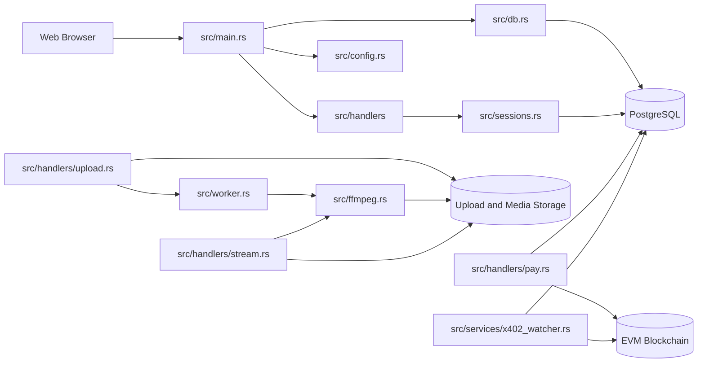

## 3. Source Tree and Responsibility

```text
src/
├── main.rs                   ← composition root; all routers and state wired here
├── commission.rs             ← affiliate commission helper (all payment paths use this)
├── config.rs
├── db.rs
├── email.rs                  ← SMTP email (lettre); send_reset, send_password_changed, send_test
├── ffmpeg.rs
├── sessions.rs               ← HMAC-SHA256 signed session cookies
├── validators.rs
├── worker.rs                 ← in-process transcode queue with Semaphore
├── handlers/
│   ├── mod.rs
│   ├── admin.rs              ← admin_data, admin_payments, admin_disburse, admin_smtp
│   │                            admin_wallet_transactions, admin_wallet_approve/complete/reject
│   ├── affiliate.rs          ← affiliate_settings_get/save, affiliate_link, affiliate_earnings
│   │                            affiliate_program_info, admin_affiliate_commissions
│   ├── auth_admin.rs         ← post_admin_login/logout, admin_change_password
│   ├── auth_user.rs          ← post_register/login/logout/forgot/reset, change_password
│   ├── kurs.rs               ← USD/IDR exchange rate
│   ├── me.rs                 ← GET /api/me (current user info)
│   ├── pay.rs                ← x402 payment + all_options endpoint
│   ├── payment_plugins.rs    ← fiat plugin handlers + affiliate commission on webhook
│   ├── setup.rs              ← admin bootstrap
│   ├── stream.rs             ← HLS playback + watermark generation
│   ├── upload.rs             ← video upload with atomic write
│   ├── users.rs              ← profile CRUD + public profiles
│   ├── video.rs              ← video list/update/allowlist
│   └── wallet.rs             ← balance/deposit/withdraw/transfer/pay + commission call
├── plugins/
│   ├── mod.rs
│   ├── payment/
│   │   ├── mod.rs
│   │   ├── models.rs
│   │   ├── traits.rs         ← PaymentPlugin trait
│   │   ├── registry.rs       ← PaymentPluginRegistry
│   │   └── providers/
│   │       ├── x402.rs
│   │       ├── stripe.rs     ← Checkout Sessions + HMAC-SHA256 webhook
│   │       ├── paypal.rs     ← Orders v2 + verify-webhook-signature
│   │       ├── midtrans.rs   ← Snap API + SHA-512 webhook
│   │       └── xendit.rs     ← Invoice API + callback token + auto-disburse
│   └── storage/
│       └── ...               ← local / S3 storage plugin
├── services/
│   └── x402_watcher.rs       ← optional WebSocket blockchain event listener
└── bin/
    └── seed_dummy.rs
```

Some files such as `auth.rs`, `bootstrap.rs`, `hls.rs`, and `token.rs` appear to be legacy or currently unregistered modules because `main.rs` does not declare them. They are documented because they remain part of the repository and may still be useful for migration or future refactoring.

# 4. Application Bootstrap

## 4.1 `src/main.rs`

### Purpose

`main.rs` is the composition root. It initializes the application, loads configuration, creates the database pool, constructs route groups, attaches state and middleware, optionally starts the x402 watcher, and starts the Axum HTTP server.

### Functions

#### `main() -> anyhow::Result<()>`

Responsibilities:

1. Initialize tracing based logging.
2. Call `Config::from_env()` from `config.rs`.
3. Call `db::new_pool()` from `db.rs`.
4. Delegate server construction to `start_http_server()`.

Dependencies:

```text
main()
├── tracing_subscriber
├── config::Config::from_env
├── db::new_pool
└── start_http_server
```

#### `start_http_server(cfg, pool) -> anyhow::Result<()>`

Responsibilities:

* Construct static file services.
* Build each route group.
* Create handler state objects.
* Create the video processing worker.
* Merge all routers.
* Attach cookie middleware.
* Start the optional x402 event watcher.
* Bind the TCP listener and serve requests.

Registered routes include:

| Route | Handler |
|---|---|
| `GET /health` | inline health response |
| `POST /auth/register` | `auth_user::post_register` |
| `POST /auth/login` | `auth_user::post_login` |
| `POST /auth/logout` | `auth_user::post_logout` |
| `POST /api/change_password` | `auth_user::change_password` |
| `POST /admin/login` | `auth_admin::post_admin_login` |
| `POST /admin/logout` | `auth_admin::post_admin_logout` |
| `POST /admin/change_password` | `auth_admin::admin_change_password` |
| `GET /admin/data` | `admin::admin_data` |
| `GET /admin/payments` | `admin::admin_payments` |
| `POST /admin/payments/:uid/disburse` | `admin::admin_disburse` |
| `GET /admin/smtp` | `admin::admin_smtp_get` |
| `POST /admin/smtp` | `admin::admin_smtp_save` |
| `GET /setup_admin` | `setup::setup_admin` |
| `POST /api/upload` | `upload::upload_video` |
| `GET /api/videos` | `video::list_videos` |
| `GET /api/my_videos` | `video::my_videos` |
| `GET /api/user_lookup` | `video::user_lookup` |
| `POST /api/allow` | `video::add_allow` |
| `POST /api/video_update` | `video::update_video` |
| `GET /api/pay/options` | `pay::pay_options` |
| `POST /api/pay/x402/start` | `pay::x402_start` |
| `GET /api/crypto_price` | `pay::crypto_price` |
| `POST /api/pay/x402/confirm` | `pay::x402_confirm` |
| `GET /api/pay/providers` | `payment_plugins::list_payment_plugins` |
| `POST /api/pay/start` | `payment_plugins::create_default_payment_invoice` |
| `POST /api/pay/confirm` | `payment_plugins::confirm_default_payment` |
| `POST /api/pay/:provider/start` | `payment_plugins::create_payment_invoice` |
| `POST /api/pay/:provider/confirm` | `payment_plugins::confirm_payment` |
| `POST /api/pay/:provider/webhook` | `payment_plugins::handle_webhook` |
| `GET /api/profile` | `users::get_my_profile` |
| `POST /api/profile_update` | `users::update_my_profile` |
| `GET /api/user_profile` | `users::public_profile` |
| `GET /api/request_play` | `stream::request_play` |
| `GET /hls/:session/:file` | `stream::serve_hls` |
| `GET /api/me` | `me::me` |
| `GET /api/kurs` | `kurs::get_kurs` through `kurs::router` |

# 5. Configuration and Database

## 5.1 `src/config.rs`

### `Config`

The shared runtime configuration object. It stores database, server, filesystem, upload, HLS, security, exchange rate, hardware acceleration, and x402 settings.

Important fields:

| Field | Purpose |
|---|---|
| `database_url` | PostgreSQL connection string |
| `bind` | HTTP listen address |
| `upload_dir` | Original uploaded media |
| `media_dir` | Preprocessed HLS output |
| `tmp_dir` | Temporary processing files |
| `public_dir` | Frontend static assets |
| `hls_root` | Per playback session HLS output |
| `hls_segment_seconds` | HLS segment duration |
| `watermark_font` | Font used for dynamic watermarking |
| `session_token_ttl` | Login session lifetime |
| `hmac_secret` | Session cookie signing key |
| `hwaccel` | Video encoder mode |
| `max_upload_bytes` | Upload size limit |
| `allow_exts` | Allowed media extensions |
| `dollar_usd_to_rupiah` | USD to IDR conversion |
| `x402_contract` | Payment smart contract address |
| `x402_rpc_wss` | WebSocket blockchain RPC |
| `x402_chain_id` | EVM chain identifier |

### `Config::from_env() -> Config`

Reads environment variables, applies defaults, creates configured directories, logs a redacted configuration summary, and returns the configuration.

Related functions:

* `ensure_dirs()` creates all storage directories.
* `video_hls_dir(video_id)` generates `media_dir/<video_id>`.
* `redacted()` masks passwords in logged database URLs.
* `parse_csv_list()` normalizes comma separated extension lists.

## 5.2 `src/db.rs`

### `new_pool(database_url) -> anyhow::Result<PgPool>`

Creates a PostgreSQL connection pool with up to ten connections, executes SQLx migrations from the `sql` directory, and returns the pool.

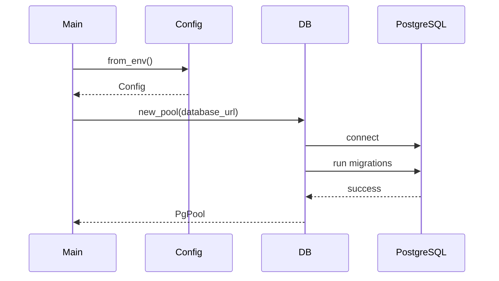

# 6. Authentication, Sessions, and Validation

## 6.1 `src/sessions.rs`

This module implements database backed sessions and HMAC signed cookies.

### Private helpers

#### `b64(s)`

Encodes a string with URL safe Base64 without padding.

#### `b64_bytes(bytes)`

Encodes raw bytes for use in the cookie signature.

#### `b64_decode_to_string(s)`

Decodes the session ID component.

#### `sign_sid(sid, secret)`

Creates an HMAC SHA256 signature over the raw session ID.

#### `build_cookie_value(sid, secret)`

Creates the cookie format:

```text
base64(session_id).base64(hmac_signature)
```

#### `parse_and_verify_cookie(value, secret)`

Decodes the session ID and verifies the HMAC signature. Invalid cookies return `None`.

### Public functions

#### `create_session(pool, cfg, user_id, is_admin, cookies)`

Creates a session row with expiry time and adds an HTTP only, SameSite Lax cookie.

#### `destroy_session(pool, cfg, cookies)`

Verifies the cookie, deletes the database session, and removes the cookie.

#### `current_user_id(pool, cfg, cookies)`

Verifies the signed cookie, loads the session row, checks expiry, removes expired sessions, and returns `(user_id, is_admin)`.

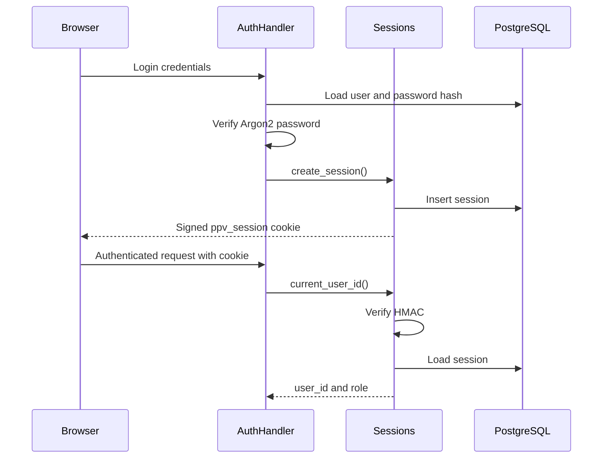

## 6.2 `src/validators.rs`

### `valid_email(s) -> bool`

Applies a basic regular expression to validate common email structure.

### `valid_password(s) -> bool`

Requires a minimum length of eight characters.

## 6.3 `src/email.rs`

This module manages outgoing email through `lettre` with `AsyncSmtpTransport<Tokio1Executor>`.

### `SmtpConfig`

Holds SMTP connection parameters: `host`, `port`, `username`, `password`, `from_email`, `from_name`, `use_tls`, `enabled`.

### `SmtpConfig::load(pool)`

Reads SMTP settings from the `smtp_settings` table (row id=1). Uses `sqlx::query()` for runtime reflection so no live DB is required at compile time.

### `send(cfg, to_email, to_name, subject, html)`

Builds a `lettre::Message` and sends via `relay()` (TLS port 465) or `starttls_relay()` (STARTTLS port 587) depending on `use_tls`. If `cfg.enabled` is false, the message is logged only.

### `send_reset(pool, to_email, token, base_url)`

Sends a password-reset email with an HTML button linking to `/auth/reset_password.html?token=...`. Used by `post_forgot()`.

### `send_password_changed(pool, to_email, username)`

Sends a security notification email when a password is successfully changed. Called fire-and-forget via `tokio::spawn` from both `change_password` and `admin_change_password`.

### `send_test(cfg, to_email)`

Sends a test email using the provided `SmtpConfig` directly (does not reload from DB). Used by `admin_smtp_save()` when `test_email` is present in the payload.

# 7. User Authentication Handlers

## 7.1 `src/handlers/auth_user.rs`

### `post_register()`

Flow:

1. Validate required fields.
2. Validate email and password.
3. Check email uniqueness.
4. Hash password with Argon2.
5. Insert a non admin user.
6. Redirect to login.

Dependencies: `validators.rs`, PostgreSQL, Argon2.

### `post_login()`

Loads the user by email, verifies the Argon2 hash, creates a signed session through `sessions::create_session()`, and redirects to the dashboard.

### `post_logout()`

Calls `sessions::destroy_session()` and redirects to login.

### `post_forgot()`

Creates a two hour password reset token when the account exists, stores it in `password_resets`, and calls `email::send_reset()`. The same success response is returned for existing and nonexistent accounts to reduce account enumeration.

### `post_reset()`

Validates the new password, checks reset token validity and expiry, hashes the new password, updates the user, and marks the reset token as used.

## 7.2 `src/handlers/auth_admin.rs`

### `post_admin_login()`

Authenticates a user with Argon2, requires `is_admin != 0`, then creates an admin session.

### `post_admin_logout()`

Destroys the current session and redirects to the admin login page.

### `admin_change_password()`

Allows an authenticated admin to change their password. Flow:

1. Verify admin session via `sessions::current_user_id` and confirm `is_admin = true`.
2. Validate new password length ≥ 8 and differs from current.
3. Load `password_hash, email, username` from `users` using `sqlx::query()`.
4. Verify current password with Argon2.
5. Hash new password with Argon2 and `SaltString::generate`.
6. `UPDATE users SET password_hash` in PostgreSQL.
7. Fire-and-forget `email::send_password_changed()` via `tokio::spawn`.

### `change_password()` (in `auth_user.rs`)

Same flow as above but for regular users. Requires non-admin session, same validation and email notification pattern.

# 8. User and Administration Handlers

## 8.1 `src/handlers/me.rs`

### `me()`

Returns basic identity data for the current session. It calls `sessions::current_user_id()` and then selects `id`, `username`, and `email` from `users`.

## 8.2 `src/handlers/users.rs`

### `get_my_profile()`

Returns the authenticated user's full editable profile.

### `update_my_profile()`

Validates the optional EVM wallet address, normalizes it to lowercase, and updates bank, wallet, chain, WhatsApp, and profile description fields.

### `public_profile()`

Loads a profile by `user_id` or `username`. The current implementation exposes email, banking, wallet, and WhatsApp data, so privacy requirements should be reviewed before production use.

## 8.3 `src/handlers/admin.rs`

### `admin_data()`

Builds an HTML page containing recent rows and total counts for: users, sessions, videos, allowlist, purchases, and password resets. Contains an internal `esc()` HTML escaping helper.

Note: admin session check is commented out in this handler; route is not protected in the current implementation.

### `admin_payments()`

Returns JSON with fiat invoice monitoring data. Accepts query parameters `provider`, `status`, and `limit`. Builds a dynamic SQL string and returns:

```json
{
  "ok": true,
  "totals": {"all": 42, "paid": 10, "pending": 30, "failed": 2},
  "items": [...]
}
```

Each item includes `invoice_uid`, `provider`, `buyer_username`, `buyer_email`, `video_title`, `amount`, `currency`, `status`, `created_at`, `paid_at`, `disbursed_at`, `disburse_ref`, `creator_bank`.

### `admin_disburse()`

Triggers a disburse for a paid, not-yet-disbursed invoice. For Xendit, calls the real Disbursements API and stores the disburse reference. For other providers, marks `disburse_ref='manual'` and sets `disbursed_at`. Returns JSON with `ok`, `method`, and `disburse_ref`.

### `admin_smtp_get()`

Returns the current `smtp_settings` row as JSON. Used by `public/admin/settings.html` to pre-populate the form.

### `admin_smtp_save()`

Accepts `SmtpSavePayload` with all SMTP fields. UPSERTs into `smtp_settings`. If `test_email` is present, calls `email::send_test()` and returns `test_sent` or `test_error` in the response.

## 8.4 `src/handlers/setup.rs`

### `setup_admin()`

Uses environment based bootstrap credentials to create an administrator or promote an existing user. If `ADMIN_BOOTSTRAP_TOKEN` is configured, the query token must match.

# 9. Video Catalog and Access Control

## 9.1 `src/handlers/video.rs`

### Data structures

* `VideoState` contains configuration and database pool.
* `VideoItem` is the public video catalog representation.
* `MyVideo` contains creator specific video details and allowlist data.
* Request structs represent lookup, allowlist, and video update forms.

### `list_videos()`

Returns all videos joined with creator profile data.

### `my_videos()`

Authenticates the user, selects videos owned by that user, and loads allowlisted usernames for each video.

### `user_lookup()`

Searches users by exact username, exact email, or partial query.

### `add_allow()`

Verifies that the current user owns the video, resolves the target user, and inserts an idempotent allowlist entry.

### `update_video()`

Updates title, description, and price only when the authenticated user owns the video.

### `user_has_view_access(pool, video_id, user_id)`

Central authorization helper used by streaming. It grants access when:

1. The user owns the video, or
2. The user's username exists in the video's allowlist.

A successful x402 payment inserts an allowlist entry, so payment and streaming authorization are connected through this helper.

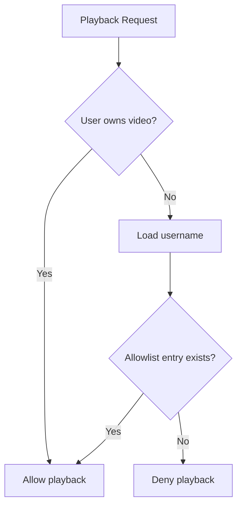

# 10. Upload and Background Processing

## 10.1 `src/handlers/upload.rs`

### `upload_video()`

This endpoint manages the complete upload acceptance flow.

Steps:

1. Authenticate through `sessions::current_user_id()`.
2. Ensure the upload directory exists.
3. Read multipart fields.
4. Generate a UUID for the video.
5. Validate extension against `Config::allow_exts`.
6. Stream chunks into a `.part` file.
7. Enforce `max_upload_bytes` while streaming.
8. Inspect initial bytes with `infer` for MIME diagnostics.
9. Atomically rename the completed file.
10. Insert video metadata with processing state `queued`.
11. Create a `TranscodeJob` and call `Worker::enqueue()`.
12. Return the new video ID and queued state.

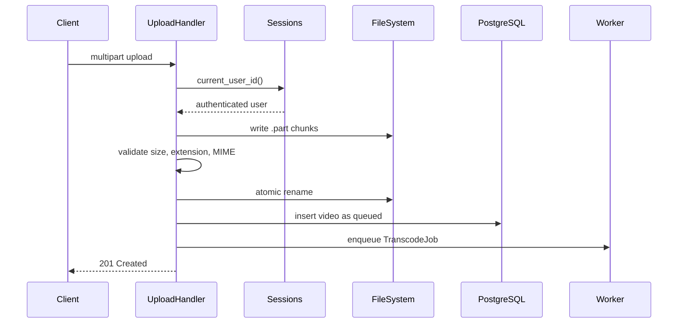

## 10.2 `src/worker.rs`

### `TranscodeJob`

Contains:

* `video_id`
* `input_path`
* `out_dir`

### `Worker::new(pool, cfg, concurrency)`

Creates a bounded Tokio channel and a semaphore limited processing loop. Every received job obtains a permit and runs `process_job()` in a spawned task.

### `Worker::enqueue(job)`

Sends a job to the channel.

### `process_job(pool, cfg, job)`

Processing lifecycle:

1. Set video state to `processing`.
2. Create a temporary FastStart MP4.
3. Create output directory.
4. Encode three HLS renditions.
5. Mark video `ready` and store master playlist path.
6. Remove the temporary MP4.
7. On failure, store `processing_state='error'` and `last_error`.

### Private `faststart_mp4()`

Creates a FastStart MP4 through `ffmpeg::run_ffmpeg()`.

### Private `encode_hls_abr()`

Creates fixed 240p, 360p, and 480p HLS variants using CPU based libx264 encoding.

### `run_work_dir()`

Creates the `v0`, `v1`, and `v2` directories before FFmpeg writes variant segments.

Important architectural observation: `worker.rs` contains its own private `faststart_mp4()` and `encode_hls_abr()` even though `ffmpeg.rs` also exposes equivalent functions. This creates duplicated transcoding logic and inconsistent output ladders. A future refactor should make `worker.rs` call `ffmpeg::faststart_mp4()` and `ffmpeg::encode_hls_abr()` directly.

# 11. FFmpeg Integration

## 11.1 `src/ffmpeg.rs`

### `run_ffmpeg(args, work_dir)`

Starts FFmpeg asynchronously, captures stderr concurrently, waits for completion, and returns detailed diagnostics on failure.

### `transcode_hls(input_path, session_dir, args)`

Compatibility wrapper that delegates to `run_ffmpeg()`.

### `faststart_mp4(input, output)`

Remuxes MP4 content without reencoding and applies `+faststart` so metadata is positioned for progressive playback.

### `ffprobe_duration(input)`

Returns media duration as seconds.

### `ffprobe_dimensions(input)`

Returns the first video stream width and height.

### `ffprobe_has_audio(input)`

Detects whether the source contains an audio stream.

### `encode_hls_abr(input_mp4, out_dir, hwaccel, seg_seconds)`

Generates an adaptive bitrate HLS ladder while avoiding upscale. It supports:

| Mode | Encoder |
|---|---|
| `nvidia` | `h264_nvenc` |
| `intel` | `h264_qsv` |
| `amd` | `h264_vaapi` |
| default | `libx264` |

The function adds silent AAC when the source lacks audio, aligns GOP settings, writes variant playlists and segments, and returns the master playlist path.

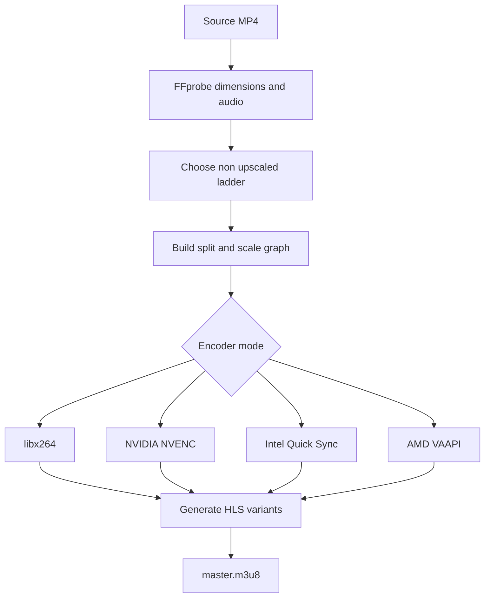

# 12. Playback and Watermarked Streaming

## 12.1 `src/handlers/stream.rs`

### `request_play()`

The playback setup endpoint performs:

1. Session authentication.
2. Video access authorization through `video::user_has_view_access()`.
3. Video metadata lookup.
4. Username lookup for watermark text.
5. Playback session UUID creation.
6. Session directory creation under `hls_root`.
7. Dynamic watermark text file creation.
8. FFmpeg drawtext filter generation with periodically changing position.
9. Source file resolution.
10. Per session HLS generation.
11. Return of `/hls/<session>/master.m3u8`.

### `resolve_input_path()`

Searches for the video source in this order:

1. Absolute path stored in the database
2. `upload_dir`
3. `media_dir`
4. `uploads`
5. Current working directory

The current implementation comment says it prefers worker generated HLS, but the actual resolution uses `filename` and then runs FFmpeg with `-i`. It does not directly resolve `media_dir/<video_id>/master.m3u8` because the function does not receive `video_id` or `hls_master`. This should be reviewed.

### `serve_hls()`

Validates session and file path tokens, opens the requested HLS file, assigns the correct MIME type, disables caching, and streams the file through `ReaderStream`.

### `file_type()`

Maps file suffixes to M3U8, TS, M4S, MP4, or unknown.

### `is_safe_token()`

Restricts session IDs to alphanumeric, hyphen, and underscore.

### `is_safe_file()`

Prevents path traversal and limits served extensions.

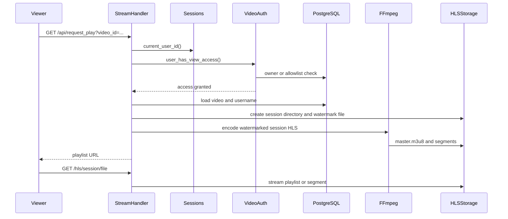

# 13. Payment and x402

## 13.1 `src/handlers/pay.rs`

### `pay_options()`

Loads video price, creator wallet, preferred chain, and active token configuration. It returns the payment choices required by the frontend.

### `x402_start()`

Creates a payment invoice and signed authorization payload.

Flow:

1. Authenticate buyer.
2. Validate video, chain, symbol, and payer address.
3. Load video price and creator wallet.
4. Validate token configuration.
5. Convert price cents to token base units.
6. Create invoice UUID and bytes32 hash.
7. Insert a pending invoice.
8. ABI encode payment parameters.
9. Hash the message.
10. Sign it with `X402_ADMIN_PRIVKEY`.
11. Return signature fields and contract parameters.

### `crypto_price()`

Fetches cryptocurrency prices from CoinGecko and caches responses in memory for sixty seconds.

### `paid_event_abi()`

Defines the `Paid` smart contract event schema for receipt decoding.

### `x402_confirm()`

Confirms payment by retrieving an Ethereum transaction receipt and validating:

* transaction success
* emitting contract address
* event signature
* invoice UID topic
* paid amount
* video ID

It then updates the invoice, records the purchase, and inserts the username into the video allowlist.

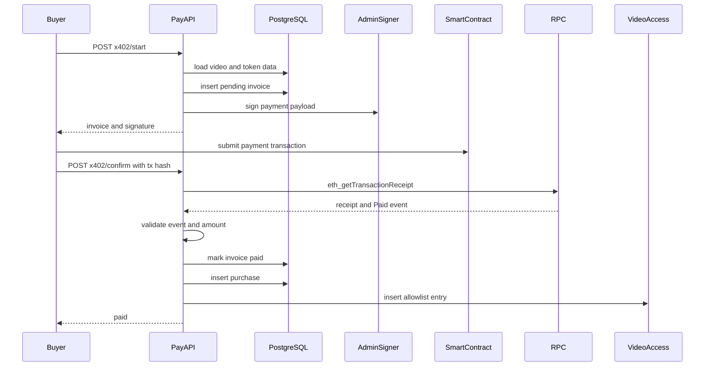

## 13.2 `src/services/x402_watcher.rs`

### `run_watcher(pool, wss_url, contract_addr)`

Runs forever, calling `watch_once()`. It reconnects ten seconds after graceful termination or failure.

### `watch_once()`

Connects to a WebSocket RPC endpoint, subscribes to `Paid` events, and calls `handle_paid_event()` for each event.

### `handle_paid_event()`

Looks up the invoice by hash, marks it paid, loads the user, and idempotently inserts purchase and allowlist rows.

The watcher and `x402_confirm()` overlap in responsibility. Both can unlock content. This is acceptable when database operations are idempotent, but invoice status and amount verification behavior should remain consistent between both paths.

# 14. Currency Route

## 14.1 `src/handlers/kurs.rs`

### `get_kurs()`

Returns the configured USD to IDR conversion value.

### `router(state)`

Builds the `/api/kurs` route with its configuration state.

# 15. Handler Module Registry

## 15.1 `src/handlers/mod.rs`

This file exposes each handler submodule to the crate. `main.rs` can only import handlers declared here.

# 16. Standalone Utilities and Legacy Files

## 16.1 `src/bin/seed_dummy.rs`

Standalone Tokio binary that inserts ten dummy users with Argon2 password hashes. It requires `DATABASE_URL`.

### `main()`

Connects to PostgreSQL, creates predictable sample accounts, skips existing emails, hashes passwords, and inserts users.

## 16.2 `src/auth.rs`

Legacy SQLite based username only login. It uses unsigned `username` and `user_id` cookies and is not registered by the current `main.rs`. It should not be used for production authentication.

### `post_login()`

Creates a user if missing and stores plain identity cookies.

### `current_username()`

Reads the legacy username cookie.

## 16.3 `src/bootstrap.rs`

Legacy SQLite administrator bootstrap utility. It is not compatible with the current PostgreSQL based main runtime.

### `ensure_admin_from_env()`

Checks whether an admin exists, then creates or promotes an admin inside a transaction.

## 16.4 `src/hls.rs`

Legacy helper that only builds FFmpeg arguments for single rendition HLS with a static watermark.

### `ffmpeg_hls_args()`

Returns an FFmpeg argument vector but does not execute it.

## 16.5 `src/token.rs`

Legacy or auxiliary token signer.

### `sign_token(secret, session, exp)`

Creates `session.exp.signature` using HMAC SHA256. No verification function exists in this module.

# 17. Main Data Flow

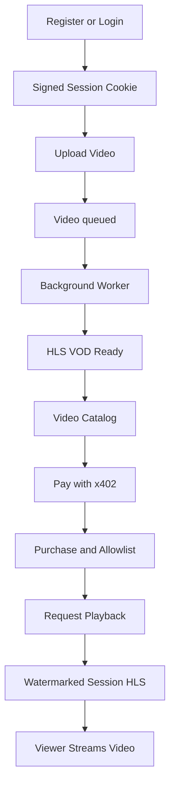

# 18. Module Dependency Map

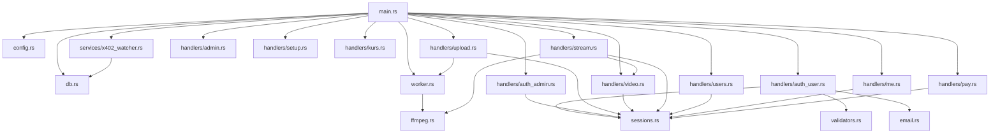

# 19. Database Tables

| Table | Used for | Migration |
|---|---|---|
| `users` | Identity, roles, creator profile, wallet, bank data | `sql/001_init.sql` |
| `sessions` | Server side sessions with HMAC-signed cookies | `sql/004_sessions.sql` |
| `videos` | Video metadata and HLS processing state | `sql/001_init.sql` |
| `allowlist` | Playback authorization `(video_id, username)` pairs | `sql/005_allowlist.sql` |
| `purchases` | Completed content purchases ledger | `sql/001_init.sql` |
| `password_resets` | Single-use password recovery tokens | `sql/003_password_resets.sql` |
| `pay_tokens` | Supported EVM blockchain payment tokens | `migrations/021_pay_tokens.sql` |
| `x402_invoices` | On-chain payment invoices and transaction state | `migrations/014_x402_invoice.sql` |
| `pay_tokens_compat` | Compatibility view for legacy `erc20` column name | `migrations/024_pay_tokens_compat_view.sql` |
| `fiat_invoices` | Fiat payment invoices (Stripe/PayPal/Midtrans/Xendit) | `migrations/026_fiat_invoices.sql` |
| `smtp_settings` | SMTP email configuration (single row, id=1) | `migrations/027_smtp_settings.sql` |

### `fiat_invoices` Schema

```sql
CREATE TABLE IF NOT EXISTS fiat_invoices (
  id          BIGSERIAL PRIMARY KEY,
  invoice_uid TEXT NOT NULL UNIQUE,
  provider    TEXT NOT NULL,              -- stripe, paypal, midtrans, xendit
  provider_ref TEXT,                      -- provider's own order/invoice ID
  user_id     TEXT NOT NULL REFERENCES users(id),
  video_id    TEXT NOT NULL REFERENCES videos(id),
  creator_id  TEXT NOT NULL REFERENCES users(id),
  amount      BIGINT NOT NULL,
  currency    TEXT NOT NULL DEFAULT 'USD',
  status      TEXT NOT NULL DEFAULT 'pending',  -- pending, paid, failed, expired, cancelled
  payment_url TEXT,
  buyer_email TEXT,
  meta        JSONB,
  created_at  TIMESTAMPTZ NOT NULL DEFAULT now(),
  paid_at     TIMESTAMPTZ,
  disbursed_at TIMESTAMPTZ,
  disburse_ref TEXT
);
```

### `smtp_settings` Schema

```sql
CREATE TABLE IF NOT EXISTS smtp_settings (
  id         SERIAL PRIMARY KEY,
  host       TEXT NOT NULL DEFAULT '',
  port       INTEGER NOT NULL DEFAULT 587,
  username   TEXT NOT NULL DEFAULT '',
  password   TEXT NOT NULL DEFAULT '',
  from_email TEXT NOT NULL DEFAULT '',
  from_name  TEXT NOT NULL DEFAULT 'PPV Stream',
  use_tls    BOOLEAN NOT NULL DEFAULT true,
  enabled    BOOLEAN NOT NULL DEFAULT false,
  updated_at TIMESTAMPTZ NOT NULL DEFAULT now()
);
-- Row id=1 is always present (seeded by migration)
```

# 20. Important Technical Risks and Refactoring Priorities

## 20.1 Duplicate transcoding implementations

`worker.rs` and `ffmpeg.rs` both implement FastStart and adaptive HLS encoding. Consolidate these into `ffmpeg.rs` to avoid different ladders and behavior.

## 20.2 Admin data endpoint is not protected

`admin_data()` has its admin session check commented out. It can expose users, sessions, reset tokens, and purchases.

## 20.3 Bootstrap endpoint uses GET

`setup_admin()` performs a state changing operation through GET. It should use POST, require a mandatory strong token, and ideally be disabled after initial setup.

## 20.4 Public profile privacy

`public_profile()` exposes email, bank account, wallet, and WhatsApp. Explicit privacy rules and field level visibility are needed.

## 20.5 Session cookie security

The session cookie is HTTP only and SameSite Lax, but Secure is not enforced. Production HTTPS deployments should set Secure.

## 20.6 Default secrets and credentials

Development defaults exist for the HMAC secret, database URL, admin email, and admin password. Production startup should fail when sensitive configuration is missing.

## 20.7 Streaming processing cost

`request_play()` runs FFmpeg synchronously before returning the playlist. For long videos this can delay requests significantly and consume high CPU per viewer. Consider asynchronous session generation, cached personalized segments, or a different watermarking strategy.

## 20.8 HLS source resolution mismatch

The playback handler does not clearly use the worker generated `hls_master` field. The preprocessed VOD and per session watermark flow should be aligned.

## 20.9 Payment amount calculation

The current cents to token unit conversion does not use market price for volatile tokens. Confirm whether `price_cents` represents token cents, USD cents, or another denomination.

## 20.10 Watcher and confirmation consistency

The watcher marks invoices paid without the same amount verification performed by `x402_confirm()`. Both paths should share one payment validation service.

# 21. Recommended Target Architecture

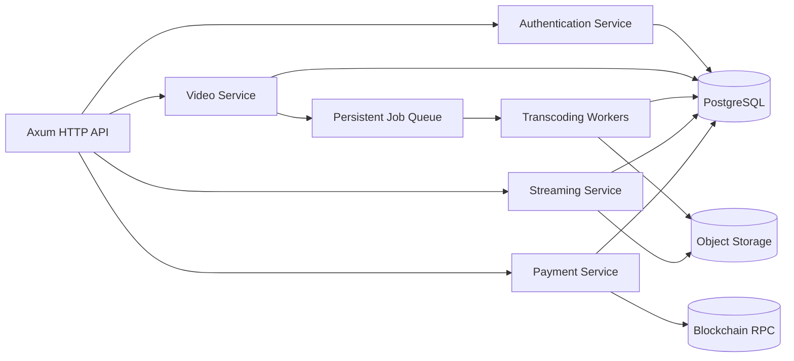

Recommended improvements:

1. Extract business services from HTTP handlers.
2. Consolidate FFmpeg behavior into one module.
3. Use a persistent queue instead of an in memory channel.
4. Store media in object storage for horizontal scaling.
5. Centralize authorization and payment unlock logic.
6. Add request tracing, timeouts, rate limits, security headers, and CORS policy.
7. Add integration tests for upload, payment, authorization, and HLS serving.
8. Add cleanup jobs for expired sessions and temporary HLS directories.
9. Validate all production secrets at startup.
10. Remove or archive SQLite legacy modules after migration is complete.
